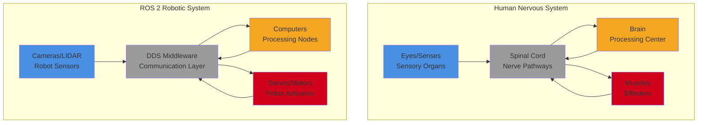

# Real-world Analogy: Human Nervous System vs ROS 2

## Learning Outcomes

By the end of this section, you will be able to:

- Draw parallels between human nervous system components and ROS 2 architecture
- Map sensory organs to robot sensors and their ROS 2 equivalents
- Compare central and peripheral nervous systems to ROS 2 processing and communication
- Explain how the human body's communication patterns relate to ROS 2 topics, services, and actions
- Understand the distributed nature of both systems and their benefits

## The Human Nervous System

To understand ROS 2, it helps to think of how the human nervous system works. Your body is a complex system with many components that need to communicate and coordinate.

### Components of the Human Nervous System

- **Sensory Organs**: Eyes, ears, skin, etc. (sensors)
- **Central Nervous System**: Brain and spinal cord (processing)
- **Peripheral Nervous System**: Nerves connecting everything (middleware)
- **Effectors**: Muscles and glands (actuators)
- **Autonomic Functions**: Heart rate, breathing, etc. (background processes)

## ROS 2 as a Robotic Nervous System

ROS 2 functions much like the human nervous system, connecting various components of a robot:

### Sensory Processing (Sensors)

Just as your eyes detect light and your ears detect sound, robot sensors detect the environment:

- Cameras → Vision processing nodes
- IMUs → State estimation nodes
- LIDAR → Mapping and localization nodes
- Joint encoders → Robot state monitoring

### Central Processing (Brains/Computers)

The "brain" of a robot includes nodes that process sensor data and make decisions:

- Perception nodes → Recognize objects (like your visual cortex)
- Planning nodes → Decide on actions (like your prefrontal cortex)
- Control nodes → Generate commands (like your motor cortex)

### Communication System (DDS Middleware)

The peripheral nervous system connects sensors to the brain and the brain to muscles. Similarly, DDS in ROS 2 connects all components:

- **Topics** → Like sensory and motor nerves carrying specific types of information
- **Services** → Like reflex pathways that require immediate responses
- **Actions** → Like complex coordinated movements requiring feedback

### Motor Control (Actuators)

Just as your brain controls muscles to move your body, ROS 2 nodes control robot actuators:

- Joint controllers → Control robot joints like motor neurons control muscles
- Grippers → Perform manipulation tasks
- Wheels/base controllers → Enable locomotion

## Communication Patterns

### Sensory-Motor Coordination

Human: Your eyes detect an obstacle → Brain processes → Motor cortex commands leg muscles to step around it.

Robot: LIDAR detects obstacle → Perception node processes → Navigation node commands base controller to avoid it.

### Feedback Control

Human: Your hand feels an object → Sensory nerves transmit → Brain adjusts grip strength.

Robot: Force sensors detect grip force → Sensor processing node → Controller adjusts motor commands.

### Reflexes vs. Deliberate Actions

Human: You pull your hand away from something hot automatically (reflex) vs. carefully picking up a fragile object (deliberate).

Robot: Emergency stop triggered by safety monitor (reflex) vs. planned manipulation of an object (deliberate).

## The Distributed Nature

Just as different parts of your brain handle different functions (visual cortex, motor cortex, etc.), different ROS 2 nodes handle different robot functions, all communicating through the middleware (DDS) like the nervous system.

This distributed architecture makes robots more robust and flexible, just as the human nervous system allows us to perform complex tasks while maintaining awareness of our environment.

## Visual Comparison

The above diagram provides a visual comparison between the human nervous system and the ROS 2 robotic system, showing the analogous components and communication pathways.