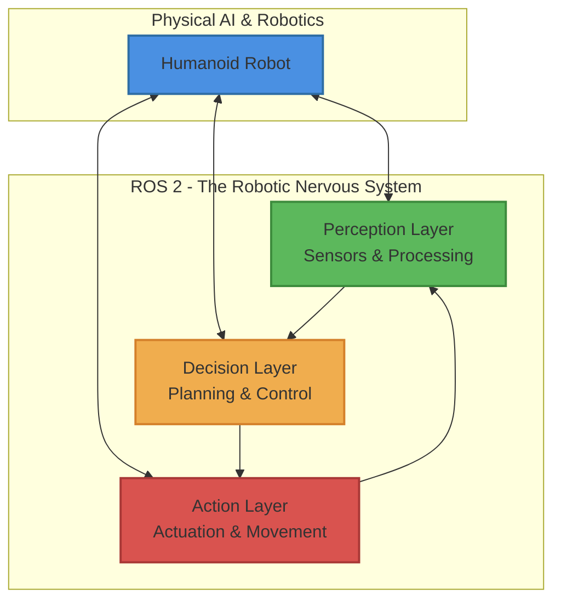

# Introduction to ROS 2 – The Robotic Nervous System

This chapter introduces ROS 2 as the middleware that connects perception, decision-making, and actuation in robots. By the end of this chapter, you will understand ROS 2's role in Physical AI, be able to identify core ROS 2 components, and conceptually map ROS 2 to humanoid robot control.

## Conceptual Overview

The above diagram illustrates how ROS 2 functions as the nervous system connecting perception, decision-making, and actuation in robots.

## Learning Outcomes

By the end of this chapter, you will be able to:

- Understand ROS 2's role in Physical AI
- Identify core ROS 2 components and their functions
- Conceptually map ROS 2 to humanoid robot control
- Explain the relationship between ROS 2 and the human nervous system
- Describe typical ROS 2 architecture patterns in humanoid robots