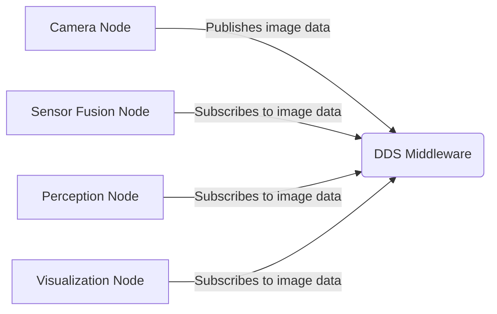

# Middleware Concept: DDS Explained Intuitively

## Learning Outcomes

By the end of this section, you will be able to:

- Define middleware and explain its role in robotics systems
- Describe how DDS functions as the communication backbone of ROS 2
- Identify key DDS concepts including topics, publishers, subscribers, and QoS
- Explain the advantages of DDS for robotics applications
- Illustrate the publisher-subscriber communication pattern with examples

## What is Middleware?

Middleware is software that provides common services and capabilities to applications outside of what's offered by the operating system. In the context of ROS 2, the middleware handles communication between different parts of your robot system.

## DDS: Data Distribution Service

DDS (Data Distribution Service) is the middleware that powers ROS 2's communication system. Think of DDS as a "digital nervous system" that enables different parts of your robot to share information seamlessly.

## Intuitive Understanding of DDS

Imagine your robot as a human body:

- **Sensors** are like your sensory organs (eyes, ears, skin)
- **Processors** are like your brain, making decisions
- **Actuators** are like your muscles, carrying out actions
- **DDS** is like your nervous system, carrying signals between all these components

### Key DDS Concepts

#### Topics
Like channels on a radio, topics define what kind of information is being shared. For example:
- `/camera/image_raw` - for camera images
- `/cmd_vel` - for velocity commands
- `/joint_states` - for robot joint positions

#### Publishers and Subscribers
- **Publishers** send data on topics (like a radio station broadcasting)
- **Subscribers** receive data from topics (like a radio receiving)

This creates a decoupled system where publishers don't need to know who is listening, and subscribers don't need to know who is sending.

#### Quality of Service (QoS)
DDS provides policies for how data should be handled:
- **Reliability**: Ensure all messages are delivered vs. best-effort delivery
- **Durability**: Deliver messages to late-joining subscribers vs. only current ones
- **History**: How many messages to keep vs. only the most recent
- **Deadline**: Maximum time between consecutive messages

## Why DDS Matters

DDS provides several advantages for robotics:

1. **Language Independence**: Different components can be written in different programming languages
2. **Platform Independence**: Components can run on different operating systems
3. **Real-time Capabilities**: Guarantees about message delivery timing
4. **Security**: Authentication and encryption capabilities
5. **Scalability**: Can handle simple robots to complex multi-robot systems

## Simple DDS Example

In this example, the camera node publishes images to a topic, and multiple other nodes can subscribe to that same topic without the camera knowing who they are. This is the power of DDS-based communication.