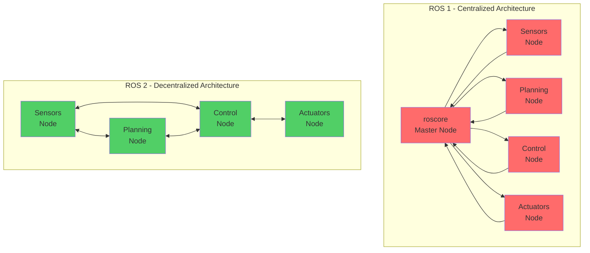

# ROS 2 vs ROS 1 (Conceptual)

## Learning Outcomes

By the end of this section, you will be able to:

- Compare the architectural differences between ROS 1 and ROS 2
- Explain the advantages of DDS-based communication over TCPROS
- Identify scenarios where ROS 1 or ROS 2 would be more appropriate
- Describe the evolution of ROS to meet industrial and safety requirements

## Evolution from ROS 1 to ROS 2

ROS 1 was groundbreaking in its approach to robot software development, but as robotics applications evolved and became more sophisticated, several limitations became apparent. ROS 2 was designed to address these challenges while maintaining the core philosophy of modularity and reusability.

## Key Conceptual Differences

### Architecture Comparison

The above diagram illustrates the fundamental architectural difference between ROS 1's centralized approach with a single master node and ROS 2's decentralized approach using peer-to-peer communication.

### Architecture

**ROS 1** used a centralized architecture with a master node that coordinated all communication. This created a single point of failure and made it difficult to scale to complex, distributed systems.

**ROS 2** uses a decentralized architecture based on DDS (Data Distribution Service), which allows for more robust and scalable communication without a central master.

### Communication Model

**ROS 1** relied on TCPROS for communication, which was simple but limited in terms of quality of service, security, and real-time capabilities.

**ROS 2** uses DDS as its middleware, providing advanced features like:
- Quality of Service (QoS) policies
- Security and authentication
- Real-time performance guarantees
- Multiple transport protocols

### Lifecycle Management

**ROS 1** had limited support for managing the lifecycle of nodes and their states.

**ROS 2** includes built-in lifecycle management, allowing nodes to transition through defined states (unconfigured, inactive, active, finalized) with explicit transitions between them.

### Real-time and Safety Requirements

**ROS 1** was primarily designed for research and prototyping, with limited support for safety-critical applications.

**ROS 2** was designed with industrial and safety-critical applications in mind, supporting real-time systems and formal safety certification processes.

## When to Use Each

ROS 1 is still suitable for:
- Legacy systems and existing projects
- Simple research applications
- Educational purposes

ROS 2 is preferred for:
- Production systems
- Safety-critical applications
- Distributed and multi-robot systems
- Applications requiring security
- Real-time performance requirements