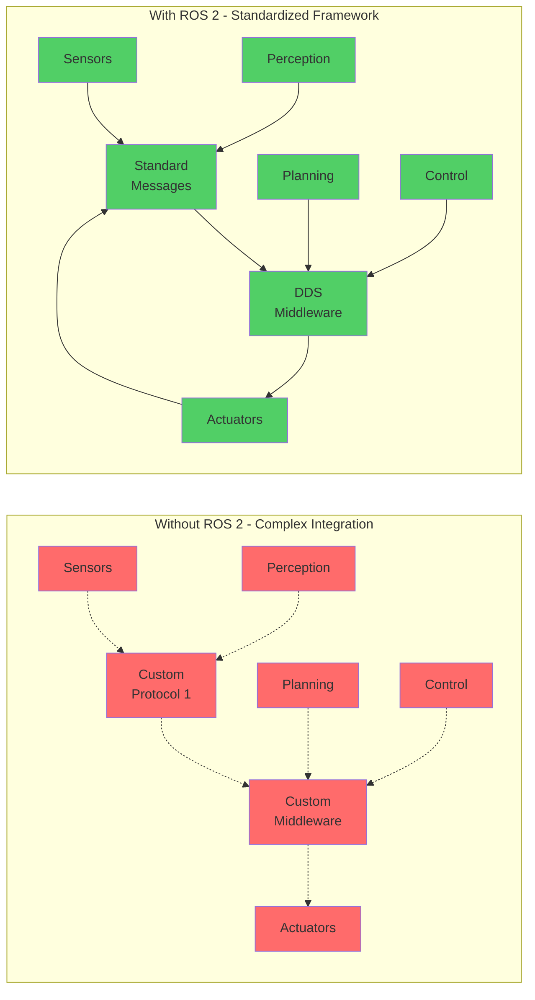

# What is ROS 2 and Why It Exists

## Learning Outcomes

By the end of this section, you will be able to:

- Define ROS 2 and distinguish it from traditional operating systems
- Explain the key problems ROS 2 solves in robotics development
- Identify the main components integrated by ROS 2 in robot systems
- Describe the importance of standardized communication in robotics

## Understanding ROS 2

ROS 2 (Robot Operating System 2) is not an actual operating system, but rather a flexible framework for writing robot software. It is a collection of tools, libraries, and conventions that aim to simplify the task of creating complex and robust robot behavior across a wide variety of robot platforms and environments.

## The Need for ROS 2

Building robots involves integrating many complex systems:

- **Sensors** (cameras, lidars, IMUs, etc.)
- **Actuators** (motors, grippers, etc.)
- **Perception systems** (object detection, localization, etc.)
- **Planning systems** (path planning, motion planning, etc.)
- **Control systems** (trajectory following, feedback control, etc.)

Without a framework like ROS 2, developers would need to build communication protocols from scratch, manage data flow between components, and handle system integration manually. ROS 2 provides standardized ways to handle these common challenges.

## ROS 2 Problem-Solution Framework

The above diagram shows the contrast between complex custom integration without ROS 2 versus the standardized framework approach that ROS 2 provides.

## Key Problems ROS 2 Solves

1. **Communication**: ROS 2 provides standardized message passing between different parts of a robot system
2. **Modularity**: Components can be developed and tested independently
3. **Reusability**: Code can be shared across different robots and projects
4. **Distributed computing**: Robot software can run across multiple computers
5. **Hardware abstraction**: Code can work with different hardware implementations