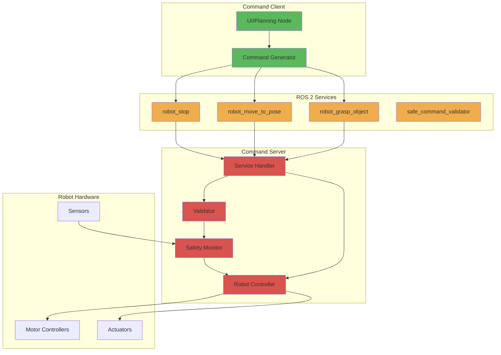

# Command Service Example

## Learning Outcomes

By the end of this section, you will be able to:

- Implement command services for robot control
- Design appropriate service interfaces for robot commands
- Create service clients that send command requests
- Handle command validation and error responses
- Build robust command execution systems

## Command Services in Robotics

Command services provide a synchronous way to execute specific robot actions that require confirmation of completion or failure. Unlike topics which stream continuous data, services provide transactional command execution with clear success/failure responses.

## Basic Command Service Example

```python
import rclpy
from rclpy.node import Node
from example_interfaces.srv import Trigger
from std_msgs.msg import Bool

class RobotCommandService(Node):
    def __init__(self):
        super().__init__('robot_command_service')

        # Create service servers for different robot commands
        self.stop_service = self.create_service(
            Trigger,
            'robot_stop',
            self.handle_stop_request
        )

        self.reset_service = self.create_service(
            Trigger,
            'robot_reset',
            self.handle_reset_request
        )

        # Publisher for robot state changes
        self.state_publisher = self.create_publisher(Bool, 'robot_enabled', 10)

        self.robot_enabled = True
        self.get_logger().info('Robot command service started')

    def handle_stop_request(self, request, response):
        """Handle robot stop command"""
        if not self.robot_enabled:
            response.success = False
            response.message = 'Robot already stopped'
            return response

        # Execute stop command
        self.robot_enabled = False
        state_msg = Bool()
        state_msg.data = False
        self.state_publisher.publish(state_msg)

        response.success = True
        response.message = 'Robot stopped successfully'
        self.get_logger().info('Robot stopped')
        return response

    def handle_reset_request(self, request, response):
        """Handle robot reset command"""
        if self.robot_enabled:
            response.success = False
            response.message = 'Robot already enabled'
            return response

        # Execute reset command
        self.robot_enabled = True
        state_msg = Bool()
        state_msg.data = True
        self.state_publisher.publish(state_msg)

        response.success = True
        response.message = 'Robot reset and enabled successfully'
        self.get_logger().info('Robot reset and enabled')
        return response

def main(args=None):
    rclpy.init(args=args)
    robot_service = RobotCommandService()

    try:
        rclpy.spin(robot_service)
    except KeyboardInterrupt:
        pass
    finally:
        robot_service.destroy_node()
        rclpy.shutdown()

if __name__ == '__main__':
    main()
```

## Advanced Command Service with Custom Message

First, let's define a custom service message for more complex commands. This would typically be in a `.srv` file:

```
# CustomRobotCommand.srv
# Request
string command_type  # 'move_to_pose', 'grasp_object', 'navigate', etc.
float64[] parameters  # Command-specific parameters
string target_frame   # Target coordinate frame

---
# Response
bool success
string message
float64 execution_time
```

```python
import rclpy
from rclpy.node import Node
from geometry_msgs.msg import Pose
from std_msgs.msg import String
import time

# For this example, we'll use a simplified version with Trigger service
# In practice, you would use a custom service type

class AdvancedRobotCommandService(Node):
    def __init__(self):
        super().__init__('advanced_robot_command_service')

        # Create service for complex robot commands
        self.command_service = self.create_service(
            # In practice, this would be a custom service type
            # For this example, we'll use Trigger and implement command parsing
            self.parse_command_request
        )

        # For this example, we'll create separate services for different commands
        self.move_service = self.create_service(
            String,  # In practice, use custom message with Pose
            'robot_move_to_pose',
            self.handle_move_request
        )

        self.grasp_service = self.create_service(
            String,  # In practice, use custom message with object info
            'robot_grasp_object',
            self.handle_grasp_request
        )

        self.get_logger().info('Advanced robot command service started')

    def handle_move_request(self, request, response):
        """Handle move to pose command"""
        try:
            # Parse the pose from request (in practice, this would be a Pose message)
            # For this example, we'll simulate parsing
            start_time = time.time()

            # Simulate robot movement (in real implementation, this would control actual robot)
            self.get_logger().info(f'Executing move command: {request.data}')

            # Simulate movement time
            time.sleep(2.0)  # Simulate 2 seconds for movement

            execution_time = time.time() - start_time

            response.success = True
            response.message = f'Moved to pose successfully in {execution_time:.2f}s'

            return response
        except Exception as e:
            response.success = False
            response.message = f'Move command failed: {str(e)}'
            return response

    def handle_grasp_request(self, request, response):
        """Handle grasp object command"""
        try:
            start_time = time.time()

            # Simulate grasp operation
            self.get_logger().info(f'Executing grasp command: {request.data}')

            # Simulate grasp time
            time.sleep(1.5)  # Simulate 1.5 seconds for grasping

            execution_time = time.time() - start_time

            response.success = True
            response.message = f'Object grasped successfully in {execution_time:.2f}s'

            return response
        except Exception as e:
            response.success = False
            response.message = f'Grasp command failed: {str(e)}'
            return response

def main(args=None):
    rclpy.init(args=args)
    command_service = AdvancedRobotCommandService()

    try:
        rclpy.spin(command_service)
    except KeyboardInterrupt:
        pass
    finally:
        command_service.destroy_node()
        rclpy.shutdown()

if __name__ == '__main__':
    main()
```

## Command Service Client Example

```python
import rclpy
from rclpy.node import Node
from example_interfaces.srv import Trigger
import time

class RobotCommandClient(Node):
    def __init__(self):
        super().__init__('robot_command_client')

        # Create clients for different robot services
        self.stop_client = self.create_client(Trigger, 'robot_stop')
        self.reset_client = self.create_client(Trigger, 'robot_reset')

        # Wait for services to be available
        while not self.stop_client.wait_for_service(timeout_sec=1.0):
            self.get_logger().info('Stop service not available, waiting again...')

        while not self.reset_client.wait_for_service(timeout_sec=1.0):
            self.get_logger().info('Reset service not available, waiting again...')

        self.get_logger().info('Robot command client ready')

    def send_stop_command(self):
        """Send stop command to robot"""
        request = Trigger.Request()

        self.get_logger().info('Sending stop command...')
        future = self.stop_client.call_async(request)

        # Wait for response
        rclpy.spin_until_future_complete(self, future)

        try:
            response = future.result()
            if response.success:
                self.get_logger().info(f'Stop command successful: {response.message}')
            else:
                self.get_logger().info(f'Stop command failed: {response.message}')
        except Exception as e:
            self.get_logger().info(f'Stop command service call failed: {e}')

    def send_reset_command(self):
        """Send reset command to robot"""
        request = Trigger.Request()

        self.get_logger().info('Sending reset command...')
        future = self.reset_client.call_async(request)

        # Wait for response
        rclpy.spin_until_future_complete(self, future)

        try:
            response = future.result()
            if response.success:
                self.get_logger().info(f'Reset command successful: {response.message}')
            else:
                self.get_logger().info(f'Reset command failed: {response.message}')
        except Exception as e:
            self.get_logger().info(f'Reset command service call failed: {e}')

def main(args=None):
    rclpy.init(args=args)
    client = RobotCommandClient()

    try:
        # Send commands in sequence
        client.send_stop_command()
        time.sleep(1.0)  # Wait 1 second
        client.send_reset_command()
    except KeyboardInterrupt:
        pass
    finally:
        client.destroy_node()
        rclpy.shutdown()

if __name__ == '__main__':
    main()
```

## Complex Command Service with Validation

```python
import rclpy
from rclpy.node import Node
from example_interfaces.srv import Trigger, SetBool
from geometry_msgs.msg import Pose
from std_msgs.msg import Float64
import math

class ValidatedCommandService(Node):
    def __init__(self):
        super().__init__('validated_command_service')

        # Create command services
        self.move_service = self.create_service(
            SetBool,  # Using SetBool as example, would use custom message in practice
            'safe_move_to_pose',
            self.handle_safe_move_request
        )

        # Robot state publishers
        self.current_pose_publisher = self.create_publisher(Pose, 'current_pose', 10)
        self.safety_status_publisher = self.create_publisher(Float64, 'safety_factor', 10)

        # Robot state
        self.current_x = 0.0
        self.current_y = 0.0
        self.current_z = 0.0
        self.safety_factor = 1.0  # 1.0 = safe, 0.0 = unsafe

        self.get_logger().info('Validated command service started')

    def validate_pose(self, target_x, target_y, target_z):
        """Validate if target pose is safe for robot"""
        # Calculate distance to target
        distance = math.sqrt(
            (target_x - self.current_x)**2 +
            (target_y - self.current_y)**2 +
            (target_z - self.current_z)**2
        )

        # Check if target is within safe bounds
        if abs(target_x) > 10.0 or abs(target_y) > 10.0 or abs(target_z) > 2.0:
            return False, "Target position out of safe bounds"

        # Check if path is clear (simplified check)
        if self.safety_factor < 0.2:
            return False, "Environment safety factor too low"

        # Check if distance is too large for single move
        if distance > 5.0:
            return False, f"Target too far: {distance:.2f}m (max 5.0m)"

        return True, "Valid pose"

    def handle_safe_move_request(self, request, response):
        """Handle validated move request"""
        try:
            # Parse target coordinates from request (simplified)
            # In practice, this would be a custom message with Pose data
            target_x = 1.0  # Example target
            target_y = 1.0
            target_z = 0.5

            # Validate the target pose
            is_valid, validation_msg = self.validate_pose(target_x, target_y, target_z)

            if not is_valid:
                response.success = False
                response.message = f'Validation failed: {validation_msg}'
                self.get_logger().warn(response.message)
                return response

            # Execute the validated move
            self.get_logger().info(f'Moving from ({self.current_x}, {self.current_y}, {self.current_z}) to ({target_x}, {target_y}, {target_z})')

            # Simulate movement
            self.current_x = target_x
            self.current_y = target_y
            self.current_z = target_z

            # Publish updated pose
            pose_msg = Pose()
            pose_msg.position.x = self.current_x
            pose_msg.position.y = self.current_y
            pose_msg.position.z = self.current_z
            self.current_pose_publisher.publish(pose_msg)

            # Update safety factor (decrease slightly after movement)
            self.safety_factor = max(0.1, self.safety_factor - 0.01)
            safety_msg = Float64()
            safety_msg.data = self.safety_factor
            self.safety_status_publisher.publish(safety_msg)

            response.success = True
            response.message = f'Moved safely to ({target_x}, {target_y}, {target_z})'

            return response

        except Exception as e:
            response.success = False
            response.message = f'Command execution failed: {str(e)}'
            self.get_logger().error(response.message)
            return response

def main(args=None):
    rclpy.init(args=args)
    service = ValidatedCommandService()

    try:
        rclpy.spin(service)
    except KeyboardInterrupt:
        pass
    finally:
        service.destroy_node()
        rclpy.shutdown()

if __name__ == '__main__':
    main()
```

## Command Service Architecture



## Best Practices for Command Services

1. **Validation**: Always validate commands before execution
2. **Safety**: Implement safety checks and emergency stops
3. **Error Handling**: Provide detailed error messages
4. **Timeouts**: Implement reasonable timeouts for long operations
5. **State Management**: Track robot state for command context
6. **Logging**: Log all commands for debugging and safety
7. **Authentication**: Consider security for critical commands
8. **Idempotency**: Design commands to be safe to repeat

Command services are essential for robot control systems, providing reliable, synchronous execution of critical robot operations with proper validation and error handling.