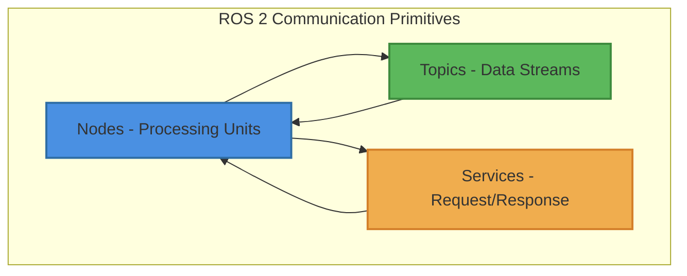

# ROS 2 Communication Primitives – Connecting Robot Components

This chapter introduces the fundamental communication patterns in ROS 2 that enable distributed robot control. You'll learn about Nodes, Topics, and Services, and understand how they work together to create robust robot systems with practical Python examples.

## Learning Outcomes

By the end of this chapter, you will be able to:

- Define ROS 2 nodes and their role in distributed robot systems
- Explain the publish/subscribe model using topics
- Understand the request/response model using services
- Choose appropriate communication patterns (Topics vs Services) for different scenarios
- Implement basic ROS 2 communication patterns in Python
- Understand real-time data flow in robot systems

## Conceptual Overview

The above diagram illustrates the three core communication primitives in ROS 2: Nodes that process information, Topics that stream data, and Services that handle requests.