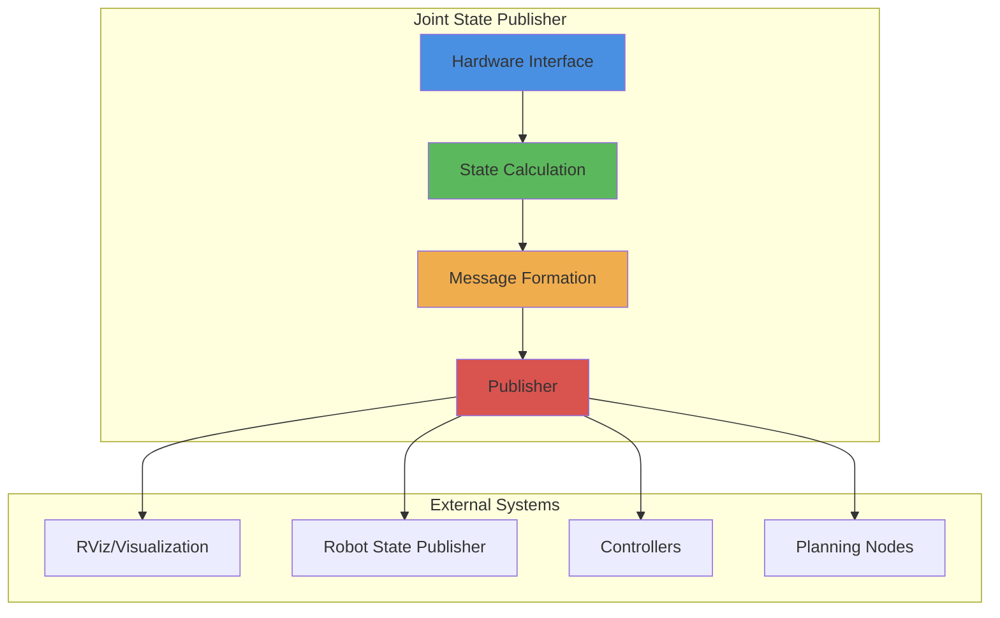

# Joint State Publisher Example

## Learning Outcomes

By the end of this section, you will be able to:

- Implement a joint state publisher node in Python
- Understand the JointState message format
- Create realistic joint state data for robot simulation
- Connect joint state publishing to robot control systems
- Debug joint state communication issues

## Understanding Joint States in Robotics

Joint states are fundamental to robot control, representing the current position, velocity, and effort of each joint in a robot. This information is crucial for:

- Robot visualization and simulation
- Forward kinematics calculations
- Control system feedback
- Safety monitoring

## JointState Message Format

The `sensor_msgs/JointState` message contains:

- `name`: Names of the joints
- `position`: Current joint positions (radians for revolute joints, meters for prismatic)
- `velocity`: Current joint velocities (rad/s or m/s)
- `effort`: Current joint efforts (torque in Nm or force in N)

## Complete Joint State Publisher Example

```python
import rclpy
from rclpy.node import Node
from sensor_msgs.msg import JointState
from std_msgs.msg import Header
import math
import numpy as np

class JointStatePublisher(Node):
    def __init__(self):
        super().__init__('joint_state_publisher')

        # Create publisher for joint states
        self.publisher = self.create_publisher(JointState, 'joint_states', 10)

        # Timer to publish joint states at 50Hz
        self.timer = self.create_timer(0.02, self.publish_joint_states)

        # Initialize joint names for a simple robot
        self.joint_names = [
            'hip_joint',      # Hip joint
            'knee_joint',     # Knee joint
            'ankle_joint',    # Ankle joint
            'shoulder_joint', # Shoulder joint
            'elbow_joint'     # Elbow joint
        ]

        # Initialize joint positions (start at zero)
        self.joint_positions = [0.0] * len(self.joint_names)
        self.joint_velocities = [0.0] * len(self.joint_names)
        self.joint_efforts = [0.0] * len(self.joint_names)

        # Simulation time tracking
        self.time_prev = self.get_clock().now().nanoseconds / 1e9

        self.get_logger().info('Joint state publisher started')

    def publish_joint_states(self):
        # Create joint state message
        msg = JointState()
        msg.header = Header()
        msg.header.stamp = self.get_clock().now().to_msg()
        msg.header.frame_id = 'base_link'

        # Set joint names
        msg.name = self.joint_names

        # Simulate some joint movement (sine wave motion)
        current_time = self.get_clock().now().nanoseconds / 1e9
        time_diff = current_time - self.time_prev
        self.time_prev = current_time

        # Update joint positions with some oscillating motion
        for i in range(len(self.joint_names)):
            # Different oscillation patterns for each joint
            frequency = 0.5 + i * 0.1  # Different frequencies
            amplitude = 0.5            # 0.5 rad amplitude
            self.joint_positions[i] = amplitude * math.sin(2 * math.pi * frequency * current_time)

            # Calculate velocity (derivative of position)
            self.joint_velocities[i] = amplitude * 2 * math.pi * frequency * math.cos(2 * math.pi * frequency * current_time)

            # Calculate effort (simple proportional to position for simulation)
            self.joint_efforts[i] = -1.0 * self.joint_positions[i]  # Simple spring-like behavior

        # Set the calculated values
        msg.position = self.joint_positions.copy()
        msg.velocity = self.joint_velocities.copy()
        msg.effort = self.joint_efforts.copy()

        # Publish the message
        self.publisher.publish(msg)

        # Log a sample of the joint states
        self.get_logger().info(
            f'Published joint states: hip={self.joint_positions[0]:.3f}, '
            f'knee={self.joint_positions[1]:.3f}, shoulder={self.joint_positions[3]:.3f}'
        )

def main(args=None):
    rclpy.init(args=args)
    joint_publisher = JointStatePublisher()

    try:
        rclpy.spin(joint_publisher)
    except KeyboardInterrupt:
        pass
    finally:
        joint_publisher.destroy_node()
        rclpy.shutdown()

if __name__ == '__main__':
    main()
```

## Understanding the Example

### Key Components:

1. **Joint Names**: Defines the names of each joint in the robot
2. **Timer-based Publishing**: Ensures consistent 50Hz update rate
3. **State Calculation**: Computes positions, velocities, and efforts
4. **Message Construction**: Properly formats JointState message
5. **Timestamp Management**: Ensures accurate timing information

### Joint State Visualization:

The published joint states can be used with tools like:
- RViz for 3D visualization
- Robot State Publisher for TF transforms
- Gazebo for physics simulation

## Advanced Joint State Publisher with Real Robot Interface

```python
import rclpy
from rclpy.node import Node
from sensor_msgs.msg import JointState
from std_msgs.msg import Header

class AdvancedJointStatePublisher(Node):
    def __init__(self):
        super().__init__('advanced_joint_state_publisher')

        # Create publisher
        self.publisher = self.create_publisher(JointState, 'joint_states', 10)

        # Timer for publishing
        self.timer = self.create_timer(0.01, self.publish_joint_states)  # 100Hz

        # Simulate connection to real robot hardware
        self.robot_hardware_interface = self.initialize_hardware_interface()

        # Joint mapping for a humanoid robot
        self.joint_map = {
            'left_hip': {'id': 1, 'offset': 0.0},
            'left_knee': {'id': 2, 'offset': 0.0},
            'left_ankle': {'id': 3, 'offset': 0.0},
            'right_hip': {'id': 4, 'offset': 0.0},
            'right_knee': {'id': 5, 'offset': 0.0},
            'right_ankle': {'id': 6, 'offset': 0.0},
            'left_shoulder': {'id': 7, 'offset': 0.0},
            'left_elbow': {'id': 8, 'offset': 0.0},
            'right_shoulder': {'id': 9, 'offset': 0.0},
            'right_elbow': {'id': 10, 'offset': 0.0}
        }

        self.get_logger().info('Advanced joint state publisher started')

    def initialize_hardware_interface(self):
        """Initialize connection to robot hardware (simulated)"""
        # In a real implementation, this would connect to actual robot hardware
        return {'connected': True, 'joint_count': 10}

    def get_joint_states_from_hardware(self):
        """Read current joint states from hardware (simulated)"""
        # In a real robot, this would interface with actual encoders/sensors
        positions = []
        velocities = []
        efforts = []

        for joint_name, config in self.joint_map.items():
            # Simulate reading from hardware
            # In real implementation, this would read from actual encoders
            pos = config['offset'] + 0.1 * math.sin(self.get_clock().now().nanoseconds / 1e9)
            vel = 0.1 * math.cos(self.get_clock().now().nanoseconds / 1e9)
            effort = -0.5 * pos  # Simple spring model

            positions.append(pos)
            velocities.append(vel)
            efforts.append(effort)

        return list(self.joint_map.keys()), positions, velocities, efforts

    def publish_joint_states(self):
        # Get current joint states from hardware
        names, positions, velocities, efforts = self.get_joint_states_from_hardware()

        # Create and populate joint state message
        msg = JointState()
        msg.header = Header()
        msg.header.stamp = self.get_clock().now().to_msg()
        msg.header.frame_id = 'base_link'

        msg.name = names
        msg.position = positions
        msg.velocity = velocities
        msg.effort = efforts

        # Publish the message
        self.publisher.publish(msg)

def main(args=None):
    rclpy.init(args=args)
    joint_publisher = AdvancedJointStatePublisher()

    try:
        rclpy.spin(joint_publisher)
    except KeyboardInterrupt:
        pass
    finally:
        joint_publisher.destroy_node()
        rclpy.shutdown()

if __name__ == '__main__':
    main()
```

## Joint State Publisher Architecture



## Best Practices

1. **Consistent Timing**: Maintain regular publishing intervals
2. **Accurate Timestamps**: Use ROS time for synchronization
3. **Complete Joint Set**: Publish all joint states in one message
4. **Error Handling**: Handle hardware interface failures gracefully
5. **Performance**: Optimize for real-time requirements
6. **Safety**: Validate joint limits and ranges

Joint state publishers are critical for robot operation, providing the essential feedback needed for control, visualization, and safety monitoring systems.