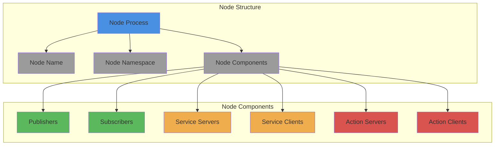

# ROS 2 Nodes

## Learning Outcomes

By the end of this section, you will be able to:

- Define what a ROS 2 node is and its role in robot systems
- Explain how nodes encapsulate robot functionality
- Understand the lifecycle of a ROS 2 node
- Create simple nodes using Python and rclpy

## What is a ROS 2 Node?

A ROS 2 node is the fundamental building block of a ROS 2 system. It's an executable process that performs specific functions within a robot system. Think of nodes as individual workers in a factory, each responsible for a specific task.

### Key Characteristics of Nodes

- **Encapsulation**: Each node encapsulates a specific piece of robot functionality
- **Communication**: Nodes communicate with each other through topics, services, and actions
- **Independence**: Nodes run independently and can be started/stopped individually
- **Distribution**: Nodes can run on the same or different machines

## Node Architecture



## Python Example: Creating a Simple Node

Here's a basic example of creating a ROS 2 node using Python and rclpy:

```python
import rclpy
from rclpy.node import Node

class SimpleNode(Node):
    def __init__(self):
        # Initialize the node with a name
        super().__init__('simple_node')
        self.get_logger().info('Simple node has been created')

def main(args=None):
    # Initialize the ROS 2 client library
    rclpy.init(args=args)

    # Create an instance of the node
    simple_node = SimpleNode()

    # Keep the node running until interrupted
    try:
        rclpy.spin(simple_node)
    except KeyboardInterrupt:
        pass
    finally:
        # Clean up and shutdown
        simple_node.destroy_node()
        rclpy.shutdown()

if __name__ == '__main__':
    main()
```

In this example:
- We create a class `SimpleNode` that inherits from `rclpy.node.Node`
- The node is initialized with a unique name
- `rclpy.spin()` keeps the node active and responsive to incoming messages
- Proper cleanup is performed when the node shuts down

## Node Lifecycle

ROS 2 nodes have a well-defined lifecycle that includes:

1. **Unconfigured**: The node has been created but not yet configured
2. **Inactive**: The node is configured but not actively processing
3. **Active**: The node is fully operational and processing data
4. **Finalized**: The node has been shut down and cleaned up

This lifecycle management allows for more robust and controllable robot systems, especially in safety-critical applications.