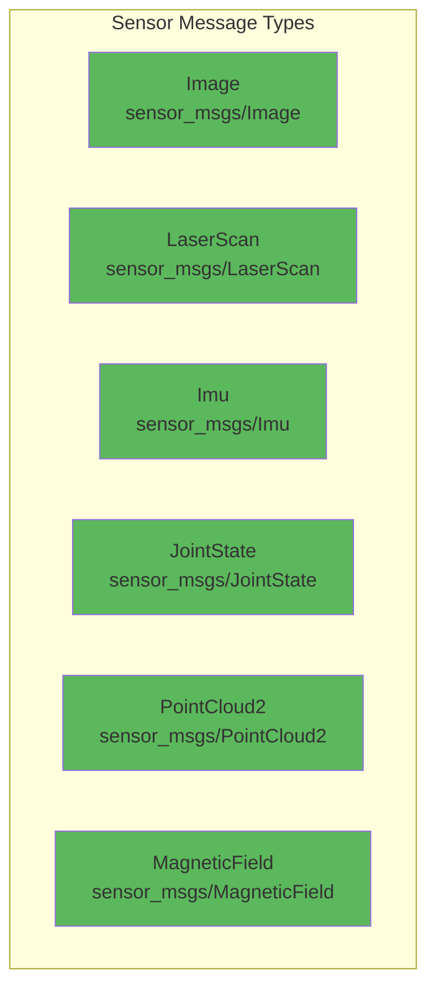
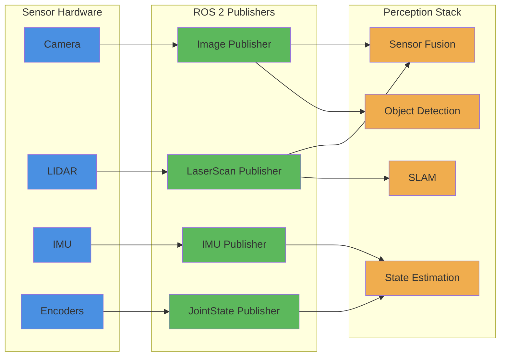

# Sensor Data Stream Example

## Learning Outcomes

By the end of this section, you will be able to:

- Implement sensor data publishers for various sensor types
- Understand common sensor message formats in ROS 2
- Create realistic sensor data streams for robot perception
- Design efficient sensor data processing pipelines
- Handle sensor synchronization and timing issues

## Sensor Data in Robotics

Sensors provide the robot's "senses," enabling perception of the environment and internal state. Common robot sensors include:

- **Cameras**: Visual perception and object recognition
- **LIDAR**: 3D mapping and obstacle detection
- **IMU**: Orientation and acceleration data
- **Joint Encoders**: Robot configuration and position
- **Force/Torque Sensors**: Interaction forces with environment

## Common Sensor Message Types



## Camera Sensor Publisher Example

```python
import rclpy
from rclpy.node import Node
from sensor_msgs.msg import Image
from std_msgs.msg import Header
from cv_bridge import CvBridge
import cv2
import numpy as np

class CameraPublisher(Node):
    def __init__(self):
        super().__init__('camera_publisher')

        # Create publisher for camera images
        self.publisher = self.create_publisher(Image, 'camera/image_raw', 10)

        # Timer to publish images at 30Hz (typical camera rate)
        self.timer = self.create_timer(1.0/30.0, self.publish_camera_image)

        # Initialize OpenCV bridge to convert between ROS and OpenCV images
        self.bridge = CvBridge()

        # Simulate camera capture
        self.frame_counter = 0
        self.get_logger().info('Camera publisher started')

    def publish_camera_image(self):
        # Create a simulated image (in real implementation, this would come from actual camera)
        height, width = 480, 640
        # Create a test image with some patterns
        image = np.zeros((height, width, 3), dtype=np.uint8)

        # Add some geometric shapes to make it interesting
        cv2.rectangle(image, (50, 50), (200, 200), (255, 0, 0), -1)  # Blue rectangle
        cv2.circle(image, (400, 150), 75, (0, 255, 0), -1)          # Green circle
        cv2.line(image, (0, 300), (640, 300), (0, 0, 255), 3)       # Red line

        # Add a moving element to simulate dynamic scene
        moving_x = int(100 + 200 * np.sin(self.frame_counter * 0.1))
        cv2.circle(image, (moving_x, 350), 30, (255, 255, 255), -1)  # White moving circle

        self.frame_counter += 1

        # Convert OpenCV image to ROS Image message
        ros_image = self.bridge.cv2_to_imgmsg(image, encoding='bgr8')
        ros_image.header = Header()
        ros_image.header.stamp = self.get_clock().now().to_msg()
        ros_image.header.frame_id = 'camera_frame'

        # Publish the image
        self.publisher.publish(ros_image)

        self.get_logger().info(f'Published camera image {self.frame_counter}')

def main(args=None):
    rclpy.init(args=args)
    camera_publisher = CameraPublisher()

    try:
        rclpy.spin(camera_publisher)
    except KeyboardInterrupt:
        pass
    finally:
        camera_publisher.destroy_node()
        rclpy.shutdown()

if __name__ == '__main__':
    main()
```

## LIDAR Sensor Publisher Example

```python
import rclpy
from rclpy.node import Node
from sensor_msgs.msg import LaserScan
from std_msgs.msg import Header
import math

class LidarPublisher(Node):
    def __init__(self):
        super().__init__('lidar_publisher')

        # Create publisher for LIDAR data
        self.publisher = self.create_publisher(LaserScan, 'scan', 10)

        # Timer to publish LIDAR data at 10Hz
        self.timer = self.create_timer(0.1, self.publish_lidar_scan)

        # LIDAR configuration
        self.angle_min = -math.pi  # -180 degrees
        self.angle_max = math.pi   # 180 degrees
        self.angle_increment = math.pi / 180.0  # 1 degree increment
        self.scan_time = 0.1  # 10Hz
        self.range_min = 0.1
        self.range_max = 30.0

        self.get_logger().info('LIDAR publisher started')

    def publish_lidar_scan(self):
        # Create LaserScan message
        msg = LaserScan()
        msg.header = Header()
        msg.header.stamp = self.get_clock().now().to_msg()
        msg.header.frame_id = 'lidar_frame'

        # Set LIDAR parameters
        msg.angle_min = self.angle_min
        msg.angle_max = self.angle_max
        msg.angle_increment = self.angle_increment
        msg.scan_time = self.scan_time
        msg.time_increment = 0.0
        msg.range_min = self.range_min
        msg.range_max = self.range_max

        # Calculate number of ranges
        num_ranges = int((self.angle_max - self.angle_min) / self.angle_increment) + 1
        msg.ranges = [0.0] * num_ranges

        # Simulate LIDAR data with some obstacles
        current_time = self.get_clock().now().nanoseconds / 1e9

        for i in range(num_ranges):
            angle = self.angle_min + i * self.angle_increment

            # Simulate some obstacles in the environment
            distance = self.range_max  # Default: no obstacle detected

            # Add some obstacles
            if abs(angle) < 0.2:  # Front
                distance = 2.0 + 0.5 * math.sin(current_time * 2)  # Moving obstacle
            elif abs(angle - math.pi/4) < 0.1:  # 45 degrees
                distance = 5.0
            elif abs(angle + math.pi/3) < 0.15:  # -60 degrees
                distance = 3.0

            msg.ranges[i] = distance

        # Publish the scan
        self.publisher.publish(msg)

        self.get_logger().info(f'Published LIDAR scan with {len(msg.ranges)} ranges')

def main(args=None):
    rclpy.init(args=args)
    lidar_publisher = LidarPublisher()

    try:
        rclpy.spin(lidar_publisher)
    except KeyboardInterrupt:
        pass
    finally:
        lidar_publisher.destroy_node()
        rclpy.shutdown()

if __name__ == '__main__':
    main()
```

## IMU Sensor Publisher Example

```python
import rclpy
from rclpy.node import Node
from sensor_msgs.msg import Imu
from std_msgs.msg import Header
from geometry_msgs.msg import Vector3, Quaternion
import math
import numpy as np

class ImuPublisher(Node):
    def __init__(self):
        super().__init__('imu_publisher')

        # Create publisher for IMU data
        self.publisher = self.create_publisher(Imu, 'imu/data', 10)

        # Timer to publish IMU data at 100Hz
        self.timer = self.create_timer(0.01, self.publish_imu_data)

        self.get_logger().info('IMU publisher started')

    def publish_imu_data(self):
        # Create IMU message
        msg = Imu()
        msg.header = Header()
        msg.header.stamp = self.get_clock().now().to_msg()
        msg.header.frame_id = 'imu_link'

        # Get current time for simulation
        current_time = self.get_clock().now().nanoseconds / 1e9

        # Simulate orientation (as quaternion)
        # Create a slowly rotating orientation
        roll = 0.1 * math.sin(current_time * 0.5)   # Small roll oscillation
        pitch = 0.05 * math.cos(current_time * 0.3) # Small pitch oscillation
        yaw = current_time * 0.1                    # Slow yaw rotation

        # Convert Euler angles to quaternion
        cy = math.cos(yaw * 0.5)
        sy = math.sin(yaw * 0.5)
        cp = math.cos(pitch * 0.5)
        sp = math.sin(pitch * 0.5)
        cr = math.cos(roll * 0.5)
        sr = math.sin(roll * 0.5)

        msg.orientation = Quaternion()
        msg.orientation.x = sr * cp * cy - cr * sp * sy
        msg.orientation.y = cr * sp * cy + sr * cp * sy
        msg.orientation.z = cr * cp * sy - sr * sp * cy
        msg.orientation.w = cr * cp * cy + sr * sp * sy

        # Simulate angular velocity
        msg.angular_velocity = Vector3()
        msg.angular_velocity.x = 0.1 * 0.5 * math.cos(current_time * 0.5)   # Roll rate
        msg.angular_velocity.y = -0.05 * 0.3 * math.sin(current_time * 0.3) # Pitch rate
        msg.angular_velocity.z = 0.1  # Constant yaw rate

        # Simulate linear acceleration
        msg.linear_acceleration = Vector3()
        msg.linear_acceleration.x = -9.81 * math.sin(roll)  # Gravity effect on x-axis
        msg.linear_acceleration.y = -9.81 * math.sin(pitch) # Gravity effect on y-axis
        msg.linear_acceleration.z = 9.81 * math.cos(roll) * math.cos(pitch)  # Gravity on z-axis

        # Set covariance matrices (set to zero if unknown)
        msg.orientation_covariance = [0.0] * 9
        msg.angular_velocity_covariance = [0.0] * 9
        msg.linear_acceleration_covariance = [0.0] * 9

        # Publish the IMU data
        self.publisher.publish(msg)

        self.get_logger().info(f'Published IMU data: roll={roll:.3f}, pitch={pitch:.3f}, yaw={yaw:.3f}')

def main(args=None):
    rclpy.init(args=args)
    imu_publisher = ImuPublisher()

    try:
        rclpy.spin(imu_publisher)
    except KeyboardInterrupt:
        pass
    finally:
        imu_publisher.destroy_node()
        rclpy.shutdown()

if __name__ == '__main__':
    main()
```

## Sensor Data Processing Pipeline



## Sensor Synchronization Considerations

For applications requiring multiple sensors, consider:

1. **Timestamp Synchronization**: Ensure all sensors use synchronized timestamps
2. **Rate Matching**: Publish at appropriate rates for each sensor type
3. **Message Filters**: Use ROS 2 message filters for multi-sensor processing
4. **Buffer Management**: Handle sensor data efficiently to avoid memory issues

## Best Practices for Sensor Publishers

1. **Consistent Rates**: Maintain stable publishing rates for each sensor
2. **Accurate Timestamps**: Use ROS time for proper synchronization
3. **Error Handling**: Handle sensor failures gracefully
4. **Calibration**: Apply sensor calibration parameters
5. **Frame IDs**: Use proper coordinate frame identifiers
6. **Data Validation**: Validate sensor data before publishing
7. **Performance**: Optimize for real-time constraints
8. **Safety**: Implement safety checks for critical sensors

Sensor data streams form the foundation of robot perception systems, providing the essential information needed for navigation, manipulation, and interaction with the environment.