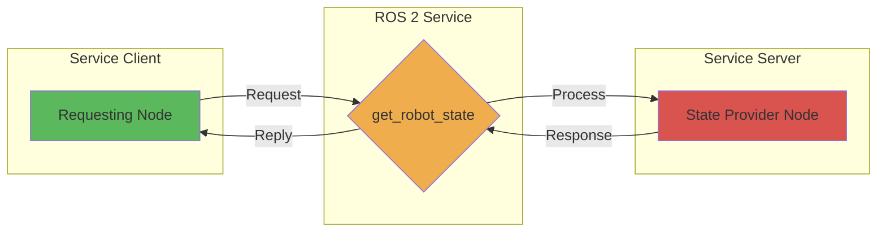

# Services (Request/Response Model)

## Learning Outcomes

By the end of this section, you will be able to:

- Explain the request/response communication pattern in ROS 2
- Identify when to use services for robot communication
- Create service servers and clients in Python
- Understand service interfaces and their role in synchronous communication
- Implement service-based communication between nodes

## Understanding the Request/Response Model

The request/response model (services) is another core communication pattern in ROS 2. Unlike topics which provide asynchronous, continuous communication, services provide synchronous, transaction-based communication where:

- **Service Clients** send a request and wait for a response
- **Service Servers** receive requests, process them, and send back responses
- Communication is synchronous - the client waits for the server to respond

This pattern is ideal for operations that need a guaranteed response or have a clear request-response cycle.

## Service Communication Pattern



## Python Example: Service Server

Here's an example of creating a service server that provides robot state information:

```python
import rclpy
from rclpy.node import Node
from example_interfaces.srv import Trigger

class RobotStateService(Node):
    def __init__(self):
        super().__init__('robot_state_service')

        # Create a service server
        # Using Trigger service type (no input, returns success + message)
        self.srv = self.create_service(
            Trigger,
            'get_robot_state',
            self.state_callback
        )

        self.get_logger().info('Robot state service server started')

    def state_callback(self, request, response):
        # Process the request and create a response
        # In a real robot, this would query actual robot state
        response.success = True
        response.message = 'Robot is operational with 85% battery'

        self.get_logger().info('Returning robot state response')
        return response

def main(args=None):
    rclpy.init(args=args)
    robot_state_service = RobotStateService()

    try:
        rclpy.spin(robot_state_service)
    except KeyboardInterrupt:
        pass
    finally:
        robot_state_service.destroy_node()
        rclpy.shutdown()

if __name__ == '__main__':
    main()
```

## Python Example: Service Client

Here's an example of creating a service client that requests robot state information:

```python
import rclpy
from rclpy.node import Node
from example_interfaces.srv import Trigger

class RobotStateClient(Node):
    def __init__(self):
        super().__init__('robot_state_client')

        # Create a service client
        self.cli = self.create_client(Trigger, 'get_robot_state')

        # Wait for the service to be available
        while not self.cli.wait_for_service(timeout_sec=1.0):
            self.get_logger().info('Service not available, waiting again...')

        self.request = Trigger.Request()

    def send_request(self):
        # Send the request asynchronously
        self.future = self.cli.call_async(self.request)
        self.get_logger().info('Request sent to get robot state')

def main(args=None):
    rclpy.init(args=args)
    robot_state_client = RobotStateClient()

    # Send the request
    robot_state_client.send_request()

    try:
        # Wait for the response
        while rclpy.ok():
            rclpy.spin_once(robot_state_client)
            if robot_state_client.future.done():
                try:
                    response = robot_state_client.future.result()
                    robot_state_client.get_logger().info(
                        f'Response: success={response.success}, message={response.message}'
                    )
                except Exception as e:
                    robot_state_client.get_logger().info(f'Service call failed: {e}')
                break
    except KeyboardInterrupt:
        pass
    finally:
        robot_state_client.destroy_node()
        rclpy.shutdown()

if __name__ == '__main__':
    main()
```

## Custom Service Types

For more complex services, you can define custom service types. Here's an example of a custom service definition (saved as `.srv` file):

```
# Request part
string robot_name
int32 query_type  # 0=state, 1=battery, 2=position
---
# Response part
bool success
string message
float32 value
```

## Key Characteristics of Services

1. **Synchronous**: Client waits for server response
2. **Request-Response**: Clear transaction model
3. **Blocking**: Client is blocked until response received
4. **Guaranteed**: Each request gets a response
5. **One-to-One**: Typically one client talks to one server

## When to Use Services

Services are appropriate for:

- Operations that require a guaranteed response
- Configuration changes that need confirmation
- Querying robot state or status
- Operations that should be atomic
- Actions that have a clear input/output relationship
- Commands that should return success/failure status

## Comparison with Topics

| Aspect | Topics | Services |
|--------|--------|----------|
| Communication Type | Asynchronous | Synchronous |
| Data Flow | Continuous stream | One-time transaction |
| Coupling | Decoupled | More coupled |
| Latency | Lower | Higher (due to waiting) |
| Use Case | Streaming data | Request-response operations |