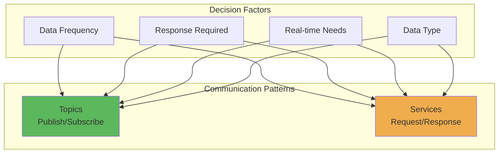
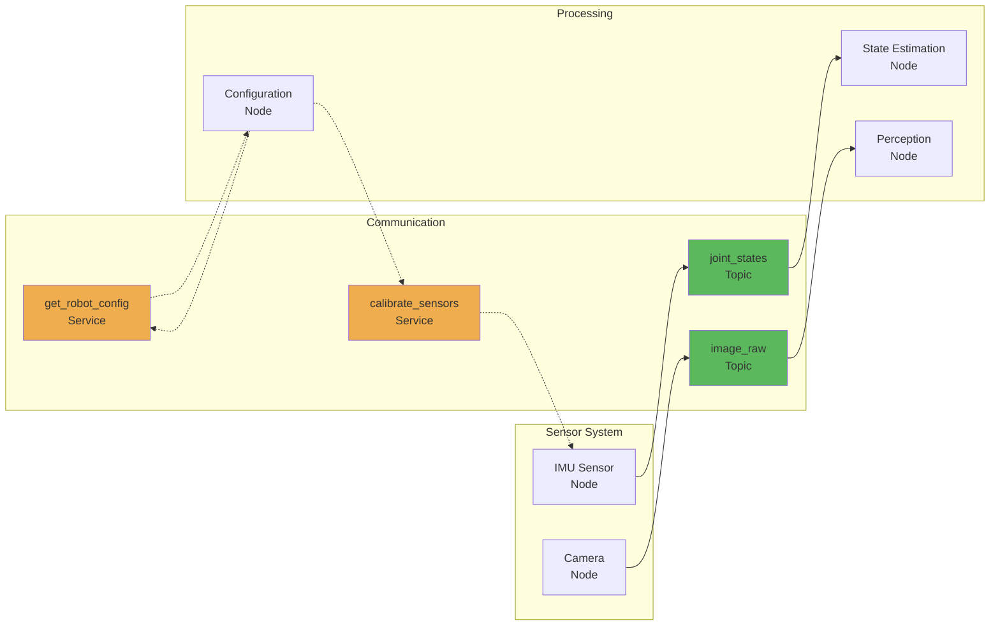

# When to Use Topics vs Services

## Learning Outcomes

By the end of this section, you will be able to:

- Compare and contrast topics and services for different robot communication needs
- Choose the appropriate communication pattern for specific scenarios
- Understand the trade-offs between topics and services
- Design effective communication architectures for robot systems

## Communication Pattern Comparison



## Topics vs Services: Key Differences

| Aspect | Topics | Services |
|--------|--------|----------|
| **Communication Type** | Asynchronous, continuous | Synchronous, transactional |
| **Data Flow** | One-way stream | Two-way exchange |
| **Coupling** | Loose coupling | Tighter coupling |
| **Latency** | Lower | Higher (due to waiting) |
| **Scalability** | High (many subscribers) | Limited (typically 1:1) |
| **Reliability** | Best effort or reliable | Guaranteed response |
| **Use Case** | Streaming data | Configuration/queries |

## When to Use Topics

### Choose Topics for:

1. **Sensor Data Streaming**
   - Camera images, LIDAR scans, IMU readings
   - Joint states, odometry data
   - Any continuous data stream

2. **Control Commands**
   - Velocity commands to base controller
   - Joint position commands
   - Motor control signals

3. **Status Updates**
   - Robot state broadcasts
   - Battery level monitoring
   - System health reports

4. **Event Notifications**
   - Obstacle detection alerts
   - Task completion notifications
   - Error condition broadcasts

### Example: Sensor Data Publishing

```python
# Publisher for sensor data (topics are ideal for streaming)
class SensorPublisher(Node):
    def __init__(self):
        super().__init__('sensor_publisher')
        self.publisher = self.create_publisher(SensorMsg, 'sensor_data', 10)
        self.timer = self.create_timer(0.1, self.publish_sensor_data)  # 10Hz

    def publish_sensor_data(self):
        msg = SensorMsg()
        # Update with current sensor values
        self.publisher.publish(msg)
```

## When to Use Services

### Choose Services for:

1. **Configuration Changes**
   - Setting robot parameters
   - Changing operational modes
   - Updating system settings

2. **Queries and Information Requests**
   - Getting current robot state
   - Requesting system information
   - Checking system status

3. **One-time Actions**
   - Calibration procedures
   - System reset commands
   - Emergency stops

4. **Operations Requiring Confirmation**
   - Critical system commands
   - Actions requiring success/failure status
   - Atomic operations

### Example: Robot State Query (Service)

```python
# Service for querying robot state (services are ideal for requests with responses)
class RobotStateService(Node):
    def __init__(self):
        super().__init__('robot_state_service')
        self.srv = self.create_service(GetRobotState, 'get_robot_state', self.handle_state_request)

    def handle_state_request(self, request, response):
        # Query actual robot state and return response
        response.state = self.get_current_robot_state()
        response.success = True
        return response
```

## Practical Decision Framework

### Use Topics When:
- Data is continuously generated (sensors, state updates)
- Multiple subscribers need the same data
- Real-time performance is critical
- Response is not required
- Data loss is acceptable (for non-critical data)

### Use Services When:
- You need a guaranteed response
- Operation is transactional (request → process → respond)
- Operation is configuration-related
- You need to ensure atomicity
- Error handling and success confirmation are important

## Hybrid Approach

Many robot systems use both patterns together:



## Common Patterns in Robot Systems

### 1. Sensor-Controller Pattern
- **Topics**: Sensor data flows to controllers continuously
- **Services**: Controllers request specific configurations when needed

### 2. Navigation System
- **Topics**: Sensor data, map updates, goal poses
- **Services**: Get robot position, set new goals, cancel navigation

### 3. Manipulation System
- **Topics**: Joint states, camera feeds, force/torque data
- **Services**: Execute grasp, plan trajectory, check collision

## Summary

The choice between topics and services depends on your specific use case:
- Use **topics** for continuous, asynchronous data flow
- Use **services** for synchronous, transactional operations
- Many robot systems effectively combine both patterns
- Consider real-time requirements, coupling needs, and scalability when making decisions