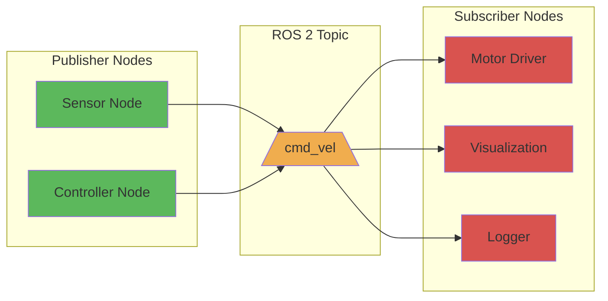

# Topics (Publish/Subscribe Model)

## Learning Outcomes

By the end of this section, you will be able to:

- Explain the publish/subscribe communication pattern in ROS 2
- Identify when to use topics for robot communication
- Create publishers and subscribers in Python
- Understand message types and their role in topic communication
- Implement topic-based communication between nodes

## Understanding the Publish/Subscribe Model

The publish/subscribe model is one of the core communication patterns in ROS 2. It enables asynchronous, decoupled communication between nodes where:

- **Publishers** send data to topics without knowing who will receive it
- **Subscribers** receive data from topics without knowing who sent it
- Multiple publishers and subscribers can exist for the same topic

This creates a flexible, scalable communication system where components can be added or removed without affecting others.

## Topic Communication Pattern



## Python Example: Publisher Node

Here's an example of creating a publisher node that sends velocity commands:

```python
import rclpy
from rclpy.node import Node
from geometry_msgs.msg import Twist

class VelocityPublisher(Node):
    def __init__(self):
        super().__init__('velocity_publisher')

        # Create a publisher for the /cmd_vel topic
        # Using Twist message type for velocity commands
        self.publisher = self.create_publisher(Twist, 'cmd_vel', 10)

        # Create a timer to publish messages at 1Hz
        self.timer = self.create_timer(1.0, self.publish_velocity)

        self.get_logger().info('Velocity publisher node started')

    def publish_velocity(self):
        # Create a Twist message
        msg = Twist()
        msg.linear.x = 0.5  # Move forward at 0.5 m/s
        msg.angular.z = 0.2 # Rotate counterclockwise at 0.2 rad/s

        # Publish the message
        self.publisher.publish(msg)
        self.get_logger().info(f'Publishing: linear.x={msg.linear.x}, angular.z={msg.angular.z}')

def main(args=None):
    rclpy.init(args=args)
    velocity_publisher = VelocityPublisher()

    try:
        rclpy.spin(velocity_publisher)
    except KeyboardInterrupt:
        pass
    finally:
        velocity_publisher.destroy_node()
        rclpy.shutdown()

if __name__ == '__main__':
    main()
```

## Python Example: Subscriber Node

Here's an example of creating a subscriber node that receives velocity commands:

```python
import rclpy
from rclpy.node import Node
from geometry_msgs.msg import Twist

class VelocitySubscriber(Node):
    def __init__(self):
        super().__init__('velocity_subscriber')

        # Create a subscriber for the /cmd_vel topic
        self.subscription = self.create_subscription(
            Twist,
            'cmd_vel',
            self.velocity_callback,
            10)  # QoS history depth

        self.subscription  # Prevent unused variable warning
        self.get_logger().info('Velocity subscriber node started')

    def velocity_callback(self, msg):
        # Process the received velocity command
        self.get_logger().info(
            f'Received velocity command: linear.x={msg.linear.x}, angular.z={msg.angular.z}'
        )

def main(args=None):
    rclpy.init(args=args)
    velocity_subscriber = VelocitySubscriber()

    try:
        rclpy.spin(velocity_subscriber)
    except KeyboardInterrupt:
        pass
    finally:
        velocity_subscriber.destroy_node()
        rclpy.shutdown()

if __name__ == '__main__':
    main()
```

## Key Characteristics of Topics

1. **Asynchronous**: Publishers and subscribers don't need to run simultaneously
2. **Decoupled**: Publishers don't know who subscribes, subscribers don't know who publishes
3. **Broadcast**: One publisher can send to multiple subscribers
4. **Data-Driven**: Communication is triggered by data availability
5. **Real-time**: Suitable for streaming data like sensor readings or control commands

## Quality of Service (QoS) in Topics

QoS settings determine how messages are handled:

- **Reliability**: Best effort vs. reliable delivery
- **Durability**: Keep for late-joining subscribers vs. only current ones
- **History**: Number of messages to keep in the queue
- **Depth**: Size of the message queue

These settings allow fine-tuning communication behavior based on the specific requirements of your robot application.