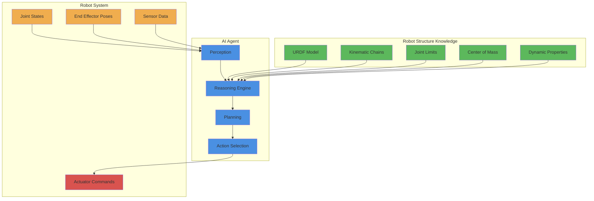

# How AI Agents Reason Over Robot Structure

## Learning Outcomes

By the end of this section, you will be able to:

- Explain how AI agents use robot structure information for decision making
- Understand the relationship between URDF models and AI reasoning
- Implement AI algorithms that consider robot kinematics and dynamics
- Design AI systems that respect robot physical constraints
- Create AI agents that plan motions based on robot structure
- Integrate robot structure knowledge into AI decision-making processes

## AI and Robot Structure Relationship

AI agents need to understand robot structure to make informed decisions. This understanding enables them to:

- Plan feasible motions within joint limits
- Consider balance and stability constraints
- Optimize for energy efficiency
- Avoid self-collisions and environmental collisions
- Coordinate multiple limbs effectively

### Conceptual Framework



## AI Reasoning with Kinematic Constraints

### Forward Kinematics Reasoning

AI agents use forward kinematics to understand where end effectors will be based on joint angles:

```python
import rclpy
from rclpy.node import Node
from sensor_msgs.msg import JointState
from geometry_msgs.msg import PoseStamped
import numpy as np
import math

class KinematicReasoningAgent(Node):
    def __init__(self):
        super().__init__('kinematic_reasoning_agent')

        # Subscribe to joint states
        self.joint_subscriber = self.create_subscription(
            JointState, 'joint_states', self.joint_callback, 10
        )

        # Publisher for calculated end effector poses
        self.pose_publisher = self.create_publisher(
            PoseStamped, 'end_effector_pose', 10
        )

        # Store current joint positions
        self.current_joints = {}

        # Simple 2-link arm parameters (for demonstration)
        self.link_lengths = [0.3, 0.25]  # meters

        self.get_logger().info('Kinematic Reasoning Agent initialized')

    def joint_callback(self, msg):
        """Update current joint positions"""
        for i, name in enumerate(msg.name):
            if i < len(msg.position):
                self.current_joints[name] = msg.position[i]

    def forward_kinematics_2d(self, joint1_angle, joint2_angle):
        """Calculate end effector position for 2D planar arm"""
        l1, l2 = self.link_lengths

        # Calculate position of first joint
        x1 = l1 * math.cos(joint1_angle)
        y1 = l1 * math.sin(joint1_angle)

        # Calculate position of end effector
        x2 = x1 + l2 * math.cos(joint1_angle + joint2_angle)
        y2 = y1 + l2 * math.sin(joint1_angle + joint2_angle)

        return x2, y2

    def calculate_end_effector_pose(self):
        """Calculate current end effector pose based on joint angles"""
        try:
            # Get relevant joint angles (example names)
            shoulder_angle = self.current_joints.get('left_shoulder_joint', 0.0)
            elbow_angle = self.current_joints.get('left_elbow_joint', 0.0)

            # Calculate end effector position
            x, y = self.forward_kinematics_2d(shoulder_angle, elbow_angle)

            # Create pose message
            pose_msg = PoseStamped()
            pose_msg.header.stamp = self.get_clock().now().to_msg()
            pose_msg.header.frame_id = 'base_link'
            pose_msg.pose.position.x = x
            pose_msg.pose.position.y = y
            pose_msg.pose.position.z = 0.0  # Simplified 2D

            return pose_msg
        except Exception as e:
            self.get_logger().error(f'Error in forward kinematics: {e}')
            return None

    def ai_reasoning_step(self):
        """Main AI reasoning step"""
        try:
            # Calculate current end effector pose
            pose_msg = self.calculate_end_effector_pose()
            if pose_msg:
                # Publish the calculated pose
                self.pose_publisher.publish(pose_msg)

                # AI reasoning based on current pose
                self.perform_reasoning(pose_msg.pose)
        except Exception as e:
            self.get_logger().error(f'Error in AI reasoning: {e}')

    def perform_reasoning(self, current_pose):
        """AI reasoning based on current robot state"""
        # Example reasoning: Check if end effector is in safe workspace
        workspace_limit = 0.7  # meters
        distance_from_base = math.sqrt(
            current_pose.position.x**2 + current_pose.position.y**2
        )

        if distance_from_base > workspace_limit:
            self.get_logger().warn('End effector outside safe workspace!')
        else:
            self.get_logger().info(f'End effector position: ({current_pose.position.x:.2f}, {current_pose.position.y:.2f})')

def main(args=None):
    rclpy.init(args=args)
    agent = KinematicReasoningAgent()

    # Timer for AI reasoning loop
    agent.reasoning_timer = agent.create_timer(0.1, agent.ai_reasoning_step)

    try:
        rclpy.spin(agent)
    except KeyboardInterrupt:
        agent.get_logger().info('Kinematic reasoning agent stopped')
    finally:
        agent.destroy_node()
        rclpy.shutdown()

if __name__ == '__main__':
    main()
```

### Inverse Kinematics Reasoning

AI agents use inverse kinematics to determine joint angles needed for desired end effector positions:

```python
import rclpy
from rclpy.node import Node
from std_msgs.msg import Float64MultiArray
from geometry_msgs.msg import Point
import math

class InverseKinematicsAgent(Node):
    def __init__(self):
        super().__init__('inverse_kinematics_agent')

        # Publisher for joint commands
        self.joint_publisher = self.create_publisher(
            Float64MultiArray, 'joint_group_position_controller/commands', 10
        )

        # Subscriber for target positions
        self.target_subscriber = self.create_subscription(
            Point, 'target_position', self.target_callback, 10
        )

        # Store target position
        self.target_position = Point()
        self.target_reached = False

        # Robot arm parameters
        self.link_lengths = [0.3, 0.25]  # meters

        self.get_logger().info('Inverse Kinematics Agent initialized')

    def target_callback(self, msg):
        """Update target position"""
        self.target_position = msg
        self.target_reached = False
        self.get_logger().info(f'New target: ({msg.x}, {msg.y})')

    def inverse_kinematics_2d(self, x, y):
        """Calculate joint angles for 2D planar arm to reach (x, y)"""
        l1, l2 = self.link_lengths

        # Calculate distance from base to target
        r = math.sqrt(x*x + y*y)

        # Check if target is reachable
        if r > l1 + l2:
            self.get_logger().warn('Target out of reach, scaling to reach')
            x = x * (l1 + l2) / r
            y = y * (l1 + l2) / r
            r = math.sqrt(x*x + y*y)

        if r < abs(l1 - l2):
            self.get_logger().warn('Target too close, moving to closest reachable point')
            x = x * abs(l1 - l2) / r
            y = y * abs(l1 - l2) / r
            r = abs(l1 - l2)

        # Calculate second joint angle
        cos_angle2 = (x*x + y*y - l1*l1 - l2*l2) / (2 * l1 * l2)
        angle2 = math.acos(max(-1, min(1, cos_angle2)))  # Clamp to valid range

        # Calculate first joint angle
        k1 = l1 + l2 * math.cos(angle2)
        k2 = l2 * math.sin(angle2)
        angle1 = math.atan2(y, x) - math.atan2(k2, k1)

        return angle1, angle2

    def calculate_joint_commands(self):
        """Calculate joint commands to reach target position"""
        try:
            target_x = self.target_position.x
            target_y = self.target_position.y

            # Calculate required joint angles
            joint1_angle, joint2_angle = self.inverse_kinematics_2d(target_x, target_y)

            # Create joint command message
            command_msg = Float64MultiArray()
            command_msg.data = [joint1_angle, joint2_angle, 0.0]  # 3 joints example

            return command_msg
        except Exception as e:
            self.get_logger().error(f'Error in inverse kinematics: {e}')
            return None

    def ai_control_loop(self):
        """AI control loop for reaching targets"""
        try:
            command_msg = self.calculate_joint_commands()
            if command_msg:
                self.joint_publisher.publish(command_msg)

                # Check if target is reached (simplified)
                current_pos = self.estimate_current_position(command_msg.data[0], command_msg.data[1])
                target_dist = math.sqrt(
                    (current_pos[0] - self.target_position.x)**2 +
                    (current_pos[1] - self.target_position.y)**2
                )

                if target_dist < 0.01:  # 1cm tolerance
                    if not self.target_reached:
                        self.get_logger().info('Target reached!')
                        self.target_reached = True
        except Exception as e:
            self.get_logger().error(f'Error in control loop: {e}')

    def estimate_current_position(self, joint1, joint2):
        """Estimate current end effector position"""
        l1, l2 = self.link_lengths
        x1 = l1 * math.cos(joint1)
        y1 = l1 * math.sin(joint1)
        x2 = x1 + l2 * math.cos(joint1 + joint2)
        y2 = y1 + l2 * math.sin(joint1 + joint2)
        return (x2, y2)

def main(args=None):
    rclpy.init(args=args)
    agent = InverseKinematicsAgent()

    # Timer for control loop
    agent.control_timer = agent.create_timer(0.05, agent.ai_control_loop)

    try:
        rclpy.spin(agent)
    except KeyboardInterrupt:
        agent.get_logger().info('Inverse kinematics agent stopped')
    finally:
        agent.destroy_node()
        rclpy.shutdown()

if __name__ == '__main__':
    main()
```

## Balance and Stability Reasoning

AI agents must consider robot balance, especially for humanoid robots:

```python
import rclpy
from rclpy.node import Node
from sensor_msgs.msg import JointState, Imu
from std_msgs.msg import Bool
import numpy as np

class BalanceReasoningAgent(Node):
    def __init__(self):
        super().__init__('balance_reasoning_agent')

        # Subscribe to joint states and IMU
        self.joint_subscriber = self.create_subscription(
            JointState, 'joint_states', self.joint_callback, 10
        )
        self.imu_subscriber = self.create_subscription(
            Imu, 'imu/data', self.imu_callback, 10
        )

        # Publisher for balance status
        self.balance_publisher = self.create_publisher(Bool, 'balance_status', 10)

        # Robot parameters (simplified)
        self.robot_height = 1.0  # meters
        self.base_width = 0.2    # meters (foot width)

        # State variables
        self.current_joints = {}
        self.current_orientation = [0.0, 0.0, 0.0, 1.0]  # x, y, z, w
        self.balance_threshold = 15.0  # degrees

        self.get_logger().info('Balance Reasoning Agent initialized')

    def joint_callback(self, msg):
        """Update current joint positions"""
        for i, name in enumerate(msg.name):
            if i < len(msg.position):
                self.current_joints[name] = msg.position[i]

    def imu_callback(self, msg):
        """Update current orientation from IMU"""
        self.current_orientation = [
            msg.orientation.x,
            msg.orientation.y,
            msg.orientation.z,
            msg.orientation.w
        ]

    def quaternion_to_euler(self, x, y, z, w):
        """Convert quaternion to Euler angles (roll, pitch, yaw)"""
        # Roll (x-axis rotation)
        sinr_cosp = 2 * (w * x + y * z)
        cosr_cosp = 1 - 2 * (x * x + y * y)
        roll = math.atan2(sinr_cosp, cosr_cosp)

        # Pitch (y-axis rotation)
        sinp = 2 * (w * y - z * x)
        if abs(sinp) >= 1:
            pitch = math.copysign(math.pi / 2, sinp)
        else:
            pitch = math.asin(sinp)

        # Yaw (z-axis rotation)
        siny_cosp = 2 * (w * z + x * y)
        cosy_cosp = 1 - 2 * (y * y + z * z)
        yaw = math.atan2(siny_cosp, cosy_cosp)

        return roll, pitch, yaw

    def calculate_balance_metrics(self):
        """Calculate various balance metrics"""
        # Get orientation from IMU
        roll, pitch, yaw = self.quaternion_to_euler(*self.current_orientation)

        # Convert to degrees
        roll_deg = math.degrees(roll)
        pitch_deg = math.degrees(pitch)

        # Calculate center of mass estimate (simplified)
        # In a real system, this would use full URDF and joint positions
        com_offset = self.estimate_com_offset()

        # Balance metrics
        tilt_angle = math.sqrt(roll_deg**2 + pitch_deg**2)
        stability = self.calculate_stability_score(roll_deg, pitch_deg, com_offset)

        return {
            'tilt_angle': tilt_angle,
            'roll_angle': roll_deg,
            'pitch_angle': pitch_deg,
            'com_offset': com_offset,
            'stability_score': stability
        }

    def estimate_com_offset(self):
        """Estimate center of mass offset (simplified)"""
        # This would be more complex in a real system
        # considering all link positions and masses
        com_x = 0.0
        com_y = 0.0
        com_z = self.robot_height / 2.0  # Simplified COM height

        # Consider joint positions for COM offset
        for joint_name, position in self.current_joints.items():
            if 'arm' in joint_name:
                # Arms affect COM position
                if 'left' in joint_name:
                    com_x += 0.1 * math.sin(position)  # Simplified
                elif 'right' in joint_name:
                    com_x -= 0.1 * math.sin(position)

        return math.sqrt(com_x**2 + com_y**2)

    def calculate_stability_score(self, roll, pitch, com_offset):
        """Calculate a stability score (0-1, where 1 is most stable)"""
        # Higher tilt angles reduce stability
        tilt_penalty = min(math.sqrt(roll**2 + pitch**2) / self.balance_threshold, 1.0)

        # Higher COM offset reduces stability
        com_penalty = min(com_offset / (self.base_width/2), 1.0)

        # Stability score (inverted penalties)
        stability = max(0.0, 1.0 - (tilt_penalty + com_penalty) / 2)
        return stability

    def ai_balance_reasoning(self):
        """Main AI balance reasoning function"""
        try:
            # Calculate balance metrics
            metrics = self.calculate_balance_metrics()

            # Determine if robot is in safe balance state
            is_balanced = metrics['stability_score'] > 0.3  # 30% stability threshold

            # Create balance status message
            balance_msg = Bool()
            balance_msg.data = is_balanced

            # Publish balance status
            self.balance_publisher.publish(balance_msg)

            # Log balance information
            self.get_logger().info(
                f'Balance: tilt={metrics["tilt_angle"]:.2f}°, '
                f'stability={metrics["stability_score"]:.2f}, '
                f'balanced={is_balanced}'
            )

            # AI decision making based on balance
            if not is_balanced:
                self.get_logger().warn('Robot is unbalanced! Taking corrective action...')
                self.take_balance_corrective_action()

        except Exception as e:
            self.get_logger().error(f'Error in balance reasoning: {e}')

    def take_balance_corrective_action(self):
        """Take action to improve robot balance"""
        # In a real system, this would send commands to balance controllers
        self.get_logger().info('Balance corrective action: Adjusting stance...')

def main(args=None):
    rclpy.init(args=args)
    agent = BalanceReasoningAgent()

    # Timer for balance reasoning loop
    agent.balance_timer = agent.create_timer(0.1, agent.ai_balance_reasoning)

    try:
        rclpy.spin(agent)
    except KeyboardInterrupt:
        agent.get_logger().info('Balance reasoning agent stopped')
    finally:
        agent.destroy_node()
        rclpy.shutdown()

if __name__ == '__main__':
    main()
```

## AI Motion Planning with Structure Awareness

AI agents plan motions that respect the robot's structure:

```python
import rclpy
from rclpy.node import Node
from std_msgs.msg import Float64MultiArray
from geometry_msgs.msg import Point
import math

class StructureAwareMotionPlanner(Node):
    def __init__(self):
        super().__init__('structure_aware_motion_planner')

        # Publisher for planned trajectories
        self.trajectory_publisher = self.create_publisher(
            Float64MultiArray, 'planned_trajectory', 10
        )

        # Robot structure parameters
        self.link_lengths = [0.3, 0.25]  # 2-link arm
        self.joint_limits = [(-1.57, 1.57), (-1.57, 1.57)]  # radians

        # Planning parameters
        self.step_size = 0.05  # meters
        self.time_step = 0.1   # seconds

        self.get_logger().info('Structure-Aware Motion Planner initialized')

    def plan_reachable_trajectory(self, start_pos, end_pos):
        """Plan a trajectory that stays within robot reachability"""
        try:
            # Calculate distance between start and end
            distance = math.sqrt(
                (end_pos.x - start_pos.x)**2 +
                (end_pos.y - start_pos.y)**2
            )

            # Calculate number of steps
            num_steps = int(distance / self.step_size) + 1
            if num_steps < 2:
                num_steps = 2

            trajectory = []

            # Generate intermediate points
            for i in range(num_steps + 1):
                t = i / num_steps  # interpolation parameter

                # Linear interpolation between start and end
                x = start_pos.x + t * (end_pos.x - start_pos.x)
                y = start_pos.y + t * (end_pos.y - start_pos.y)

                # Check if point is reachable
                if self.is_reachable(x, y):
                    # Convert to joint angles
                    joint_angles = self.inverse_kinematics_2d(x, y)

                    if joint_angles and self.are_joints_valid(joint_angles):
                        trajectory.append(joint_angles)
                    else:
                        self.get_logger().warn(f'IK solution invalid for point ({x:.2f}, {y:.2f})')
                else:
                    self.get_logger().warn(f'Point ({x:.2f}, {y:.2f}) not reachable')
                    # Could implement path around workspace here
                    break

            return trajectory
        except Exception as e:
            self.get_logger().error(f'Error in trajectory planning: {e}')
            return []

    def is_reachable(self, x, y):
        """Check if point (x, y) is reachable by robot arm"""
        l1, l2 = self.link_lengths
        distance = math.sqrt(x*x + y*y)

        # Check if within reachable range
        min_reach = abs(l1 - l2)
        max_reach = l1 + l2

        return min_reach <= distance <= max_reach

    def inverse_kinematics_2d(self, x, y):
        """Calculate joint angles for 2D planar arm to reach (x, y)"""
        l1, l2 = self.link_lengths

        # Calculate distance from base to target
        r = math.sqrt(x*x + y*y)

        # Check if target is reachable
        if r > l1 + l2:
            return None  # Not reachable
        if r < abs(l1 - l2):
            return None  # Too close

        # Calculate second joint angle
        cos_angle2 = (x*x + y*y - l1*l1 - l2*l2) / (2 * l1 * l2)
        angle2 = math.acos(max(-1, min(1, cos_angle2)))

        # Calculate first joint angle
        k1 = l1 + l2 * math.cos(angle2)
        k2 = l2 * math.sin(angle2)
        angle1 = math.atan2(y, x) - math.atan2(k2, k1)

        return (angle1, angle2)

    def are_joints_valid(self, joint_angles):
        """Check if joint angles are within limits"""
        for i, angle in enumerate(joint_angles):
            lower, upper = self.joint_limits[i]
            if not (lower <= angle <= upper):
                return False
        return True

    def execute_trajectory(self, trajectory):
        """Execute the planned trajectory"""
        try:
            for i, joint_angles in enumerate(trajectory):
                # Create command message
                command_msg = Float64MultiArray()
                command_msg.data = list(joint_angles) + [0.0]  # Add placeholder for 3rd joint

                # Publish command
                self.trajectory_publisher.publish(command_msg)

                self.get_logger().info(f'Executing trajectory step {i+1}/{len(trajectory)}: {joint_angles}')

                # In a real system, you'd wait for execution or use action servers
                # For simulation, we'll just continue to next point

        except Exception as e:
            self.get_logger().error(f'Error executing trajectory: {e}')

    def plan_and_execute_motion(self, start_pos, end_pos):
        """Plan and execute motion from start to end position"""
        self.get_logger().info(f'Planning motion from ({start_pos.x}, {start_pos.y}) to ({end_pos.x}, {end_pos.y})')

        # Plan trajectory
        trajectory = self.plan_reachable_trajectory(start_pos, end_pos)

        if trajectory:
            self.get_logger().info(f'Planned trajectory with {len(trajectory)} points')
            self.execute_trajectory(trajectory)
        else:
            self.get_logger().error('Failed to plan trajectory')

def main(args=None):
    rclpy.init(args=args)
    planner = StructureAwareMotionPlanner()

    # Example: Plan motion from one point to another
    start = Point()
    start.x = 0.3
    start.y = 0.0
    start.z = 0.0

    end = Point()
    end.x = 0.4
    end.y = 0.3
    end.z = 0.0

    # Plan and execute motion (in a real system, this would be triggered by a service call)
    planner.plan_and_execute_motion(start, end)

    try:
        rclpy.spin(planner)
    except KeyboardInterrupt:
        planner.get_logger().info('Motion planner stopped')
    finally:
        planner.destroy_node()
        rclpy.shutdown()

if __name__ == '__main__':
    main()
```

## Integration with ROS 2 Ecosystem

AI agents integrate with the broader ROS 2 ecosystem to access robot structure information:

```python
import rclpy
from rclpy.node import Node
from tf2_ros import TransformListener, Buffer
from sensor_msgs.msg import JointState
from visualization_msgs.msg import MarkerArray
import tf_transformations

class IntegratedStructureReasoningAgent(Node):
    def __init__(self):
        super().__init__('integrated_structure_reasoning_agent')

        # Initialize TF2 listener
        self.tf_buffer = Buffer()
        self.tf_listener = TransformListener(self.tf_buffer, self)

        # Subscribe to joint states
        self.joint_subscriber = self.create_subscription(
            JointState, 'joint_states', self.joint_callback, 10
        )

        # Publisher for visualization markers
        self.marker_publisher = self.create_publisher(
            MarkerArray, 'structure_markers', 10
        )

        # Store joint information
        self.joint_positions = {}
        self.joint_names = []

        self.get_logger().info('Integrated Structure Reasoning Agent initialized')

    def joint_callback(self, msg):
        """Update joint information from joint states"""
        for i, name in enumerate(msg.name):
            if i < len(msg.position):
                self.joint_positions[name] = msg.position[i]

        # Update joint names list
        self.joint_names = msg.name

    def get_link_transform(self, target_frame, source_frame='base_link'):
        """Get transform between two frames"""
        try:
            transform = self.tf_buffer.lookup_transform(
                source_frame, target_frame, rclpy.time.Time()
            )
            return transform
        except Exception as e:
            self.get_logger().warn(f'Could not get transform {source_frame} to {target_frame}: {e}')
            return None

    def ai_reasoning_with_structure(self):
        """AI reasoning that incorporates structure information"""
        try:
            # Get transforms for all relevant links
            relevant_links = ['torso', 'head', 'left_hand', 'right_hand', 'left_foot', 'right_foot']

            link_positions = {}
            for link in relevant_links:
                transform = self.get_link_transform(link)
                if transform:
                    pos = transform.transform.translation
                    link_positions[link] = (pos.x, pos.y, pos.z)

            # Perform AI reasoning based on structure
            self.analyze_structure_configuration(link_positions)

        except Exception as e:
            self.get_logger().error(f'Error in structure reasoning: {e}')

    def analyze_structure_configuration(self, link_positions):
        """Analyze robot structure configuration"""
        if 'left_hand' in link_positions and 'right_hand' in link_positions:
            left_pos = link_positions['left_hand']
            right_pos = link_positions['right_hand']

            # Calculate distance between hands
            distance = math.sqrt(
                (left_pos[0] - right_pos[0])**2 +
                (left_pos[1] - right_pos[1])**2 +
                (left_pos[2] - right_pos[2])**2
            )

            self.get_logger().info(f'Distance between hands: {distance:.2f}m')

    def create_structure_markers(self):
        """Create visualization markers for robot structure"""
        marker_array = MarkerArray()

        # Create markers for joints
        for i, joint_name in enumerate(self.joint_names):
            if joint_name in self.joint_positions:
                marker = self.create_joint_marker(joint_name, i)
                if marker:
                    marker_array.markers.append(marker)

        return marker_array

    def create_joint_marker(self, joint_name, id_num):
        """Create a marker for a specific joint"""
        # This would create a visualization marker for the joint
        # In practice, this would use the URDF to determine proper positions
        pass

def main(args=None):
    rclpy.init(args=args)
    agent = IntegratedStructureReasoningAgent()

    # Timer for reasoning loop
    agent.reasoning_timer = agent.create_timer(0.5, agent.ai_reasoning_with_structure)

    try:
        rclpy.spin(agent)
    except KeyboardInterrupt:
        agent.get_logger().info('Integrated reasoning agent stopped')
    finally:
        agent.destroy_node()
        rclpy.shutdown()

if __name__ == '__main__':
    main()
```

## Best Practices for AI Structure Reasoning

1. **Model Accuracy**: Use accurate URDF models that reflect real robot properties
2. **Real-time Constraints**: Optimize algorithms for real-time performance
3. **Safety First**: Always consider safety constraints in reasoning
4. **Validation**: Validate reasoning results against physical constraints
5. **Modularity**: Separate structure reasoning from other AI components
6. **Error Handling**: Robust error handling for edge cases
7. **Testing**: Thoroughly test with various robot configurations

AI agents that effectively reason over robot structure can make more informed decisions, leading to safer and more efficient robot operation.