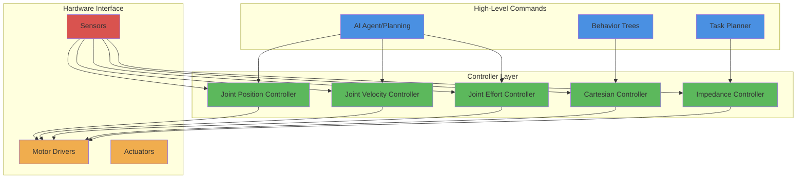
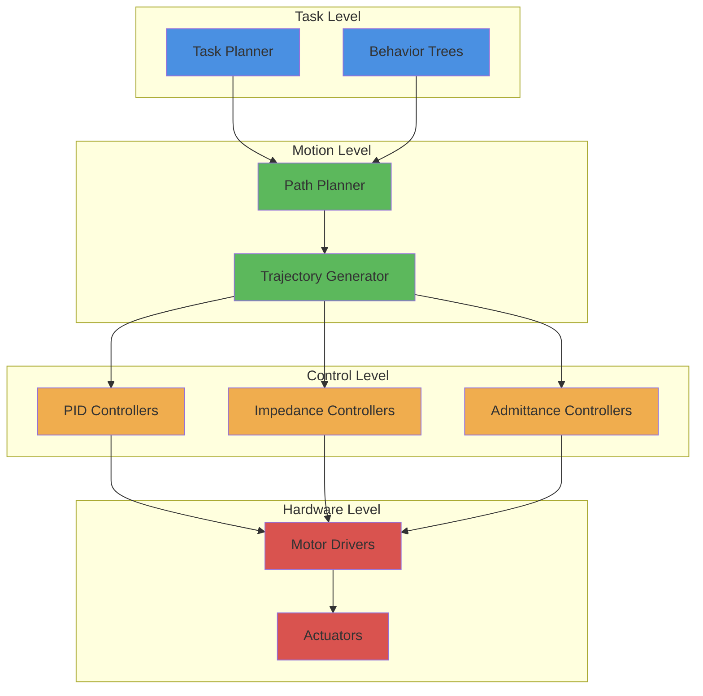

# Concept of Controllers and Actuator Interfaces

## Learning Outcomes

By the end of this section, you will be able to:

- Define robot controllers and their role in the system architecture
- Explain different types of controllers used in robotics
- Understand actuator interfaces and their communication protocols
- Identify the relationship between controllers and robot hardware
- Implement basic controller interfaces in ROS 2
- Understand the control hierarchy in robot systems

## Understanding Robot Controllers

Robot controllers are software components that translate high-level commands into low-level actuator commands. They form the bridge between abstract robot behaviors and physical robot motion, managing the complex dynamics and constraints of robotic systems.

### Controller Architecture



## Types of Robot Controllers

### 1. Joint-Level Controllers

#### Position Controllers
Control the position of individual joints:

```python
import rclpy
from rclpy.node import Node
from std_msgs.msg import Float64MultiArray
from sensor_msgs.msg import JointState
import math

class JointPositionController(Node):
    def __init__(self):
        super().__init__('joint_position_controller')

        # Publisher for joint position commands
        self.position_publisher = self.create_publisher(
            Float64MultiArray,
            'position_controller/commands',
            10
        )

        # Subscriber for current joint states
        self.state_subscriber = self.create_subscription(
            JointState,
            'joint_states',
            self.state_callback,
            10
        )

        # Timer for control loop
        self.control_timer = self.create_timer(0.01, self.control_loop)  # 100Hz

        # Controller parameters
        self.kp = 10.0  # Proportional gain
        self.kd = 1.0   # Derivative gain

        # Target positions
        self.target_positions = [0.0, 0.0, 0.0]  # Example: 3 joints
        self.current_positions = [0.0, 0.0, 0.0]
        self.current_velocities = [0.0, 0.0, 0.0]

        self.get_logger().info('Joint Position Controller initialized')

    def state_callback(self, msg):
        """Update current joint states"""
        for i, name in enumerate(msg.name):
            if i < len(msg.position) and i < len(self.current_positions):
                self.current_positions[i] = msg.position[i]
            if i < len(msg.velocity) and i < len(self.current_velocities):
                self.current_velocities[i] = msg.velocity[i]

    def control_loop(self):
        """PID control loop for joint positions"""
        command_msg = Float64MultiArray()

        # Calculate control commands using PID
        commands = []
        for i in range(len(self.target_positions)):
            error = self.target_positions[i] - self.current_positions[i]
            derivative = -self.current_velocities[i]  # Negative because we want to reduce error
            command = self.kp * error + self.kd * derivative
            commands.append(command)

        command_msg.data = commands
        self.position_publisher.publish(command_msg)

    def set_target_positions(self, positions):
        """Set new target positions"""
        self.target_positions = positions
        self.get_logger().info(f'Set target positions: {positions}')

def main(args=None):
    rclpy.init(args=args)
    controller = JointPositionController()

    # Example: Set some target positions
    controller.set_target_positions([0.5, 1.0, -0.5])

    try:
        rclpy.spin(controller)
    except KeyboardInterrupt:
        controller.get_logger().info('Controller stopped by user')
    finally:
        controller.destroy_node()
        rclpy.shutdown()

if __name__ == '__main__':
    main()
```

#### Velocity Controllers
Control the velocity of joints:

```python
import rclpy
from rclpy.node import Node
from std_msgs.msg import Float64MultiArray
from sensor_msgs.msg import JointState

class JointVelocityController(Node):
    def __init__(self):
        super().__init__('joint_velocity_controller')

        # Publisher for velocity commands
        self.velocity_publisher = self.create_publisher(
            Float64MultiArray,
            'velocity_controller/commands',
            10
        )

        # Subscriber for current states
        self.state_subscriber = self.create_subscription(
            JointState,
            'joint_states',
            self.state_callback,
            10
        )

        # Control timer
        self.control_timer = self.create_timer(0.02, self.control_loop)  # 50Hz

        # Control parameters
        self.target_velocities = [0.0, 0.0, 0.0]
        self.current_velocities = [0.0, 0.0, 0.0]

        self.get_logger().info('Joint Velocity Controller initialized')

    def state_callback(self, msg):
        """Update current joint velocities"""
        for i, name in enumerate(msg.name):
            if i < len(msg.velocity) and i < len(self.current_velocities):
                self.current_velocities[i] = msg.velocity[i]

    def control_loop(self):
        """Publish velocity commands"""
        command_msg = Float64MultiArray()
        command_msg.data = self.target_velocities
        self.velocity_publisher.publish(command_msg)

    def set_target_velocities(self, velocities):
        """Set new target velocities"""
        self.target_velocities = velocities
        self.get_logger().info(f'Set target velocities: {velocities}')

def main(args=None):
    rclpy.init(args=args)
    controller = JointVelocityController()

    # Example: Set some target velocities
    controller.set_target_velocities([0.1, 0.2, -0.1])

    try:
        rclpy.spin(controller)
    except KeyboardInterrupt:
        controller.get_logger().info('Velocity controller stopped')
    finally:
        controller.destroy_node()
        rclpy.shutdown()

if __name__ == '__main__':
    main()
```

#### Effort/Torque Controllers
Control the force/torque applied to joints:

```python
import rclpy
from rclpy.node import Node
from std_msgs.msg import Float64MultiArray
from sensor_msgs.msg import JointState

class JointEffortController(Node):
    def __init__(self):
        super().__init__('joint_effort_controller')

        # Publisher for effort commands
        self.effort_publisher = self.create_publisher(
            Float64MultiArray,
            'effort_controller/commands',
            10
        )

        # Subscriber for current states
        self.state_subscriber = self.create_subscription(
            JointState,
            'joint_states',
            self.state_callback,
            10
        )

        # Control timer
        self.control_timer = self.create_timer(0.001, self.control_loop)  # 1kHz for torque control

        # Control parameters
        self.target_efforts = [0.0, 0.0, 0.0]
        self.current_positions = [0.0, 0.0, 0.0]
        self.current_velocities = [0.0, 0.0, 0.0]

        self.get_logger().info('Joint Effort Controller initialized')

    def state_callback(self, msg):
        """Update current joint states"""
        for i, name in enumerate(msg.name):
            if i < len(msg.position) and i < len(self.current_positions):
                self.current_positions[i] = msg.position[i]
            if i < len(msg.velocity) and i < len(self.current_velocities):
                self.current_velocities[i] = msg.velocity[i]

    def control_loop(self):
        """Publish effort commands"""
        command_msg = Float64MultiArray()
        command_msg.data = self.target_efforts
        self.effort_publisher.publish(command_msg)

    def set_target_efforts(self, efforts):
        """Set new target efforts with safety limits"""
        # Apply safety limits
        limited_efforts = []
        max_effort = 10.0  # Nm or N
        for effort in efforts:
            limited_efforts.append(max(min(effort, max_effort), -max_effort))

        self.target_efforts = limited_efforts
        self.get_logger().info(f'Set target efforts: {limited_efforts}')

def main(args=None):
    rclpy.init(args=args)
    controller = JointEffortController()

    # Example: Set some target efforts
    controller.set_target_efforts([1.0, 2.0, -1.5])

    try:
        rclpy.spin(controller)
    except KeyboardInterrupt:
        controller.get_logger().info('Effort controller stopped')
    finally:
        controller.destroy_node()
        rclpy.shutdown()

if __name__ == '__main__':
    main()
```

### 2. Cartesian Controllers

Control end-effector position and orientation in Cartesian space:

```python
import rclpy
from rclpy.node import Node
from geometry_msgs.msg import Pose
from std_msgs.msg import Float64MultiArray
import numpy as np
import math

class CartesianController(Node):
    def __init__(self):
        super().__init__('cartesian_controller')

        # Publisher for joint commands (after inverse kinematics)
        self.joint_publisher = self.create_publisher(
            Float64MultiArray,
            'joint_group_position_controller/commands',
            10
        )

        # Subscriber for desired Cartesian pose
        self.pose_subscriber = self.create_subscription(
            Pose,
            'target_pose',
            self.pose_callback,
            10
        )

        # Control timer
        self.control_timer = self.create_timer(0.02, self.control_loop)

        # Target and current poses
        self.target_pose = Pose()
        self.current_pose = Pose()

        # Simple inverse kinematics parameters (for example)
        self.arm_length = 0.5  # meters

        self.get_logger().info('Cartesian Controller initialized')

    def pose_callback(self, msg):
        """Update target Cartesian pose"""
        self.target_pose = msg
        self.get_logger().info(f'Received target pose: ({msg.position.x}, {msg.position.y}, {msg.position.z})')

    def inverse_kinematics(self, target_pose):
        """Simple 2D inverse kinematics example"""
        # Simplified 2D IK for a 2-DOF arm
        x = target_pose.position.x
        y = target_pose.position.y

        # Calculate distance from base
        r = math.sqrt(x*x + y*y)

        # Check if target is reachable
        if r > 2 * self.arm_length:
            self.get_logger().warn('Target out of reach, scaling down')
            x = x * (2 * self.arm_length) / r
            y = y * (2 * self.arm_length) / r
            r = 2 * self.arm_length

        # Inverse kinematics calculations
        cos_angle2 = (x*x + y*y - self.arm_length*self.arm_length - self.arm_length*self.arm_length) / (2 * self.arm_length * self.arm_length)
        angle2 = math.acos(max(-1, min(1, cos_angle2)))  # Clamp to valid range

        k1 = self.arm_length + self.arm_length * math.cos(angle2)
        k2 = self.arm_length * math.sin(angle2)
        angle1 = math.atan2(y, x) - math.atan2(k2, k1)

        return [angle1, angle2, 0.0]  # Return joint angles

    def control_loop(self):
        """Main control loop"""
        try:
            # Calculate joint commands from Cartesian target
            joint_commands = self.inverse_kinematics(self.target_pose)

            # Publish joint commands
            command_msg = Float64MultiArray()
            command_msg.data = joint_commands
            self.joint_publisher.publish(command_msg)

            self.get_logger().info(f'Published joint commands: {joint_commands}')
        except Exception as e:
            self.get_logger().error(f'Error in control loop: {e}')

def main(args=None):
    rclpy.init(args=args)
    controller = CartesianController()

    try:
        rclpy.spin(controller)
    except KeyboardInterrupt:
        controller.get_logger().info('Cartesian controller stopped')
    finally:
        controller.destroy_node()
        rclpy.shutdown()

if __name__ == '__main__':
    main()
```

## Actuator Interfaces

Actuator interfaces handle the communication between controllers and physical hardware:

```python
import rclpy
from rclpy.node import Node
from std_msgs.msg import Float64MultiArray
from sensor_msgs.msg import JointState
import time

class ActuatorInterface(Node):
    def __init__(self):
        super().__init__('actuator_interface')

        # Subscriber for controller commands
        self.command_subscriber = self.create_subscription(
            Float64MultiArray,
            'controller_commands',
            self.command_callback,
            10
        )

        # Publisher for hardware status
        self.status_publisher = self.create_publisher(JointState, 'hardware_status', 10)

        # Simulate hardware interface
        self.joint_names = ['joint1', 'joint2', 'joint3']
        self.current_positions = [0.0, 0.0, 0.0]
        self.current_velocities = [0.0, 0.0, 0.0]
        self.current_efforts = [0.0, 0.0, 0.0]

        # Control timer
        self.hardware_timer = self.create_timer(0.001, self.hardware_update)  # 1kHz

        self.get_logger().info('Actuator Interface initialized')

    def command_callback(self, msg):
        """Process commands from controllers"""
        # In a real implementation, this would send commands to actual hardware
        # For simulation, we'll update our internal state
        if len(msg.data) == len(self.current_positions):
            target_positions = list(msg.data)

            # Simulate hardware response (first-order system)
            dt = 0.001  # 1kHz timer
            for i in range(len(self.current_positions)):
                # Simple first-order response
                error = target_positions[i] - self.current_positions[i]
                self.current_positions[i] += 10.0 * error * dt  # 10 rad/s response
                self.current_velocities[i] = 10.0 * error
                self.current_efforts[i] = 100.0 * error  # Simulated effort

            self.get_logger().info(f'Hardware updated: {self.current_positions}')

    def hardware_update(self):
        """Simulate hardware state update"""
        # In a real system, this would read from actual hardware
        # For simulation, we'll just publish current state
        status_msg = JointState()
        status_msg.header.stamp = self.get_clock().now().to_msg()
        status_msg.name = self.joint_names
        status_msg.position = self.current_positions
        status_msg.velocity = self.current_velocities
        status_msg.effort = self.current_efforts

        self.status_publisher.publish(status_msg)

def main(args=None):
    rclpy.init(args=args)
    interface = ActuatorInterface()

    try:
        rclpy.spin(interface)
    except KeyboardInterrupt:
        interface.get_logger().info('Actuator interface stopped')
    finally:
        interface.destroy_node()
        rclpy.shutdown()

if __name__ == '__main__':
    main()
```

## Controller Hierarchy

Robot control systems typically have multiple layers of controllers:



## Best Practices for Controllers

1. **Safety First**: Always implement safety limits and emergency stops
2. **Real-time Performance**: Controllers often require real-time performance
3. **Tuning**: Properly tune controller parameters for your specific robot
4. **Monitoring**: Monitor controller performance and error signals
5. **Fallback**: Implement safe fallback behaviors when controllers fail
6. **Testing**: Thoroughly test controllers with safety constraints

Controllers form the critical link between high-level robot behaviors and physical hardware, enabling precise and safe robot operation.