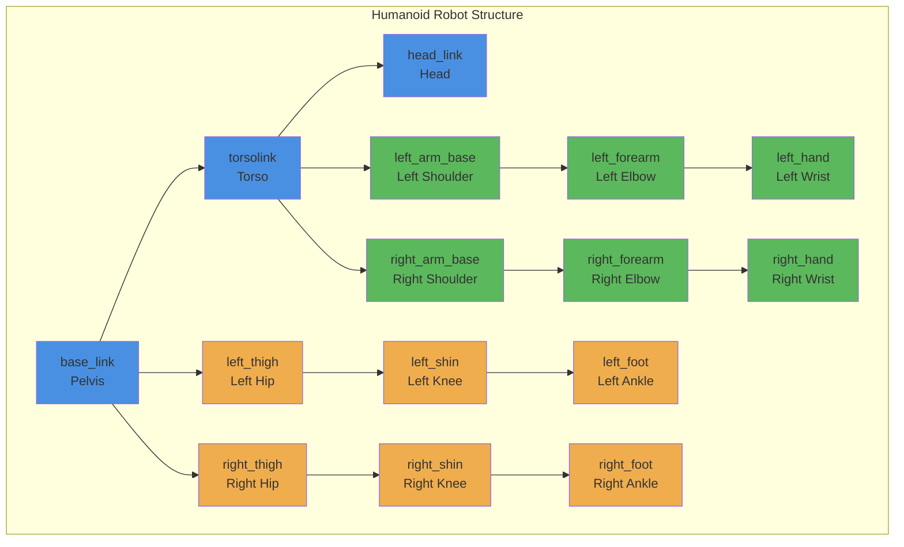

# URDF for Humanoid Robots: Head, Torso, Arms, Legs

## Learning Outcomes

By the end of this section, you will be able to:

- Create URDF models for humanoid robots with proper kinematic chains
- Design URDF for head, torso, arms, and legs components
- Understand the specific requirements for humanoid robot URDF
- Implement realistic joint constraints for humanoid movement
- Structure URDF for complex multi-limb systems
- Validate humanoid URDF models for proper kinematics

## Humanoid Robot Structure

Humanoid robots have a complex structure with multiple limbs that need to be modeled accurately in URDF. The typical structure includes:

- **Torso**: The central body with head attachment
- **Head**: Neck joints for head movement
- **Arms**: Shoulder, elbow, and wrist joints
- **Legs**: Hip, knee, and ankle joints
- **Hands/Feet**: For manipulation and locomotion

### Humanoid Robot Architecture



## Complete Humanoid URDF Example

Here's a simplified but complete humanoid robot URDF:

```xml
<?xml version="1.0"?>
<robot name="simple_humanoid" xmlns:xacro="http://www.ros.org/wiki/xacro">
  <!-- MATERIALS -->
  <material name="black">
    <color rgba="0.0 0.0 0.0 1.0"/>
  </material>
  <material name="blue">
    <color rgba="0.0 0.0 0.8 1.0"/>
  </material>
  <material name="green">
    <color rgba="0.0 0.8 0.0 1.0"/>
  </material>
  <material name="grey">
    <color rgba="0.5 0.5 0.5 1.0"/>
  </material>
  <material name="orange">
    <color rgba="1.0 0.423529411765 0.0392156862745 1.0"/>
  </material>
  <material name="brown">
    <color rgba="0.870588235294 0.811764705882 0.764705882353 1.0"/>
  </material>
  <material name="red">
    <color rgba="0.8 0.0 0.0 1.0"/>
  </material>
  <material name="white">
    <color rgba="1.0 1.0 1.0 1.0"/>
  </material>

  <!-- BASE LINK (Pelvis) -->
  <link name="base_link">
    <visual>
      <origin xyz="0 0 0" rpy="0 0 0"/>
      <geometry>
        <box size="0.2 0.2 0.1"/>
      </geometry>
      <material name="grey"/>
    </visual>
    <collision>
      <origin xyz="0 0 0" rpy="0 0 0"/>
      <geometry>
        <box size="0.2 0.2 0.1"/>
      </geometry>
    </collision>
    <inertial>
      <mass value="5.0"/>
      <origin xyz="0 0 0"/>
      <inertia ixx="0.1" ixy="0.0" ixz="0.0" iyy="0.1" iyz="0.0" izz="0.1"/>
    </inertial>
  </link>

  <!-- TORSO -->
  <link name="torso">
    <visual>
      <origin xyz="0 0 0.25" rpy="0 0 0"/>
      <geometry>
        <box size="0.3 0.2 0.5"/>
      </geometry>
      <material name="orange"/>
    </visual>
    <collision>
      <origin xyz="0 0 0.25" rpy="0 0 0"/>
      <geometry>
        <box size="0.3 0.2 0.5"/>
      </geometry>
    </collision>
    <inertial>
      <mass value="10.0"/>
      <origin xyz="0 0 0.25"/>
      <inertia ixx="0.5" ixy="0.0" ixz="0.0" iyy="0.5" iyz="0.0" izz="0.2"/>
    </inertial>
  </link>

  <joint name="torso_joint" type="fixed">
    <parent link="base_link"/>
    <child link="torso"/>
    <origin xyz="0 0 0.05" rpy="0 0 0"/>
  </joint>

  <!-- HEAD -->
  <link name="head">
    <visual>
      <origin xyz="0 0 0.1" rpy="0 0 0"/>
      <geometry>
        <sphere radius="0.1"/>
      </geometry>
      <material name="white"/>
    </visual>
    <collision>
      <origin xyz="0 0 0.1" rpy="0 0 0"/>
      <geometry>
        <sphere radius="0.1"/>
      </geometry>
    </collision>
    <inertial>
      <mass value="2.0"/>
      <origin xyz="0 0 0.1"/>
      <inertia ixx="0.01" ixy="0.0" ixz="0.0" iyy="0.01" iyz="0.0" izz="0.01"/>
    </inertial>
  </link>

  <joint name="neck_joint" type="revolute">
    <parent link="torso"/>
    <child link="head"/>
    <origin xyz="0 0 0.5" rpy="0 0 0"/>
    <axis xyz="0 1 0"/>
    <limit lower="-0.5" upper="0.5" effort="5.0" velocity="1.0"/>
  </joint>

  <!-- LEFT ARM -->
  <link name="left_shoulder">
    <visual>
      <origin xyz="0.15 0 0" rpy="0 0 0"/>
      <geometry>
        <cylinder radius="0.05" length="0.15"/>
      </geometry>
      <material name="blue"/>
    </visual>
    <collision>
      <origin xyz="0.15 0 0" rpy="0 0 0"/>
      <geometry>
        <cylinder radius="0.05" length="0.15"/>
      </geometry>
    </collision>
    <inertial>
      <mass value="1.0"/>
      <origin xyz="0.15 0 0"/>
      <inertia ixx="0.01" ixy="0.0" ixz="0.0" iyy="0.01" iyz="0.0" izz="0.01"/>
    </inertial>
  </link>

  <joint name="left_shoulder_joint" type="revolute">
    <parent link="torso"/>
    <child link="left_shoulder"/>
    <origin xyz="0.15 0 0.2" rpy="0 0 0"/>
    <axis xyz="0 1 0"/>
    <limit lower="-1.57" upper="1.57" effort="50.0" velocity="1.0"/>
  </joint>

  <link name="left_upper_arm">
    <visual>
      <origin xyz="0.15 0 -0.15" rpy="0 0 0"/>
      <geometry>
        <cylinder radius="0.04" length="0.3"/>
      </geometry>
      <material name="blue"/>
    </visual>
    <collision>
      <origin xyz="0.15 0 -0.15" rpy="0 0 0"/>
      <geometry>
        <cylinder radius="0.04" length="0.3"/>
      </geometry>
    </collision>
    <inertial>
      <mass value="1.5"/>
      <origin xyz="0.15 0 -0.15"/>
      <inertia ixx="0.02" ixy="0.0" ixz="0.0" iyy="0.02" iyz="0.0" izz="0.005"/>
    </inertial>
  </link>

  <joint name="left_elbow_joint" type="revolute">
    <parent link="left_shoulder"/>
    <child link="left_upper_arm"/>
    <origin xyz="0.15 0 0" rpy="0 0 0"/>
    <axis xyz="0 0 1"/>
    <limit lower="-1.57" upper="1.57" effort="40.0" velocity="1.0"/>
  </joint>

  <link name="left_forearm">
    <visual>
      <origin xyz="0.15 0 -0.15" rpy="0 0 0"/>
      <geometry>
        <cylinder radius="0.03" length="0.3"/>
      </geometry>
      <material name="blue"/>
    </visual>
    <collision>
      <origin xyz="0.15 0 -0.15" rpy="0 0 0"/>
      <geometry>
        <cylinder radius="0.03" length="0.3"/>
      </geometry>
    </collision>
    <inertial>
      <mass value="1.0"/>
      <origin xyz="0.15 0 -0.15"/>
      <inertia ixx="0.01" ixy="0.0" ixz="0.0" iyy="0.01" iyz="0.0" izz="0.003"/>
    </inertial>
  </link>

  <joint name="left_wrist_joint" type="revolute">
    <parent link="left_upper_arm"/>
    <child link="left_forearm"/>
    <origin xyz="0.15 0 -0.3" rpy="0 0 0"/>
    <axis xyz="0 1 0"/>
    <limit lower="-1.57" upper="1.57" effort="20.0" velocity="1.0"/>
  </joint>

  <!-- RIGHT ARM (similar to left, mirrored) -->
  <link name="right_shoulder">
    <visual>
      <origin xyz="-0.15 0 0" rpy="0 0 0"/>
      <geometry>
        <cylinder radius="0.05" length="0.15"/>
      </geometry>
      <material name="green"/>
    </visual>
    <collision>
      <origin xyz="-0.15 0 0" rpy="0 0 0"/>
      <geometry>
        <cylinder radius="0.05" length="0.15"/>
      </geometry>
    </collision>
    <inertial>
      <mass value="1.0"/>
      <origin xyz="-0.15 0 0"/>
      <inertia ixx="0.01" ixy="0.0" ixz="0.0" iyy="0.01" iyz="0.0" izz="0.01"/>
    </inertial>
  </link>

  <joint name="right_shoulder_joint" type="revolute">
    <parent link="torso"/>
    <child link="right_shoulder"/>
    <origin xyz="-0.15 0 0.2" rpy="0 0 0"/>
    <axis xyz="0 1 0"/>
    <limit lower="-1.57" upper="1.57" effort="50.0" velocity="1.0"/>
  </joint>

  <link name="right_upper_arm">
    <visual>
      <origin xyz="-0.15 0 -0.15" rpy="0 0 0"/>
      <geometry>
        <cylinder radius="0.04" length="0.3"/>
      </geometry>
      <material name="green"/>
    </visual>
    <collision>
      <origin xyz="-0.15 0 -0.15" rpy="0 0 0"/>
      <geometry>
        <cylinder radius="0.04" length="0.3"/>
      </geometry>
    </collision>
    <inertial>
      <mass value="1.5"/>
      <origin xyz="-0.15 0 -0.15"/>
      <inertia ixx="0.02" ixy="0.0" ixz="0.0" iyy="0.02" iyz="0.0" izz="0.005"/>
    </inertial>
  </link>

  <joint name="right_elbow_joint" type="revolute">
    <parent link="right_shoulder"/>
    <child link="right_upper_arm"/>
    <origin xyz="-0.15 0 0" rpy="0 0 0"/>
    <axis xyz="0 0 1"/>
    <limit lower="-1.57" upper="1.57" effort="40.0" velocity="1.0"/>
  </joint>

  <link name="right_forearm">
    <visual>
      <origin xyz="-0.15 0 -0.15" rpy="0 0 0"/>
      <geometry>
        <cylinder radius="0.03" length="0.3"/>
      </geometry>
      <material name="green"/>
    </visual>
    <collision>
      <origin xyz="-0.15 0 -0.15" rpy="0 0 0"/>
      <geometry>
        <cylinder radius="0.03" length="0.3"/>
      </geometry>
    </collision>
    <inertial>
      <mass value="1.0"/>
      <origin xyz="-0.15 0 -0.15"/>
      <inertia ixx="0.01" ixy="0.0" ixz="0.0" iyy="0.01" iyz="0.0" izz="0.003"/>
    </inertial>
  </link>

  <joint name="right_wrist_joint" type="revolute">
    <parent link="right_upper_arm"/>
    <child link="right_forearm"/>
    <origin xyz="-0.15 0 -0.3" rpy="0 0 0"/>
    <axis xyz="0 1 0"/>
    <limit lower="-1.57" upper="1.57" effort="20.0" velocity="1.0"/>
  </joint>

  <!-- LEFT LEG -->
  <link name="left_thigh">
    <visual>
      <origin xyz="0.05 0 -0.2" rpy="0 0 0"/>
      <geometry>
        <cylinder radius="0.06" length="0.4"/>
      </geometry>
      <material name="red"/>
    </visual>
    <collision>
      <origin xyz="0.05 0 -0.2" rpy="0 0 0"/>
      <geometry>
        <cylinder radius="0.06" length="0.4"/>
      </geometry>
    </collision>
    <inertial>
      <mass value="3.0"/>
      <origin xyz="0.05 0 -0.2"/>
      <inertia ixx="0.05" ixy="0.0" ixz="0.0" iyy="0.05" iyz="0.0" izz="0.01"/>
    </inertial>
  </link>

  <joint name="left_hip_joint" type="revolute">
    <parent link="base_link"/>
    <child link="left_thigh"/>
    <origin xyz="0.05 0 -0.05" rpy="0 0 0"/>
    <axis xyz="0 1 0"/>
    <limit lower="-1.57" upper="0.5" effort="100.0" velocity="1.0"/>
  </joint>

  <link name="left_shin">
    <visual>
      <origin xyz="0.05 0 -0.2" rpy="0 0 0"/>
      <geometry>
        <cylinder radius="0.05" length="0.4"/>
      </geometry>
      <material name="red"/>
    </visual>
    <collision>
      <origin xyz="0.05 0 -0.2" rpy="0 0 0"/>
      <geometry>
        <cylinder radius="0.05" length="0.4"/>
      </geometry>
    </collision>
    <inertial>
      <mass value="2.0"/>
      <origin xyz="0.05 0 -0.2"/>
      <inertia ixx="0.03" ixy="0.0" ixz="0.0" iyy="0.03" iyz="0.0" izz="0.005"/>
    </inertial>
  </link>

  <joint name="left_knee_joint" type="revolute">
    <parent link="left_thigh"/>
    <child link="left_shin"/>
    <origin xyz="0.05 0 -0.4" rpy="0 0 0"/>
    <axis xyz="0 1 0"/>
    <limit lower="0" upper="1.57" effort="100.0" velocity="1.0"/>
  </joint>

  <link name="left_foot">
    <visual>
      <origin xyz="0.05 0 -0.05" rpy="0 0 0"/>
      <geometry>
        <box size="0.15 0.1 0.05"/>
      </geometry>
      <material name="red"/>
    </visual>
    <collision>
      <origin xyz="0.05 0 -0.05" rpy="0 0 0"/>
      <geometry>
        <box size="0.15 0.1 0.05"/>
      </geometry>
    </collision>
    <inertial>
      <mass value="1.0"/>
      <origin xyz="0.05 0 -0.05"/>
      <inertia ixx="0.005" ixy="0.0" ixz="0.0" iyy="0.01" iyz="0.0" izz="0.01"/>
    </inertial>
  </link>

  <joint name="left_ankle_joint" type="revolute">
    <parent link="left_shin"/>
    <child link="left_foot"/>
    <origin xyz="0.05 0 -0.4" rpy="0 0 0"/>
    <axis xyz="0 1 0"/>
    <limit lower="-0.5" upper="0.5" effort="50.0" velocity="1.0"/>
  </joint>

  <!-- RIGHT LEG (mirrored from left) -->
  <link name="right_thigh">
    <visual>
      <origin xyz="-0.05 0 -0.2" rpy="0 0 0"/>
      <geometry>
        <cylinder radius="0.06" length="0.4"/>
      </geometry>
      <material name="brown"/>
    </visual>
    <collision>
      <origin xyz="-0.05 0 -0.2" rpy="0 0 0"/>
      <geometry>
        <cylinder radius="0.06" length="0.4"/>
      </geometry>
    </collision>
    <inertial>
      <mass value="3.0"/>
      <origin xyz="-0.05 0 -0.2"/>
      <inertia ixx="0.05" ixy="0.0" ixz="0.0" iyy="0.05" iyz="0.0" izz="0.01"/>
    </inertial>
  </link>

  <joint name="right_hip_joint" type="revolute">
    <parent link="base_link"/>
    <child link="right_thigh"/>
    <origin xyz="-0.05 0 -0.05" rpy="0 0 0"/>
    <axis xyz="0 1 0"/>
    <limit lower="-1.57" upper="0.5" effort="100.0" velocity="1.0"/>
  </joint>

  <link name="right_shin">
    <visual>
      <origin xyz="-0.05 0 -0.2" rpy="0 0 0"/>
      <geometry>
        <cylinder radius="0.05" length="0.4"/>
      </geometry>
      <material name="brown"/>
    </visual>
    <collision>
      <origin xyz="-0.05 0 -0.2" rpy="0 0 0"/>
      <geometry>
        <cylinder radius="0.05" length="0.4"/>
      </geometry>
    </collision>
    <inertial>
      <mass value="2.0"/>
      <origin xyz="-0.05 0 -0.2"/>
      <inertia ixx="0.03" ixy="0.0" ixz="0.0" iyy="0.03" iyz="0.0" izz="0.005"/>
    </inertial>
  </link>

  <joint name="right_knee_joint" type="revolute">
    <parent link="right_thigh"/>
    <child link="right_shin"/>
    <origin xyz="-0.05 0 -0.4" rpy="0 0 0"/>
    <axis xyz="0 1 0"/>
    <limit lower="0" upper="1.57" effort="100.0" velocity="1.0"/>
  </joint>

  <link name="right_foot">
    <visual>
      <origin xyz="-0.05 0 -0.05" rpy="0 0 0"/>
      <geometry>
        <box size="0.15 0.1 0.05"/>
      </geometry>
      <material name="brown"/>
    </visual>
    <collision>
      <origin xyz="-0.05 0 -0.05" rpy="0 0 0"/>
      <geometry>
        <box size="0.15 0.1 0.05"/>
      </geometry>
    </collision>
    <inertial>
      <mass value="1.0"/>
      <origin xyz="-0.05 0 -0.05"/>
      <inertia ixx="0.005" ixy="0.0" ixz="0.0" iyy="0.01" iyz="0.0" izz="0.01"/>
    </inertial>
  </link>

  <joint name="right_ankle_joint" type="revolute">
    <parent link="right_shin"/>
    <child link="right_foot"/>
    <origin xyz="-0.05 0 -0.4" rpy="0 0 0"/>
    <axis xyz="0 1 0"/>
    <limit lower="-0.5" upper="0.5" effort="50.0" velocity="1.0"/>
  </joint>
</robot>
```

## Working with Humanoid URDF in Python

Here's how to work with humanoid URDF models in Python:

```python
import rclpy
from rclpy.node import Node
from urdf_parser_py.urdf import URDF
from std_msgs.msg import String
import math

class HumanoidUrdfProcessor(Node):
    def __init__(self):
        super().__init__('humanoid_urdf_processor')

        # For this example, we'll use a simplified URDF string
        # In practice, you would load from a file
        self.humanoid_urdf = """
        <?xml version="1.0"?>
        <robot name="simple_humanoid">
          <link name="base_link">
            <visual>
              <geometry><box size="0.2 0.2 0.1"/></geometry>
            </visual>
            <inertial>
              <mass value="5.0"/>
              <inertia ixx="0.1" ixy="0.0" ixz="0.0" iyy="0.1" iyz="0.0" izz="0.1"/>
            </inertial>
          </link>
          <link name="torso">
            <visual>
              <geometry><box size="0.3 0.2 0.5"/></geometry>
            </visual>
            <inertial>
              <mass value="10.0"/>
              <inertia ixx="0.5" ixy="0.0" ixz="0.0" iyy="0.5" iyz="0.0" izz="0.2"/>
            </inertial>
          </link>
          <joint name="torso_joint" type="fixed">
            <parent link="base_link"/>
            <child link="torso"/>
            <origin xyz="0 0 0.05" rpy="0 0 0"/>
          </joint>
          <!-- Additional joints for arms, legs, etc. would be here -->
        </robot>
        """

        try:
            # Parse the humanoid URDF
            self.robot_model = URDF.from_xml_string(self.humanoid_urdf)
            self.get_logger().info(f'Loaded humanoid model: {self.robot_model.name}')

            # Analyze the humanoid structure
            self.analyze_humanoid_structure()

        except Exception as e:
            self.get_logger().error(f'Error parsing humanoid URDF: {e}')

    def analyze_humanoid_structure(self):
        """Analyze the humanoid robot structure"""
        self.get_logger().info(f'Humanoid robot: {self.robot_model.name}')
        self.get_logger().info(f'Total links: {len(self.robot_model.links)}')
        self.get_logger().info(f'Total joints: {len(self.robot_model.joints)}')

        # Categorize links by body part
        body_parts = {
            'torso': [],
            'head': [],
            'left_arm': [],
            'right_arm': [],
            'left_leg': [],
            'right_leg': [],
            'other': []
        }

        for link in self.robot_model.links:
            name = link.name.lower()
            if 'torso' in name:
                body_parts['torso'].append(link.name)
            elif 'head' in name:
                body_parts['head'].append(link.name)
            elif 'left' in name and ('arm' in name or 'shoulder' in name or 'elbow' in name or 'wrist' in name):
                body_parts['left_arm'].append(link.name)
            elif 'right' in name and ('arm' in name or 'shoulder' in name or 'elbow' in name or 'wrist' in name):
                body_parts['right_arm'].append(link.name)
            elif 'left' in name and ('leg' in name or 'thigh' in name or 'shin' in name or 'foot' in name or 'hip' in name or 'knee' in name or 'ankle' in name):
                body_parts['left_leg'].append(link.name)
            elif 'right' in name and ('leg' in name or 'thigh' in name or 'shin' in name or 'foot' in name or 'hip' in name or 'knee' in name or 'ankle' in name):
                body_parts['right_leg'].append(link.name)
            else:
                body_parts['other'].append(link.name)

        # Log the structure
        for part, links in body_parts.items():
            if links:
                self.get_logger().info(f'{part.capitalize()}: {", ".join(links)}')

        # Analyze joint types
        joint_types = {}
        for joint in self.robot_model.joints:
            jtype = joint.type
            if jtype in joint_types:
                joint_types[jtype] += 1
            else:
                joint_types[jtype] = 1

        for jtype, count in joint_types.items():
            self.get_logger().info(f'{jtype} joints: {count}')

    def get_chain(self, start_link, end_link):
        """Get the kinematic chain between two links"""
        try:
            chain = self.robot_model.get_chain(start_link, end_link, joints=True, links=False)
            self.get_logger().info(f'Chain from {start_link} to {end_link}: {chain}')
            return chain
        except Exception as e:
            self.get_logger().error(f'Error getting chain: {e}')
            return []

def main(args=None):
    rclpy.init(args=args)
    processor = HumanoidUrdfProcessor()

    try:
        # Example: Get chain from base to left hand
        processor.get_chain('base_link', 'left_forearm')
        rclpy.spin(processor)
    except KeyboardInterrupt:
        processor.get_logger().info('Humanoid URDF processor stopped')
    finally:
        processor.destroy_node()
        rclpy.shutdown()

if __name__ == '__main__':
    main()
```

## Humanoid-Specific Considerations

### 1. Balance and Stability
Humanoid robots need special attention to balance:

```python
def calculate_center_of_mass(self, joint_states):
    """Calculate center of mass for balance control"""
    total_mass = 0.0
    weighted_pos = [0.0, 0.0, 0.0]

    # This would iterate through all links in the URDF
    # and calculate weighted center of mass
    for link in self.robot_model.links:
        if link.inertial and link.name in joint_states:
            mass = link.inertial.mass
            # Calculate position based on joint angles
            # This is a simplified example
            pos = self.calculate_link_position(link.name, joint_states)
            weighted_pos[0] += pos[0] * mass
            weighted_pos[1] += pos[1] * mass
            weighted_pos[2] += pos[2] * mass
            total_mass += mass

    if total_mass > 0:
        com = [weighted_pos[0]/total_mass,
               weighted_pos[1]/total_mass,
               weighted_pos[2]/total_mass]
        return com
    return [0.0, 0.0, 0.0]
```

### 2. Joint Limit Safety
Ensure joint limits are respected:

```python
def validate_joint_commands(self, target_positions, joint_names):
    """Validate joint commands against URDF limits"""
    valid_commands = []

    for i, joint_name in enumerate(joint_names):
        # Find joint in URDF
        joint = None
        for urdf_joint in self.robot_model.joints:
            if urdf_joint.name == joint_name:
                joint = urdf_joint
                break

        if joint and joint.limit:
            # Clamp to limits
            cmd = max(min(target_positions[i], joint.limit.upper), joint.limit.lower)
            valid_commands.append(cmd)
        else:
            # No limit defined or joint not found, use original
            valid_commands.append(target_positions[i])

    return valid_commands
```

## Best Practices for Humanoid URDF

1. **Realistic Dimensions**: Use dimensions that match real humanoid proportions
2. **Proper Mass Distribution**: Assign realistic masses and inertias
3. **Consistent Naming**: Use clear naming conventions for limbs
4. **Kinematic Chains**: Ensure proper parent-child relationships
5. **Joint Limits**: Define realistic joint limits for safety
6. **Collision Geometry**: Use appropriate collision models
7. **Validation**: Test URDF with kinematic solvers

Humanoid URDF models require careful attention to anatomical accuracy and realistic physical properties to ensure proper simulation and control.