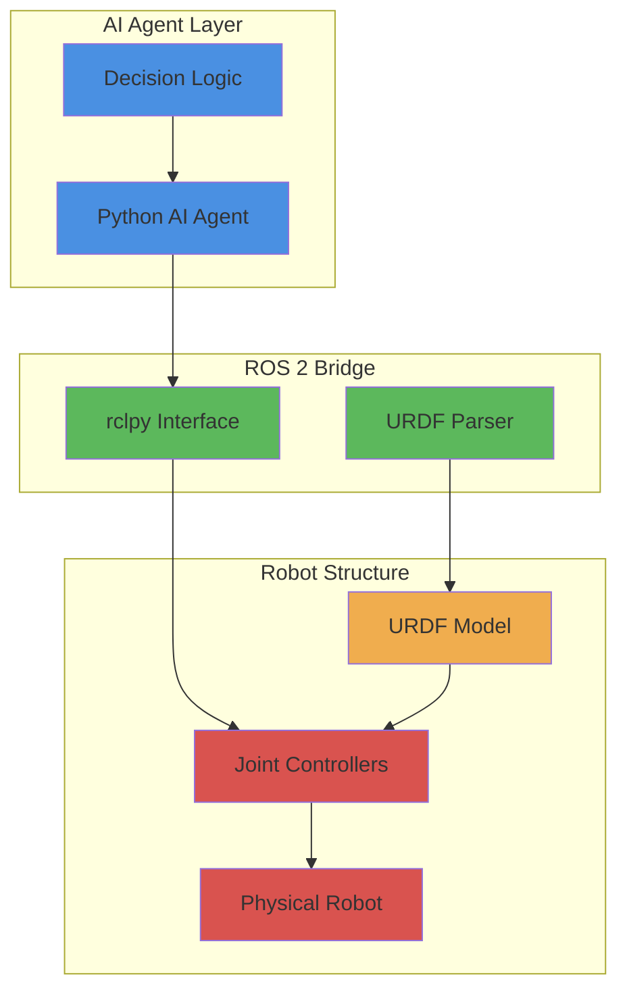

# Bridging Python Agents & Humanoid Robot Structure

This chapter explores how to connect AI logic written in Python to physical robot structure and controllers using rclpy and URDF. You'll learn how to bridge the gap between software and hardware, enabling AI agents to interact with and control humanoid robots effectively.

## Learning Outcomes

By the end of this chapter, you will be able to:

- Understand the role of rclpy in Python-based robot control
- Explain the concept of controllers and actuator interfaces
- Read and reason about URDF files for robot structure
- Understand URDF for humanoid robots including head, torso, arms, and legs
- Explain how AI agents reason over robot structure
- Create simple URDF snippets for humanoid robots
- Implement Python agents that publish joint commands
- Understand how URDF and ROS 2 work together

## Conceptual Overview

The above diagram illustrates how AI agents connect to physical robots through the ROS 2 bridge, using rclpy and URDF to understand and control robot structure.