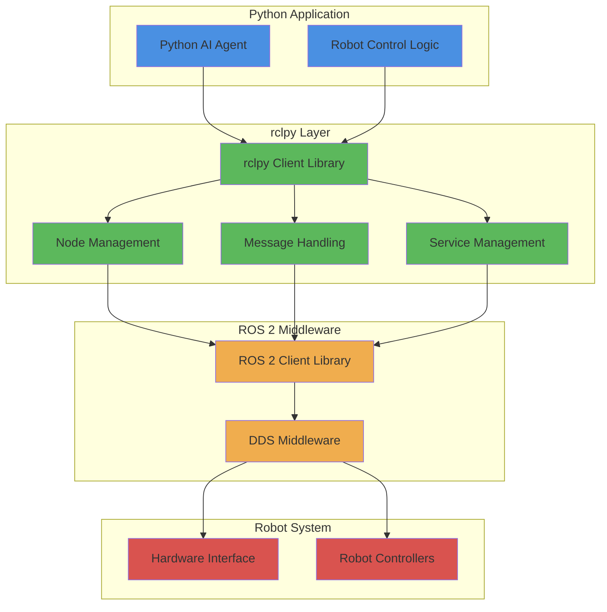

# Role of rclpy in Python-based Robot Control

## Learning Outcomes

By the end of this section, you will be able to:

- Explain the role of rclpy as the Python client library for ROS 2
- Understand how rclpy enables Python programs to interact with ROS 2
- Identify the core components of rclpy and their functions
- Implement basic rclpy functionality for robot control
- Connect Python AI logic to ROS 2 robot systems

## Understanding rclpy

`rclpy` is the Python client library for ROS 2, serving as the bridge between Python applications and the ROS 2 middleware. It provides Python developers with the tools needed to create ROS 2 nodes, publish and subscribe to topics, provide and call services, and manage robot-specific functionalities.

### Core Architecture of rclpy



## Core Components of rclpy

### 1. Node Management
The fundamental unit of computation in ROS 2:

```python
import rclpy
from rclpy.node import Node

class RobotController(Node):
    def __init__(self):
        # Initialize the node with a unique name
        super().__init__('robot_controller')
        self.get_logger().info('Robot controller initialized')
```

### 2. Publishers and Subscribers
For topic-based communication:

```python
# Creating a publisher
self.cmd_publisher = self.create_publisher(JointCommand, 'joint_commands', 10)

# Creating a subscriber
self.state_subscriber = self.create_subscription(
    JointState, 'joint_states', self.state_callback, 10
)
```

### 3. Services and Clients
For request-response communication:

```python
# Creating a service server
self.service = self.create_service(RobotCommand, 'execute_command', self.command_callback)

# Creating a service client
self.client = self.create_client(RobotStatus, 'get_robot_status')
```

## Practical Example: AI Agent Controlling Robot Movement

```python
import rclpy
from rclpy.node import Node
from std_msgs.msg import Float64MultiArray
from sensor_msgs.msg import JointState
from geometry_msgs.msg import Twist
import numpy as np

class AIBasedRobotController(Node):
    def __init__(self):
        super().__init__('ai_robot_controller')

        # Publishers for robot commands
        self.joint_publisher = self.create_publisher(
            Float64MultiArray, 'joint_group_position_controller/commands', 10
        )
        self.velocity_publisher = self.create_publisher(Twist, 'cmd_vel', 10)

        # Subscriber for robot state feedback
        self.state_subscriber = self.create_subscription(
            JointState, 'joint_states', self.state_callback, 10
        )

        # Timer for AI decision making
        self.ai_timer = self.create_timer(0.1, self.ai_decision_loop)

        # Robot state tracking
        self.current_joint_positions = {}
        self.target_positions = {}

        self.get_logger().info('AI Robot Controller initialized')

    def state_callback(self, msg):
        """Update current joint positions from robot feedback"""
        for i, name in enumerate(msg.name):
            if i < len(msg.position):
                self.current_joint_positions[name] = msg.position[i]

    def ai_decision_loop(self):
        """Main AI decision-making loop"""
        try:
            # Example AI logic: move joints to target positions
            # In a real implementation, this would contain actual AI decision logic
            self.execute_ai_control_logic()
        except Exception as e:
            self.get_logger().error(f'Error in AI decision loop: {e}')

    def execute_ai_control_logic(self):
        """Execute AI-based control decisions"""
        # Example: Simple joint position control
        command_msg = Float64MultiArray()

        # In a real AI agent, this would come from neural network outputs
        # or other AI decision mechanisms
        target_positions = [0.1, 0.2, 0.3, 0.4, 0.5]  # Example joint targets

        command_msg.data = target_positions
        self.joint_publisher.publish(command_msg)

def main(args=None):
    rclpy.init(args=args)
    ai_controller = AIBasedRobotController()

    try:
        rclpy.spin(ai_controller)
    except KeyboardInterrupt:
        ai_controller.get_logger().info('AI controller stopped by user')
    finally:
        ai_controller.destroy_node()
        rclpy.shutdown()

if __name__ == '__main__':
    main()
```

## Advanced rclpy Features for Robot Control

### 1. Parameters
Allow runtime configuration of robot behavior:

```python
class ConfigurableController(Node):
    def __init__(self):
        super().__init__('configurable_controller')

        # Declare parameters with default values
        self.declare_parameter('max_velocity', 1.0)
        self.declare_parameter('control_frequency', 50.0)
        self.declare_parameter('safety_threshold', 0.5)

        # Access parameter values
        self.max_vel = self.get_parameter('max_velocity').value
        self.freq = self.get_parameter('control_frequency').value
        self.threshold = self.get_parameter('safety_threshold').value
```

### 2. Timers and Callbacks
For real-time control loops:

```python
def __init__(self):
    super().__init__('realtime_controller')

    # Create high-frequency timer for real-time control
    self.control_timer = self.create_timer(
        1.0/100.0,  # 100Hz control loop
        self.realtime_control_callback
    )

def realtime_control_callback(self):
    """Real-time control executed at 100Hz"""
    # Implement real-time control logic here
    self.perform_control_action()
```

## Integration with AI Frameworks

rclpy can be easily integrated with popular AI frameworks:

```python
import rclpy
from rclpy.node import Node
import tensorflow as tf  # Example AI framework
# or import torch  # PyTorch example
# or import sklearn  # Scikit-learn example

class AIFrameworkController(Node):
    def __init__(self):
        super().__init__('ai_framework_controller')

        # Load AI model
        self.ai_model = self.load_ai_model()

        # Set up ROS 2 interfaces
        self.observation_subscriber = self.create_subscription(
            SensorData, 'sensor_input', self.observation_callback, 10
        )
        self.action_publisher = self.create_publisher(
            RobotAction, 'robot_action', 10
        )

        self.get_logger().info('AI Framework Controller initialized')

    def load_ai_model(self):
        """Load the AI model for decision making"""
        # Example: Load a pre-trained model
        # model = tf.keras.models.load_model('path/to/model')
        # return model
        pass

    def observation_callback(self, msg):
        """Process sensor observations and generate AI actions"""
        # Convert ROS message to format expected by AI model
        observation = self.convert_observation(msg)

        # Get AI decision
        action = self.ai_model.predict(observation)

        # Convert and publish action
        action_msg = self.convert_action(action)
        self.action_publisher.publish(action_msg)

    def convert_observation(self, msg):
        """Convert ROS message to AI model input format"""
        # Implementation depends on sensor data type
        pass

    def convert_action(self, action):
        """Convert AI model output to ROS message"""
        # Implementation depends on robot action space
        pass
```

## Best Practices for rclpy in Robot Control

1. **Error Handling**: Always wrap critical operations in try-catch blocks
2. **Resource Management**: Properly clean up nodes and resources
3. **Real-time Considerations**: Be mindful of timing constraints in control loops
4. **Safety**: Implement safety checks before executing robot commands
5. **Modularity**: Separate AI logic from ROS 2 communication code
6. **Logging**: Use appropriate log levels for debugging and monitoring

rclpy provides the essential bridge between Python-based AI systems and ROS 2 robot platforms, enabling sophisticated robot control and AI integration.