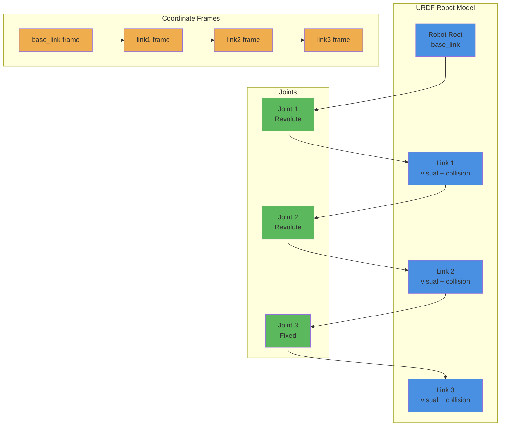

# Introduction to URDF: Links, Joints, Coordinate Frames

## Learning Outcomes

By the end of this section, you will be able to:

- Define URDF and explain its role in robot modeling
- Identify and describe the main components of URDF: links, joints, and transmissions
- Understand coordinate frames and their relationships in robot models
- Read and interpret URDF files for robot structure
- Create basic URDF models for simple robots
- Understand how URDF integrates with ROS 2 systems

## Understanding URDF

URDF (Unified Robot Description Format) is an XML-based format used to describe robot models in ROS. It defines the physical and visual properties of a robot, including its links, joints, inertial properties, and visual appearance.

### URDF Structure Overview



## Core URDF Components

### 1. Links

Links represent rigid bodies in the robot. Each link has:
- Visual properties (for visualization)
- Collision properties (for physics simulation)
- Inertial properties (for dynamics)

Basic link structure:
```xml
<link name="link_name">
  <!-- Visual properties -->
  <visual>
    <origin xyz="0 0 0" rpy="0 0 0"/>
    <geometry>
      <box size="1 1 1"/>
    </geometry>
    <material name="blue">
      <color rgba="0 0 1 1"/>
    </material>
  </visual>

  <!-- Collision properties -->
  <collision>
    <origin xyz="0 0 0" rpy="0 0 0"/>
    <geometry>
      <box size="1 1 1"/>
    </geometry>
  </collision>

  <!-- Inertial properties -->
  <inertial>
    <mass value="1.0"/>
    <origin xyz="0 0 0"/>
    <inertia ixx="1.0" ixy="0.0" ixz="0.0" iyy="1.0" iyz="0.0" izz="1.0"/>
  </inertial>
</link>
```

### 2. Joints

Joints connect links and define their relative motion:
- **Fixed**: No relative motion (0 DOF)
- **Revolute**: Single axis rotation (1 DOF)
- **Continuous**: Continuous rotation (1 DOF)
- **Prismatic**: Single axis translation (1 DOF)
- **Floating**: 6 DOF
- **Planar**: Motion in a plane (3 DOF)

Basic joint structure:
```xml
<joint name="joint_name" type="revolute">
  <parent link="parent_link_name"/>
  <child link="child_link_name"/>
  <origin xyz="0 0 0.1" rpy="0 0 0"/>
  <axis xyz="0 0 1"/>
  <limit lower="-1.57" upper="1.57" effort="10.0" velocity="1.0"/>
</joint>
```

## Complete URDF Example

Here's a simple robot arm example:

```xml
<?xml version="1.0"?>
<robot name="simple_arm" xmlns:xacro="http://www.ros.org/wiki/xacro">
  <!-- Base link -->
  <link name="base_link">
    <visual>
      <origin xyz="0 0 0.1" rpy="0 0 0"/>
      <geometry>
        <cylinder radius="0.1" length="0.2"/>
      </geometry>
      <material name="grey">
        <color rgba="0.5 0.5 0.5 1"/>
      </material>
    </visual>
    <collision>
      <origin xyz="0 0 0.1" rpy="0 0 0"/>
      <geometry>
        <cylinder radius="0.1" length="0.2"/>
      </geometry>
    </collision>
    <inertial>
      <mass value="2.0"/>
      <origin xyz="0 0 0.1"/>
      <inertia ixx="0.02" ixy="0.0" ixz="0.0" iyy="0.02" iyz="0.0" izz="0.01"/>
    </inertial>
  </link>

  <!-- First link (upper arm) -->
  <link name="upper_arm">
    <visual>
      <origin xyz="0 0 0.25" rpy="0 0 0"/>
      <geometry>
        <cylinder radius="0.05" length="0.5"/>
      </geometry>
      <material name="red">
        <color rgba="1 0 0 1"/>
      </material>
    </visual>
    <collision>
      <origin xyz="0 0 0.25" rpy="0 0 0"/>
      <geometry>
        <cylinder radius="0.05" length="0.5"/>
      </geometry>
    </collision>
    <inertial>
      <mass value="1.0"/>
      <origin xyz="0 0 0.25"/>
      <inertia ixx="0.02" ixy="0.0" ixz="0.0" iyy="0.02" iyz="0.0" izz="0.001"/>
    </inertial>
  </link>

  <!-- Joint connecting base to upper arm -->
  <joint name="shoulder_joint" type="revolute">
    <parent link="base_link"/>
    <child link="upper_arm"/>
    <origin xyz="0 0 0.2" rpy="0 0 0"/>
    <axis xyz="0 0 1"/>
    <limit lower="-1.57" upper="1.57" effort="100.0" velocity="1.0"/>
  </joint>

  <!-- Second link (forearm) -->
  <link name="forearm">
    <visual>
      <origin xyz="0 0 0.15" rpy="0 0 0"/>
      <geometry>
        <cylinder radius="0.04" length="0.3"/>
      </geometry>
      <material name="green">
        <color rgba="0 1 0 1"/>
      </material>
    </visual>
    <collision>
      <origin xyz="0 0 0.15" rpy="0 0 0"/>
      <geometry>
        <cylinder radius="0.04" length="0.3"/>
      </geometry>
    </collision>
    <inertial>
      <mass value="0.5"/>
      <origin xyz="0 0 0.15"/>
      <inertia ixx="0.005" ixy="0.0" ixz="0.0" iyy="0.005" iyz="0.0" izz="0.0005"/>
    </inertial>
  </link>

  <!-- Joint connecting upper arm to forearm -->
  <joint name="elbow_joint" type="revolute">
    <parent link="upper_arm"/>
    <child link="forearm"/>
    <origin xyz="0 0 0.5" rpy="0 0 0"/>
    <axis xyz="0 1 0"/>
    <limit lower="-1.57" upper="1.57" effort="50.0" velocity="1.0"/>
  </joint>

  <!-- End effector link -->
  <link name="end_effector">
    <visual>
      <origin xyz="0 0 0.05" rpy="0 0 0"/>
      <geometry>
        <sphere radius="0.05"/>
      </geometry>
      <material name="blue">
        <color rgba="0 0 1 1"/>
      </material>
    </visual>
    <collision>
      <origin xyz="0 0 0.05" rpy="0 0 0"/>
      <geometry>
        <sphere radius="0.05"/>
      </geometry>
    </collision>
    <inertial>
      <mass value="0.1"/>
      <origin xyz="0 0 0.05"/>
      <inertia ixx="0.0001" ixy="0.0" ixz="0.0" iyy="0.0001" iyz="0.0" izz="0.0001"/>
    </inertial>
  </link>

  <!-- Fixed joint for end effector -->
  <joint name="wrist_joint" type="fixed">
    <parent link="forearm"/>
    <child link="end_effector"/>
    <origin xyz="0 0 0.3" rpy="0 0 0"/>
  </joint>
</robot>
```

## Coordinate Frames in URDF

Each link in URDF defines its own coordinate frame. The relationships between frames are defined by joints:

```mermaid
graph LR
    subgraph "Coordinate Transformations"
        A[base_link<br/>(0,0,0)]
        B[upper_arm<br/>(0,0,0.2) rotation]
        C[forearm<br/>(0,0,0.5) rotation]
        D[end_effector<br/>(0,0,0.3) offset]
    end

    A -->|"0.2m up + rotation"| B
    B -->|"0.5m up + elbow rotation"| C
    C -->|"0.3m up + fixed"| D

    style A fill:#4A90E2
    style B fill:#5CB85C
    style C fill:#F0AD4E
    style D fill:#D9534F
```

## Working with URDF in Python

You can work with URDF models in Python using the `urdf_parser_py` library:

```python
import rclpy
from rclpy.node import Node
from urdf_parser_py.urdf import URDF
import os

class UrdfProcessor(Node):
    def __init__(self):
        super().__init__('urdf_processor')

        # Example URDF content (in practice, this would be loaded from a file)
        self.robot_urdf = """
        <?xml version="1.0"?>
        <robot name="example_robot">
          <link name="base_link">
            <visual>
              <geometry>
                <box size="1 1 1"/>
              </geometry>
            </visual>
            <collision>
              <geometry>
                <box size="1 1 1"/>
              </geometry>
            </collision>
          </link>
          <link name="arm_link">
            <visual>
              <geometry>
                <cylinder radius="0.1" length="0.5"/>
              </geometry>
            </visual>
          </link>
          <joint name="arm_joint" type="revolute">
            <parent link="base_link"/>
            <child link="arm_link"/>
            <origin xyz="0 0 0.5" rpy="0 0 0"/>
            <axis xyz="0 0 1"/>
            <limit lower="-1.57" upper="1.57" effort="10.0" velocity="1.0"/>
          </joint>
        </robot>
        """

        try:
            # Parse the URDF
            self.robot_model = URDF.from_xml_string(self.robot_urdf)
            self.get_logger().info(f'Loaded robot model: {self.robot_model.name}')

            # Process robot information
            self.analyze_robot_structure()

        except Exception as e:
            self.get_logger().error(f'Error parsing URDF: {e}')

    def analyze_robot_structure(self):
        """Analyze the robot structure from URDF"""
        self.get_logger().info(f'Robot name: {self.robot_model.name}')
        self.get_logger().info(f'Number of links: {len(self.robot_model.links)}')
        self.get_logger().info(f'Number of joints: {len(self.robot_model.joints)}')

        # Print link information
        for link in self.robot_model.links:
            self.get_logger().info(f'Link: {link.name}')
            if link.visual:
                self.get_logger().info(f'  Visual: {link.visual.geometry.type}')
            if link.collision:
                self.get_logger().info(f'  Collision: {link.collision.geometry.type}')

        # Print joint information
        for joint in self.robot_model.joints:
            self.get_logger().info(f'Joint: {joint.name} (type: {joint.type})')
            self.get_logger().info(f'  Parent: {joint.parent}')
            self.get_logger().info(f'  Child: {joint.child}')

def main(args=None):
    rclpy.init(args=args)
    urdf_processor = UrdfProcessor()

    try:
        rclpy.spin(urdf_processor)
    except KeyboardInterrupt:
        urdf_processor.get_logger().info('URDF processor stopped')
    finally:
        urdf_processor.destroy_node()
        rclpy.shutdown()

if __name__ == '__main__':
    main()
```

## URDF Best Practices

1. **Consistent Naming**: Use clear, consistent naming conventions
2. **Proper Inertias**: Calculate and include accurate inertial properties
3. **Collision vs Visual**: Use appropriate geometries for collision vs visual
4. **Joint Limits**: Define realistic joint limits and constraints
5. **Mass Properties**: Include realistic mass and inertia values
6. **Coordinate Frames**: Establish clear, consistent frame conventions
7. **Documentation**: Comment complex URDF models for clarity

## Integration with ROS 2

URDF integrates with ROS 2 through several mechanisms:

1. **Robot State Publisher**: Publishes TF transforms based on joint states
2. **TF2**: Provides coordinate transformation services
3. **Visualization**: RViz uses URDF for robot visualization
4. **Simulation**: Gazebo uses URDF for physics simulation

URDF is fundamental to robot modeling in ROS, providing the necessary information for visualization, simulation, and control of robotic systems.