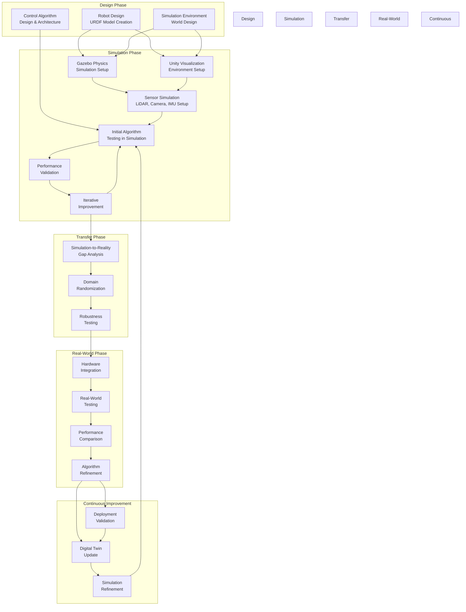

# Digital Twin Development Workflow for Humanoid Robots

This diagram illustrates the complete workflow for developing humanoid robot capabilities using digital twin simulation, from initial design to real-world deployment.

## Digital Twin Workflow Explanation

### Design Phase
1. **Robot Design**: Create the URDF model of the humanoid robot with accurate physical properties
   - Define links with mass, inertia, and visual properties
   - Specify joints with limits, dynamics, and actuator properties
   - Include sensor placements and types

2. **Simulation Environment**: Design the virtual environment for testing
   - Create worlds with appropriate challenges and scenarios
   - Include obstacles, surfaces, and interaction elements
   - Consider real-world environment requirements

3. **Control Algorithm Design**: Plan the control architecture and algorithms
   - Design balance and locomotion control systems
   - Plan perception and navigation algorithms
   - Consider safety and failure recovery systems

### Simulation Phase
4. **Gazebo Physics Simulation Setup**: Configure accurate physics simulation
   - Set up physics engine parameters (time steps, solver iterations)
   - Configure contact properties and friction models
   - Validate model physics against real robot characteristics

5. **Unity Visualization Environment Setup**: Create high-fidelity visualization
   - Develop photorealistic environments for perception training
   - Set up lighting and material properties
   - Configure VR/AR interfaces if needed

6. **Sensor Simulation Setup**: Configure virtual sensors
   - Set up LiDAR with appropriate field of view and accuracy
   - Configure cameras with realistic noise and distortion
   - Set up IMUs with proper noise models

7. **Initial Algorithm Testing**: Test control algorithms in simulation
   - Implement basic behaviors and control systems
   - Test fundamental capabilities like balance and simple navigation
   - Validate safety systems and failure recovery

8. **Performance Validation**: Evaluate algorithm performance
   - Measure success rates and performance metrics
   - Identify failure modes and edge cases
   - Document performance characteristics

9. **Iterative Improvement**: Refine algorithms based on testing
   - Address identified issues and limitations
   - Optimize performance and robustness
   - Repeat testing with improved algorithms

### Transfer Phase
10. **Simulation-to-Reality Gap Analysis**: Identify differences between simulation and reality
    - Compare sensor characteristics and noise patterns
    - Analyze environmental differences
    - Document systematic differences

11. **Domain Randomization**: Make algorithms robust to differences
    - Randomize simulation parameters during training
    - Vary environmental conditions and sensor properties
    - Train with diverse scenarios and conditions

12. **Robustness Testing**: Validate algorithm robustness
    - Test with randomized parameters
    - Evaluate performance under various conditions
    - Ensure safety and reliability

### Real-World Phase
13. **Hardware Integration**: Deploy to real robot hardware
    - Implement ROS 2 interfaces for real sensors and actuators
    - Calibrate real sensors and actuators
    - Integrate safety systems

14. **Real-World Testing**: Test on actual hardware
    - Validate basic capabilities in controlled environments
    - Test safety systems and emergency procedures
    - Evaluate performance against simulation results

15. **Performance Comparison**: Compare real-world vs simulation performance
    - Measure performance metrics in real world
    - Identify discrepancies and issues
    - Document reality gap characteristics

16. **Algorithm Refinement**: Improve algorithms based on real testing
    - Adjust parameters based on real-world performance
    - Address issues identified in real testing
    - Enhance robustness and safety

### Continuous Improvement
17. **Digital Twin Update**: Update simulation based on real-world insights
    - Incorporate learned reality gap characteristics
    - Update sensor models based on real performance
    - Improve environment models

18. **Simulation Refinement**: Enhance simulation fidelity
    - Add more realistic physics models
    - Improve sensor simulation accuracy
    - Expand testing scenarios

19. **Deployment Validation**: Validate improvements
    - Test updated algorithms in simulation
    - Plan next phase of real-world deployment
    - Iterate the continuous improvement cycle

This workflow demonstrates the iterative nature of digital twin development, where simulation and real-world testing inform each other to continuously improve robot capabilities while maintaining safety through simulation-based development.