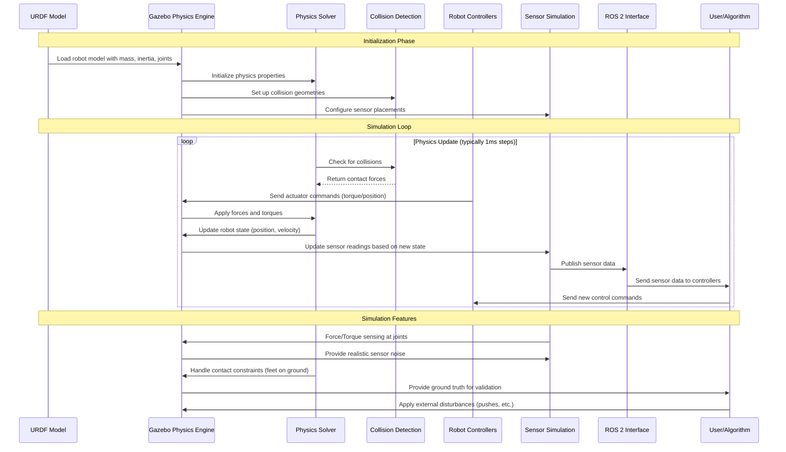

# Physics Simulation Workflow for Humanoid Robots in Gazebo

This diagram illustrates the physics simulation workflow in Gazebo, showing how humanoid robot models interact with the physics engine and environment.

## Physics Simulation Workflow Explanation

### Initialization Phase
1. **Model Loading**: The URDF robot model is loaded into Gazebo with all physical properties
2. **Physics Setup**: Mass properties, inertia tensors, and joint constraints are initialized
3. **Collision Geometry**: Collision meshes are set up for accurate contact detection
4. **Sensor Configuration**: Virtual sensors are placed on the robot model

### Simulation Loop
The physics simulation runs in discrete time steps (typically 1ms) with the following steps:

#### Collision Detection
- The collision detection system checks for contacts between robot parts and environment
- Contact points and forces are computed based on collision geometries
- Friction and contact models determine interaction forces

#### Force Application
- Robot controllers send actuator commands (torques, positions, or velocities)
- External forces (gravity, user-applied forces) are applied to the model
- Contact forces from collisions are applied to the appropriate links

#### Physics Integration
- The physics solver integrates equations of motion to update robot state
- Position, velocity, and acceleration of all links are computed
- Joint constraints are enforced to maintain robot structure

#### Sensor Update
- Sensor readings are computed based on the updated robot state
- Noise models are applied to simulate realistic sensor behavior
- Sensor data is published through the ROS 2 interface

### Key Physics Concepts for Humanoid Robots

#### Balance and Stability
- **Center of Mass**: Continuously calculated and monitored for stability
- **Support Polygon**: Defined by ground contact points for balance assessment
- **Zero Moment Point**: Used for dynamic balance control

#### Contact Modeling
- **Foot-Ground Contact**: Critical for walking and balance simulation
- **Friction Models**: Determines grip and sliding behavior
- **Impact Response**: How the robot reacts to collisions

#### Control Integration
- **Real-time Control**: Controllers operate in sync with physics updates
- **Feedback Delay**: Simulation of real-world sensor and actuator delays
- **Stability**: Maintaining simulation stability with control inputs

This workflow enables realistic simulation of humanoid robot physics, allowing for safe testing of control algorithms and robot behaviors before deployment to real hardware.