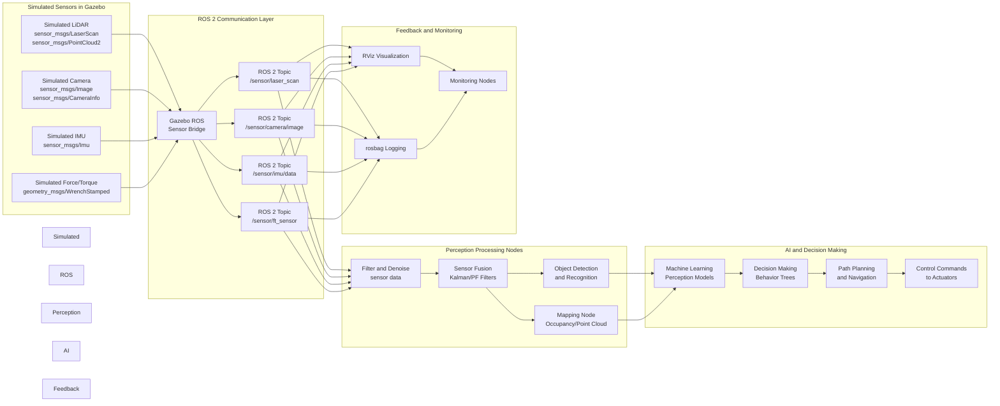

# Sensor Simulation Data Flow for Humanoid Robots

This diagram illustrates the complete data flow from simulated sensors through ROS 2 processing to AI decision making in humanoid robot simulation.

## Data Flow Explanation

### Stage 1: Simulated Sensors
- **Simulated LiDAR**: Generates realistic 3D point clouds and laser scan data with appropriate noise models
- **Simulated Camera**: Produces color images and depth maps with realistic optical properties
- **Simulated IMU**: Provides orientation, angular velocity, and linear acceleration data with proper noise characteristics
- **Simulated Force/Torque**: Generates force and torque measurements from simulated contacts

### Stage 2: ROS 2 Communication
- **Gazebo ROS Bridge**: Converts Gazebo sensor data to standard ROS 2 message formats
- **ROS 2 Topics**: Transport sensor data using DDS-based communication with configurable QoS settings
- **Message Types**: Uses standard sensor_msgs and geometry_msgs formats for compatibility

### Stage 3: Perception Processing
- **Filter and Denoise**: Applies filtering algorithms to reduce sensor noise and artifacts
- **Sensor Fusion**: Combines data from multiple sensors using Kalman filters or particle filters
- **Object Detection**: Identifies and classifies objects in the environment
- **Mapping**: Creates occupancy grids or point cloud maps of the environment

### Stage 4: AI and Decision Making
- **Machine Learning**: Applies trained models to perception data for higher-level understanding
- **Decision Making**: Uses behavior trees or state machines to select appropriate robot behaviors
- **Path Planning**: Generates navigation paths based on perception and mapping data
- **Control Commands**: Sends commands to simulated actuators to control robot motion

### Stage 5: Feedback and Monitoring
- **RViz Visualization**: Provides real-time visualization of sensor data and robot state
- **rosbag Logging**: Records sensor data and robot behavior for analysis
- **Monitoring Nodes**: Tracks system performance and detects anomalies

This data flow represents a complete pipeline from sensor simulation to robot action, demonstrating how digital twin simulation enables safe development and testing of humanoid robot capabilities.