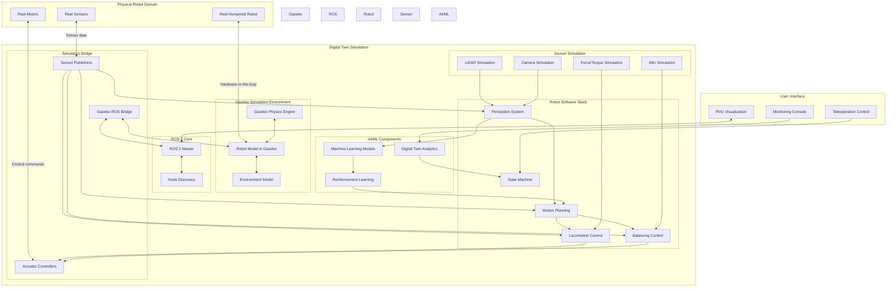

# ROS 2 Simulation Architecture for Humanoid Robots

This diagram illustrates the architecture of a ROS 2-based simulation system for humanoid robots, showing how different components interact in the digital twin environment.

## Key Components Explanation

### Gazebo Simulation Environment
- **Gazebo Physics Engine**: Provides realistic physics simulation with accurate rigid body dynamics, collision detection, and contact forces
- **Robot Model in Gazebo**: High-fidelity model of the humanoid robot with accurate mass properties, joint constraints, and visual appearance
- **Environment Model**: Simulated world including ground plane, obstacles, and interactive objects

### ROS 2 Core
- **ROS 2 Master**: Manages node discovery and communication in the DDS-based system
- **Node Discovery**: Enables automatic discovery of nodes in the distributed system

### Simulation Bridge
- **Gazebo ROS Bridge**: Facilitates communication between Gazebo and ROS 2 systems
- **Sensor Publishers**: Publish simulated sensor data to ROS 2 topics
- **Actuator Controllers**: Subscribe to ROS 2 topics and control simulated robot joints

### Robot Software Stack
- **Locomotion Control**: Algorithms for walking and movement generation
- **Balancing Control**: Control systems for maintaining robot stability
- **Perception System**: Processing sensor data to understand the environment
- **Motion Planning**: Path planning and trajectory generation
- **State Machine**: High-level behavior management

### Sensor Simulation
- **LiDAR Simulation**: Generates realistic 3D point cloud data
- **Camera Simulation**: Provides visual and depth information
- **IMU Simulation**: Supplies orientation and acceleration data
- **Force/Torque Simulation**: Provides joint and contact force information

This architecture enables the development and testing of humanoid robot capabilities in a safe, repeatable simulation environment before deployment to real hardware.