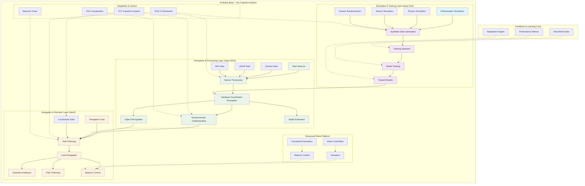

# AI-Robot Brain Conceptual Diagram

This diagram illustrates the conceptual architecture of the AI-Robot Brain, showing how Isaac Sim, Isaac ROS, and Nav2 work together to form the cognitive system of a humanoid robot.

## Diagram Explanation

### AI-Robot Brain Architecture

The AI-Robot Brain represents the cognitive system of a humanoid robot, consisting of three interconnected layers:

#### 1. Simulation & Training Layer (Isaac Sim)
- **Photorealistic Simulation**: High-fidelity visual simulation for realistic perception
- **Physics Simulation**: Accurate physics for realistic robot interactions
- **Sensor Simulation**: Simulation of real sensors (cameras, LiDAR, IMU)
- **Domain Randomization**: Techniques to improve model generalization
- **Synthetic Data Generation**: Creation of large-scale training datasets
- **Model Training**: Training of perception and navigation models
- **Trained Models**: Models ready for deployment on real hardware

#### 2. Perception & Processing Layer (Isaac ROS)
- **Real Sensors**: Physical sensors on the robot platform
- **Sensor Processing**: Processing of real sensor data
- **Hardware Accelerated Perception**: GPU-accelerated perception algorithms
- **Environmental Understanding**: Comprehensive understanding of the environment
- **Object Recognition**: Recognition and classification of objects
- **Depth Estimation**: Estimation of depth information from sensors

#### 3. Navigation & Decision Layer (Nav2)
- **Navigation Goal**: Input goal for the navigation system
- **Path Planning**: Planning of paths from current location to goal
- **Local Navigation**: Execution of navigation commands
- **Obstacle Avoidance**: Avoiding obstacles in real-time
- **Path Following**: Following planned paths with precision
- **Balance Control**: Maintaining balance during navigation

### Integration & Control Layer
- **ROS 2 Framework**: The underlying communication and coordination framework
- **TF2 Transform System**: Coordinate frame management
- **RViz Visualization**: Visualization tools for debugging and monitoring
- **Behavior Trees**: Decision-making and behavior orchestration

### Humanoid Robot Platform
- **Actuators**: Physical motors and actuators for movement
- **Motor Controllers**: Controllers for actuator management
- **Balance Control**: Specialized balance control systems for bipedal robots
- **Humanoid Kinematics**: Kinematic constraints and models for humanoid robots

### Feedback & Learning Loop
- **Performance Metrics**: Metrics for evaluating system performance
- **Real World Data**: Data from real-world operation
- **Adaptation Engine**: System for adapting models to real-world conditions

## Key Concepts

### Cognitive Architecture
The AI-Robot Brain follows a cognitive architecture pattern:
- **Perception**: Sensing and understanding the environment
- **Reasoning**: Processing information and making decisions
- **Action**: Executing physical actions
- **Learning**: Adapting and improving over time

### Layered Intelligence
- **Simulation Intelligence**: Learning in safe simulation environments
- **Perception Intelligence**: Understanding the real world
- **Navigation Intelligence**: Moving safely through the world

### Humanoid-Specific Intelligence
- **Bipedal Locomotion**: Understanding of bipedal walking
- **Balance Control**: Maintaining balance during movement
- **Human Environment Navigation**: Navigating in human-centric spaces

## Integration Points

### Isaac Sim → Isaac ROS
- **Model Transfer**: Trained models from simulation to real perception
- **Synthetic Data**: Training data used to improve real perception
- **Domain Adaptation**: Adapting simulation-trained models to real data

### Isaac ROS → Nav2
- **Environmental Understanding**: Perception data for navigation planning
- **Obstacle Detection**: Real-time obstacle information for navigation
- **Localization**: Position information for navigation

### Nav2 → Robot Platform
- **Navigation Commands**: Commands for robot movement
- **Balance Control**: Balance commands for bipedal locomotion
- **Actuator Control**: Direct control of robot actuators

## Technical Integration

### ROS 2 Ecosystem
- **Standard Messages**: Consistent message formats across all components
- **Services and Actions**: Standard interfaces for communication
- **Parameters**: Consistent parameter management
- **Launch Systems**: Coordinated system startup

### Hardware Acceleration
- **GPU Processing**: Acceleration of perception algorithms
- **Tensor Cores**: Acceleration of AI inference
- **Specialized Hardware**: Dedicated hardware for specific tasks

## Learning and Adaptation

### Continuous Learning
- **Simulation-to-Reality Transfer**: Learning in simulation, applying to reality
- **Real-World Feedback**: Improving models based on real-world performance
- **Adaptive Systems**: Systems that adapt to changing conditions
- **Performance Optimization**: Continuous optimization of system performance

### Feedback Mechanisms
- **Performance Monitoring**: Continuous monitoring of system performance
- **Error Detection**: Detection and handling of system errors
- **Model Updates**: Updating models based on new data
- **Behavior Adjustment**: Adjusting behaviors based on experience

## Benefits of the AI-Robot Brain Architecture

### Safety and Reliability
- **Simulation Testing**: Extensive testing in safe simulation environments
- **Redundant Systems**: Multiple systems for critical functions
- **Recovery Mechanisms**: Robust recovery from failures
- **Predictable Behavior**: Consistent and predictable system behavior

### Performance and Efficiency
- **Hardware Acceleration**: Leveraging specialized hardware for performance
- **Optimized Algorithms**: Algorithms optimized for real-time operation
- **Efficient Resource Usage**: Efficient use of computational resources
- **Real-Time Operation**: Real-time performance for responsive behavior

### Scalability and Flexibility
- **Modular Architecture**: Components can be developed and updated independently
- **Configurable Systems**: Systems can be configured for different robots
- **Extensible Design**: New capabilities can be added over time
- **Cross-Platform Compatibility**: Works across different robot platforms

## Learning Outcomes

After studying this diagram, you should be able to:
- Understand the conceptual architecture of the AI-Robot Brain
- Identify the three main layers: Simulation, Perception, and Navigation
- Recognize how Isaac Sim, Isaac ROS, and Nav2 integrate
- Appreciate the importance of the feedback and learning loop
- Understand the humanoid-specific aspects of the architecture
- Identify the integration points between different components
- Recognize the benefits of this cognitive architecture
- Understand the role of each layer in the overall system

## Summary

The AI-Robot Brain represents a comprehensive cognitive architecture for humanoid robots that integrates simulation-based training, hardware-accelerated perception, and intelligent navigation. This architecture enables robots to learn in safe simulation environments, perceive and understand their real-world environment using hardware acceleration, and navigate safely and efficiently using intelligent navigation systems. The integration of Isaac Sim, Isaac ROS, and Nav2 creates a complete cognitive system that can enable advanced autonomous behavior in humanoid robots. The architecture emphasizes safety, performance, and adaptability, making it suitable for deployment in complex human environments.