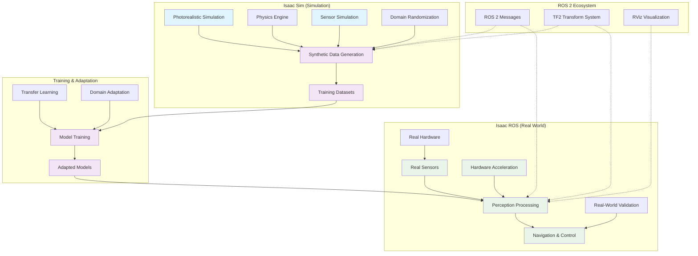

# Isaac Sim to Isaac ROS Integration Diagram

This diagram illustrates the integration between Isaac Sim and Isaac ROS, showing how simulation-based development connects to real-world deployment through synthetic data generation, domain adaptation, and transfer learning.

## Diagram Explanation

### Isaac Sim (Simulation Environment)
- **Photorealistic Simulation**: High-fidelity visual rendering for realistic perception
- **Physics Engine**: Accurate physics simulation for realistic robot interactions
- **Sensor Simulation**: Simulation of real sensors including cameras, LiDAR, IMU
- **Domain Randomization**: Randomization techniques to improve model generalization
- **Synthetic Data Generation**: Creation of large-scale training datasets with perfect ground truth

### Training & Adaptation Layer
- **Training Datasets**: Large synthetic datasets with ground truth annotations
- **Model Training**: Training of perception and navigation models on synthetic data
- **Transfer Learning**: Techniques to transfer knowledge from simulation to reality
- **Domain Adaptation**: Methods to adapt models for real-world conditions
- **Adapted Models**: Models ready for deployment on real hardware

### Isaac ROS (Real-World Deployment)
- **Real Hardware**: Actual robot platforms with real sensors
- **Real Sensors**: Physical sensors like cameras, LiDAR, IMU
- **Perception Processing**: Hardware-accelerated perception algorithms
- **Hardware Acceleration**: GPU and specialized hardware for real-time processing
- **Navigation & Control**: Real-time navigation and control execution
- **Real-World Validation**: Testing and validation in actual deployment environments

### ROS 2 Ecosystem Integration
- **ROS 2 Messages**: Standardized message formats for data exchange
- **TF2 Transform System**: Coordinate frame management
- **RViz Visualization**: Visualization tools for debugging and monitoring

## Integration Points

### Data Flow
1. **Synthetic Data Creation**: Isaac Sim generates training data with ground truth
2. **Model Training**: Models trained on synthetic data in simulation
3. **Domain Adaptation**: Models adapted for real-world conditions
4. **Real Deployment**: Adapted models deployed using Isaac ROS
5. **Validation Loop**: Real-world performance feeds back to improve simulation

### Technical Compatibility
- **Message Format Consistency**: Same ROS 2 message types in simulation and reality
- **Sensor Data Format**: Consistent data formats between simulated and real sensors
- **Interface Compatibility**: Compatible service and action interfaces
- **Parameter Structure**: Consistent parameter structures for configuration

## Benefits of Integration

### Development Efficiency
- **Safe Development**: Test algorithms in safe simulation environment
- **Cost Reduction**: Reduced need for physical hardware during development
- **Rapid Iteration**: Fast development cycles in simulation
- **Scalability**: Ability to test on multiple virtual robots simultaneously

### Performance and Reliability
- **Hardware Acceleration**: Real-time performance through specialized hardware
- **Robustness**: Models trained on diverse synthetic data perform better
- **Safety**: Thorough testing in simulation before real-world deployment
- **Transfer Learning**: Efficient adaptation from simulation to reality

## Challenges and Solutions

### The Reality Gap
- **Physics Differences**: Differences between simulated and real physics
- **Sensor Differences**: Variations between simulated and real sensors
- **Environmental Differences**: Mismatch between simulated and real environments
- **Solutions**: Domain randomization, fine-tuning, and careful calibration

### Domain Adaptation
- **Model Transfer**: Ensuring models work effectively on real data
- **Performance Degradation**: Managing performance drop when moving to reality
- **Calibration Differences**: Handling differences in sensor calibration
- **Environmental Adaptation**: Adapting to real-world conditions

## Learning Outcomes

After studying this diagram, you should be able to:
- Understand the integration flow between Isaac Sim and Isaac ROS
- Identify the key components in the simulation-to-deployment pipeline
- Recognize the role of synthetic data generation in the pipeline
- Appreciate the importance of domain adaptation techniques
- Understand the ROS 2 ecosystem's role in integration
- Identify the challenges in bridging simulation and reality

## Summary

The Isaac Sim to Isaac ROS integration represents a comprehensive pipeline from simulation-based development to real-world deployment. This integration enables safe, efficient, and scalable robotics development by leveraging the benefits of both simulation and real-world hardware acceleration. The diagram illustrates how synthetic data generation, model training, and domain adaptation connect simulation with real-world deployment through the Isaac ROS framework.