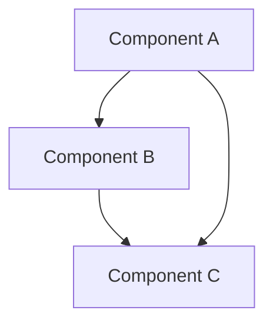
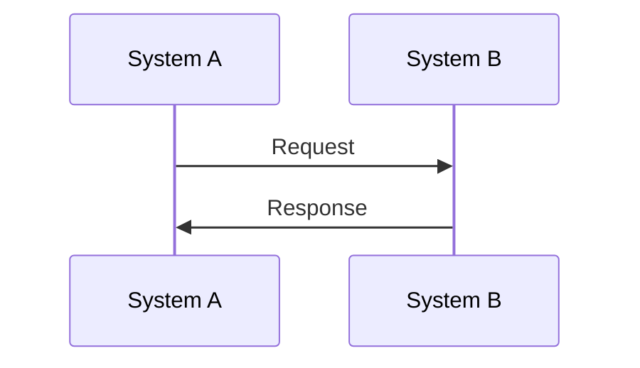
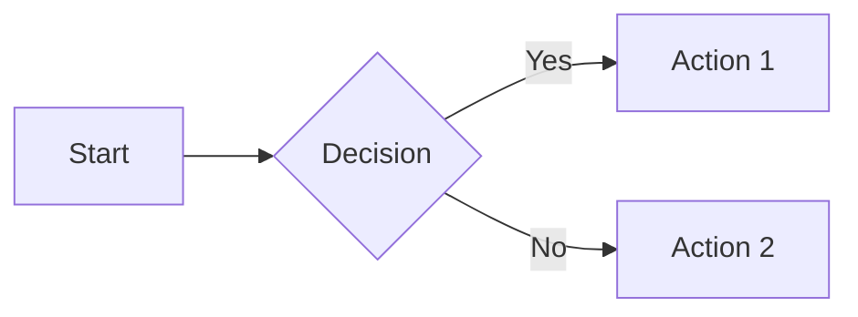

# Mermaid Diagram Structure for Module 3

This document provides guidance for creating consistent Mermaid diagrams across Module 3.

## Diagram Types

### Architecture Diagrams
Use for showing system components and their relationships:

### Workflow Diagrams
Use for showing process flows:

### Process Flow Diagrams
Use for showing step-by-step processes:

## Styling Guidelines

- Use consistent color schemes across diagrams
- Keep labels clear and concise
- Use directional arrows that match the logical flow
- Include explanatory text alongside diagrams
- Maintain consistent node naming conventions