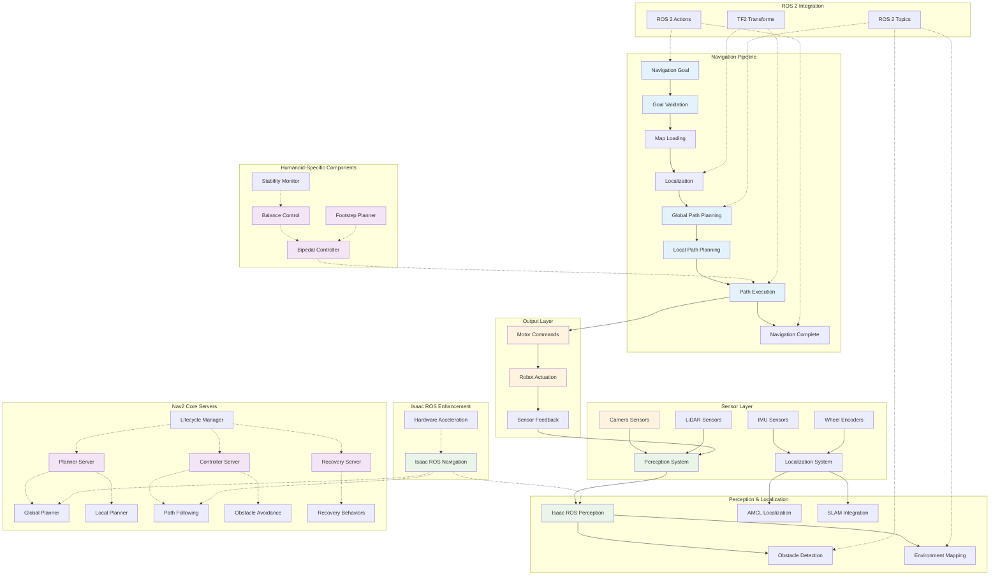

# Navigation System Architecture Diagram

This diagram illustrates the complete navigation system architecture, showing how Nav2 integrates with perception systems and Isaac ROS to enable autonomous navigation for humanoid robots.

## Diagram Explanation

### Sensor Layer
- **Camera Sensors**: Provide visual information for perception
- **LiDAR Sensors**: Provide 3D spatial information for mapping and obstacle detection
- **IMU Sensors**: Provide orientation and motion data for localization
- **Wheel Encoders**: Provide odometry information for motion tracking

### Perception & Localization Systems
- **Perception System**: Processes raw sensor data into meaningful information
- **Isaac ROS Perception**: Hardware-accelerated perception capabilities
- **Obstacle Detection**: Identifies obstacles in the environment
- **Environment Mapping**: Creates and updates environmental maps
- **AMCL Localization**: Adaptive Monte Carlo Localization for position estimation
- **SLAM Integration**: Simultaneous Localization and Mapping capabilities

### Nav2 Core Servers
- **Planner Server**: Manages global and local path planning
- **Global Planner**: Computes high-level path from current location to goal
- **Local Planner**: Plans immediate actions for path following and obstacle avoidance
- **Controller Server**: Executes navigation commands
- **Path Following**: Follows planned paths with precision
- **Obstacle Avoidance**: Avoids obstacles in real-time
- **Recovery Server**: Manages recovery behaviors when navigation fails
- **Recovery Behaviors**: Specific actions for handling navigation failures
- **Lifecycle Manager**: Manages the lifecycle of navigation components

### Isaac ROS Enhancement
- **Isaac ROS Navigation**: Enhanced navigation capabilities with hardware acceleration
- **Hardware Acceleration**: GPU and specialized hardware for performance

### Navigation Pipeline
- **Navigation Goal**: Input goal for navigation system
- **Goal Validation**: Validates that the goal is reachable
- **Map Loading**: Loads environmental map for navigation
- **Localization**: Determines robot's position in the map
- **Global Path Planning**: Computes optimal path to goal
- **Local Path Planning**: Plans immediate navigation actions
- **Path Execution**: Executes navigation commands
- **Navigation Complete**: Confirms successful goal achievement

### Humanoid-Specific Components
- **Bipedal Controller**: Controller specifically designed for bipedal locomotion
- **Balance Control**: Maintains balance during navigation
- **Footstep Planner**: Plans discrete foot placements for walking
- **Stability Monitor**: Monitors and ensures dynamic stability

### ROS 2 Integration
- **ROS 2 Actions**: Standard action interfaces for navigation
- **ROS 2 Topics**: Topic-based communication for data exchange
- **TF2 Transforms**: Coordinate frame management for navigation

### Output Layer
- **Motor Commands**: Commands sent to robot motors
- **Robot Actuation**: Physical movement of robot
- **Sensor Feedback**: Feedback from robot sensors for closed-loop control

## Architecture Characteristics

### Modular Design
The navigation system follows a modular architecture where:
- **Components are decoupled**: Each component operates independently
- **Interfaces are standardized**: Components communicate through standard interfaces
- **Configuration is flexible**: Components can be configured independently
- **Replacement is possible**: Components can be replaced with alternatives

### Real-Time Performance
- **Low Latency**: Designed for real-time navigation requirements
- **Predictable Timing**: Consistent response times for safety
- **Resource Efficiency**: Efficient use of computational resources
- **Parallel Processing**: Components can operate in parallel

## Integration with Isaac ROS

### Perception Integration
- **Enhanced Obstacle Detection**: Isaac ROS provides advanced obstacle detection
- **Semantic Mapping**: Enhanced mapping with semantic information
- **3D Processing**: Advanced 3D point cloud processing
- **Deep Learning**: AI-powered perception capabilities

### Hardware Acceleration
- **GPU Processing**: Acceleration of computationally intensive operations
- **Tensor Cores**: Acceleration of neural network inference
- **Memory Bandwidth**: Efficient use of high-bandwidth memory
- **Pipeline Optimization**: Optimized processing pipelines

## Humanoid Navigation Specifics

### Bipedal Constraints
- **Balance Maintenance**: Continuous balance control during navigation
- **Discrete Foot Placement**: Navigation through discrete footstep planning
- **Dynamic Stability**: Dynamic stability during walking
- **Gait Adaptation**: Adapting gait to terrain and obstacles

### Specialized Components
- **Footstep Planning**: Planning of individual foot placements
- **Balance Control**: Active balance control systems
- **Stability Monitoring**: Continuous monitoring of stability
- **Recovery Systems**: Recovery from balance disturbances

## Safety and Reliability

### Safety Mechanisms
- **Emergency Stops**: Immediate stopping for safety
- **Recovery Behaviors**: Handling navigation failures
- **Velocity Limiting**: Ensuring safe speed limits
- **Oscillation Detection**: Detecting and handling stuck situations

### Reliability Features
- **Redundant Systems**: Multiple systems for critical functions
- **Error Recovery**: Recovery from various error conditions
- **Validation Checks**: Validation of navigation decisions
- **Fallback Mechanisms**: Fallback to safe behaviors

## Performance Optimization

### Computational Efficiency
- **Multi-Threading**: Parallel processing where possible
- **Memory Management**: Efficient memory usage
- **Algorithm Optimization**: Optimized algorithms for real-time performance
- **Hardware Acceleration**: Leveraging specialized hardware

### Resource Management
- **Priority Scheduling**: Prioritizing critical operations
- **Load Balancing**: Balancing computational loads
- **Resource Allocation**: Efficient allocation of resources
- **Power Management**: Managing power consumption

## Learning Outcomes

After studying this diagram, you should be able to:
- Understand the complete navigation system architecture
- Identify the key components in the navigation pipeline
- Recognize how Nav2 integrates with perception systems
- Appreciate the role of Isaac ROS in navigation enhancement
- Understand the humanoid-specific navigation components
- Identify the safety and reliability mechanisms
- Recognize the performance optimization strategies
- Understand the ROS 2 integration aspects

## Summary

The navigation system architecture represents a comprehensive solution for autonomous navigation that integrates Nav2 with Isaac ROS capabilities. The architecture is modular and flexible, allowing for various configurations while maintaining safety and performance. For humanoid robots, the architecture includes specialized components for bipedal locomotion, balance control, and footstep planning. The integration with Isaac ROS provides hardware acceleration and enhanced perception capabilities, while the ROS 2 integration ensures compatibility with the broader robotics ecosystem. This architecture enables safe, efficient, and reliable navigation for humanoid robots in complex environments.