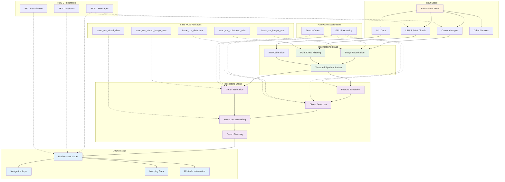

# Perception Pipeline Workflow Diagram

This diagram illustrates the complete perception pipeline workflow in Isaac ROS, showing how raw sensor data is processed through various stages to enable robot understanding of its environment.

## Diagram Explanation

### Input Stage
- **Raw Sensor Data**: Various sensors provide input to the perception pipeline
- **Camera Images**: RGB, stereo, or depth camera data
- **LiDAR Point Clouds**: 2D or 3D LiDAR scan data
- **IMU Data**: Inertial measurement unit data for orientation
- **Other Sensors**: Additional sensors like GPS, wheel encoders, etc.

### Preprocessing Stage
- **Image Rectification**: Correcting camera distortion and calibration
- **Point Cloud Filtering**: Removing noise and outliers from LiDAR data
- **IMU Calibration**: Calibrating inertial sensor data
- **Temporal Synchronization**: Synchronizing data from multiple sensors

### Processing Stage
- **Feature Extraction**: Extracting meaningful features from sensor data
- **Object Detection**: Identifying and classifying objects in the environment
- **Depth Estimation**: Estimating depth information from stereo or monocular images
- **Scene Understanding**: Understanding the overall scene context
- **Object Tracking**: Tracking objects over time to understand motion

### Hardware Acceleration
- **GPU Processing**: Parallel processing for computationally intensive operations
- **Tensor Cores**: Specialized processing for deep learning operations

### Isaac ROS Package Integration
- **Isaac ROS Packages**: Specialized packages for different perception tasks
- **Package Integration**: How different packages work together

### Output Stage
- **Environment Model**: Comprehensive understanding of the environment
- **Navigation Input**: Information for navigation planning
- **Mapping Data**: Data for creating environment maps
- **Obstacle Information**: Information about obstacles for navigation

### ROS 2 Integration
- **ROS 2 Messages**: Standard message formats for data exchange
- **TF2 Transforms**: Coordinate frame management
- **RViz Visualization**: Visualization tools for debugging

## Pipeline Architecture

### Modular Design
The perception pipeline follows a modular architecture where each stage can be:
- **Configured independently**: Each stage has configurable parameters
- **Replaced with alternatives**: Modules can be swapped based on requirements
- **Connected flexibly**: Stages can be connected in various configurations
- **Optimized separately**: Each module can be optimized independently

### Real-Time Performance
- **Low Latency**: Designed for real-time performance requirements
- **High Throughput**: Processing large volumes of sensor data
- **Deterministic Behavior**: Predictable performance characteristics
- **Resource Efficiency**: Efficient use of computational resources

## Hardware Acceleration Benefits

### GPU Processing
- **Parallel Operations**: Processing multiple data streams simultaneously
- **Memory Bandwidth**: Utilizing high memory bandwidth for large datasets
- **Specialized Units**: Leveraging specialized processing units like Tensor Cores
- **Pipeline Optimization**: Optimizing pipeline stages for GPU processing

### Optimized Libraries
- **CUDA Integration**: Integration with CUDA-accelerated libraries
- **OpenCV Acceleration**: Hardware-accelerated computer vision operations
- **Deep Learning**: Accelerated neural network inference
- **Signal Processing**: Accelerated signal processing operations

## Isaac ROS Package Ecosystem

### Perception Packages
- **isaac_ros_detection**: Object detection and classification
- **isaac_ros_segmentation**: Image segmentation capabilities
- **isaac_ros_optical_flow**: Optical flow computation
- **isaac_ros_stereo_image_proc**: Stereo image processing

### Sensor Packages
- **isaac_ros_camera**: Camera driver and processing packages
- **isaac_ros_lidar**: LiDAR processing and integration packages
- **isaac_ros_imu**: IMU integration and processing
- **isaac_ros_sensor_processing**: General sensor processing utilities

## Multi-Sensor Fusion

### Data Fusion Techniques
- **Kalman Filtering**: Hardware-accelerated Kalman filtering
- **Particle Filtering**: Accelerated particle filtering for non-linear systems
- **Bayesian Fusion**: Probabilistic fusion of sensor data
- **Graph Optimization**: Joint optimization of sensor measurements

### Fusion Benefits
- **Redundancy**: Multiple sensors providing redundant information
- **Accuracy**: Improved accuracy through sensor fusion
- **Robustness**: Increased robustness to individual sensor failures
- **Complementary Data**: Combining complementary sensor capabilities

## Performance Characteristics

### Real-Time Performance
- **Low Latency**: Minimal processing delays for real-time operation
- **High Throughput**: Processing large volumes of sensor data
- **Deterministic Behavior**: Predictable performance characteristics
- **Resource Efficiency**: Efficient use of computational resources

### Scalability
- **Multi-Node Operation**: Support for multi-node processing systems
- **Distributed Processing**: Distributed processing across multiple devices
- **Load Balancing**: Automatic load balancing for optimal performance
- **Resource Management**: Efficient resource allocation and management

## ROS 2 Integration

### Standard Interfaces
- **Message Types**: Using standard ROS 2 message types
- **Topic Names**: Following ROS 2 naming conventions
- **Service Interfaces**: Using standard ROS 2 service interfaces
- **Action Interfaces**: Supporting ROS 2 action interfaces

### Tool Compatibility
- **RViz Integration**: Full compatibility with RViz visualization
- **rosbag Support**: Support for data recording and playback
- **rqt Tools**: Compatibility with various rqt tools
- **Command Line Tools**: Integration with ROS 2 command line tools

## Learning Outcomes

After studying this diagram, you should be able to:
- Understand the complete perception pipeline workflow in Isaac ROS
- Identify the key stages in the perception pipeline
- Recognize the role of hardware acceleration in the pipeline
- Appreciate the modular architecture of the pipeline
- Understand how different Isaac ROS packages integrate
- Identify the inputs and outputs of the perception pipeline
- Recognize the importance of multi-sensor fusion
- Understand the ROS 2 integration aspects

## Summary

The perception pipeline in Isaac ROS represents a comprehensive solution for processing sensor data to enable robot understanding of its environment. The pipeline follows a modular, composable architecture that leverages hardware acceleration to deliver real-time performance while maintaining compatibility with the ROS 2 ecosystem. The modular design enables flexible deployment in various robotics applications, from simple navigation tasks to complex autonomous systems. The integration of multiple sensor types through advanced fusion techniques provides robust and accurate perception in diverse operating conditions.