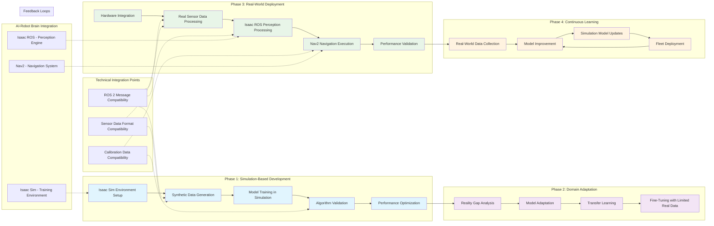

# Simulation-to-Navigation Workflow Diagram

This diagram illustrates the complete workflow from simulation-based development to real-world navigation deployment, showing how Isaac Sim, Isaac ROS, and Nav2 work together in a cohesive pipeline.

## Diagram Explanation

### Phase 1: Simulation-Based Development

This phase occurs entirely in the Isaac Sim environment:

- **Isaac Sim Environment Setup**: Creating realistic simulation environments that match deployment scenarios
  - Physics configuration to match real-world behavior
  - Sensor simulation with realistic noise models
  - Environment complexity matching real-world conditions
  - Lighting and visual conditions matching deployment

- **Synthetic Data Generation**: Creating large-scale training datasets with perfect ground truth
  - RGB image generation with photorealistic rendering
  - Depth data generation with accurate depth information
  - Segmentation mask generation with pixel-perfect labels
  - Multi-modal data collection from various sensors

- **Model Training in Simulation**: Training perception and navigation models on synthetic data
  - Deep learning model training on synthetic datasets
  - Reinforcement learning for navigation policies
  - Performance optimization in controlled environments
  - Validation of trained models in simulation

- **Algorithm Validation**: Testing algorithms in diverse simulation scenarios
  - Testing with various environmental conditions
  - Validation with different robot configurations
  - Performance benchmarking in simulation
  - Safety validation before real-world deployment

- **Performance Optimization**: Optimizing algorithms for real-world performance
  - Computational efficiency optimization
  - Real-time performance tuning
  - Resource utilization optimization
  - Algorithm refinement based on simulation results

### Phase 2: Domain Adaptation

This phase bridges the gap between simulation and reality:

- **Reality Gap Analysis**: Identifying differences between simulation and reality
  - Physics differences between simulated and real environments
  - Sensor characteristic differences
  - Environmental condition variations
  - Timing and synchronization differences

- **Model Adaptation**: Adapting models trained in simulation for real-world data
  - Fine-tuning models with limited real data
  - Adjusting for sensor calibration differences
  - Compensating for environmental variations
  - Updating models for real-world conditions

- **Transfer Learning**: Applying knowledge gained in simulation to real-world problems
  - Leveraging pre-trained models from simulation
  - Adapting features for real-world data
  - Maintaining learned capabilities while adapting to reality
  - Efficient learning with minimal real-world data

- **Fine-Tuning with Limited Real Data**: Adjusting models based on limited real-world data
  - Using small amounts of real data for model adjustment
  - Maintaining performance while adapting to reality
  - Avoiding overfitting to limited real data
  - Preserving generalization capabilities

### Phase 3: Real-World Deployment

This phase involves deployment to actual hardware:

- **Hardware Integration**: Deploying algorithms to real hardware using Isaac ROS
  - Integration with real sensors and actuators
  - Hardware-specific optimizations
  - Real-time system configuration
  - Safety system implementation

- **Real Sensor Data Processing**: Processing data from actual hardware sensors
  - Camera image processing with Isaac ROS
  - LiDAR point cloud processing
  - IMU data processing and fusion
  - Multi-sensor data synchronization

- **Isaac ROS Perception Processing**: Hardware-accelerated perception using Isaac ROS
  - GPU-accelerated object detection
  - Real-time SLAM processing
  - Hardware-accelerated deep learning inference
  - Sensor fusion with Isaac ROS packages

- **Nav2 Navigation Execution**: Navigation execution using Nav2
  - Global path planning with Nav2
  - Local navigation and obstacle avoidance
  - Recovery behaviors for navigation failures
  - Integration with perception systems

- **Performance Validation**: Validating performance in real-world scenarios
  - Navigation accuracy validation
  - Safety validation in real environments
  - Performance benchmarking in reality
  - Comparison with simulation results

### Phase 4: Continuous Learning

This phase enables ongoing improvement:

- **Real-World Data Collection**: Collecting data from real-world operation
  - Operational data collection during navigation
  - Anomaly detection and data collection
  - Performance data for model improvement
  - Environmental data for model updates

- **Model Improvement**: Improving models based on real-world experience
  - Updating models with real-world data
  - Improving model robustness
  - Addressing failure cases
  - Enhancing performance based on experience

- **Simulation Model Updates**: Updating simulation models based on real data
  - Improving simulation realism based on real data
  - Updating sensor models to match reality
  - Enhancing physics models based on real behavior
  - Improving domain randomization strategies

- **Fleet Deployment**: Scaling successful solutions across robot fleets
  - Deploying improved models to multiple robots
  - Coordinated fleet learning and updates
  - Centralized model management
  - Distributed learning and improvement

## Technical Integration Points

### ROS 2 Message Compatibility
- **Standard Message Types**: Both simulation and reality use standard ROS 2 message types
- **Sensor Data Format**: Consistent formats for camera, LiDAR, and other sensor data
- **Metadata Consistency**: Consistent metadata formats across simulation and reality
- **Calibration Data**: Compatible calibration data formats for sensors

### Sensor Data Format Compatibility
- **Topic Names**: Consistent topic naming conventions
- **Service Interfaces**: Compatible service interfaces for communication
- **Action Definitions**: Consistent action definitions for long-running tasks
- **Parameter Structures**: Compatible parameter structures for configuration

### Calibration Data Compatibility
- **Intrinsic Parameters**: Consistent camera intrinsic parameters
- **Extrinsic Parameters**: Consistent sensor placement and orientation
- **Noise Models**: Consistent noise characteristics modeling
- **Temporal Properties**: Consistent timing and synchronization characteristics

## AI-Robot Brain Integration

### Isaac Sim - Training Environment
- **Safe Development**: Provides a safe environment for testing complex behaviors
- **Synthetic Data Generation**: Generates large-scale training datasets for AI systems
- **Algorithm Validation**: Validates algorithms in controlled, reproducible environments
- **Hardware Protection**: Protects expensive hardware during development phases

### Isaac ROS - Perception Engine
- **Hardware Acceleration**: Provides real-time performance through hardware acceleration
- **Real-Sensor Integration**: Processes data from actual hardware sensors
- **Production Deployment**: Enables deployment to real robotics platforms
- **Performance Optimization**: Optimizes algorithms for real-world performance requirements

### Nav2 - Navigation System
- **Autonomous Navigation**: Provides complete navigation capabilities
- **Humanoid-Specific Navigation**: Handles bipedal navigation constraints
- **Perception Integration**: Integrates with perception systems for safe navigation
- **ROS 2 Ecosystem**: Fully integrated with the ROS 2 ecosystem

## Feedback Loops

### Simulation-to-Reality Feedback
- **Performance Comparison**: Comparing simulation and real-world performance
- **Failure Analysis**: Identifying and addressing failure cases
- **Robustness Testing**: Testing robustness in real-world conditions
- **Safety Validation**: Validating safety in real-world scenarios

### Continuous Improvement Loop
- **Data-Driven Updates**: Updating models based on real-world data
- **Performance Monitoring**: Monitoring performance across deployments
- **Adaptive Learning**: Learning from operational experience
- **System Evolution**: Evolving systems based on real-world requirements

## Benefits of the Workflow

### Development Efficiency
- **Fast Iteration**: Rapid iteration cycles in simulation
- **Cost Reduction**: Reduced costs for development and testing
- **Risk Mitigation**: Reduced risk of hardware damage during development
- **Scalability**: Ability to scale development across multiple systems

### Safety and Reliability
- **Safe Testing**: Safe testing of complex behaviors in simulation
- **Failure Mode Testing**: Testing failure modes safely in simulation
- **Edge Case Coverage**: Comprehensive testing of edge cases in simulation
- **Validation**: Thorough validation before real-world deployment

### Performance Optimization
- **Algorithm Development**: Developing algorithms with perfect ground truth
- **Performance Tuning**: Optimizing performance in controlled environments
- **Resource Optimization**: Optimizing resource usage before deployment
- **Scalability Testing**: Testing scalability in simulated environments

## Challenges and Considerations

### The Reality Gap
- **Physics Differences**: Differences between simulated and real physics
- **Sensor Differences**: Differences between simulated and real sensors
- **Environmental Differences**: Differences between simulated and real environments
- **Temporal Differences**: Differences in timing and synchronization

### Domain Adaptation
- **Model Transfer**: Ensuring models transfer effectively to real data
- **Performance Degradation**: Managing performance degradation in real-world
- **Calibration Differences**: Managing differences in sensor calibration
- **Environmental Adaptation**: Adapting to real-world environmental conditions

## Learning Outcomes

After studying this diagram, you should be able to:
- Understand the complete simulation-to-navigation workflow
- Identify the four key phases of the workflow
- Recognize the integration points between different phases
- Appreciate the importance of domain adaptation
- Understand the feedback loops in the workflow
- Identify the technical compatibility requirements
- Recognize the benefits of this workflow approach
- Understand the challenges in the simulation-to-reality transition

## Summary

The simulation-to-navigation workflow represents a comprehensive pipeline that enables safe, efficient, and scalable robotics development. By starting with simulation-based development in Isaac Sim, transitioning through domain adaptation, deploying to real hardware with Isaac ROS and Nav2, and incorporating continuous learning, this workflow provides a complete solution for developing advanced robotics capabilities. The workflow emphasizes safety by testing in simulation first, efficiency through synthetic data generation, and scalability through systematic domain adaptation. The integration of Isaac Sim, Isaac ROS, and Nav2 creates a cohesive system that bridges the gap between simulation and reality, enabling humanoid robots to operate safely and effectively in human environments.